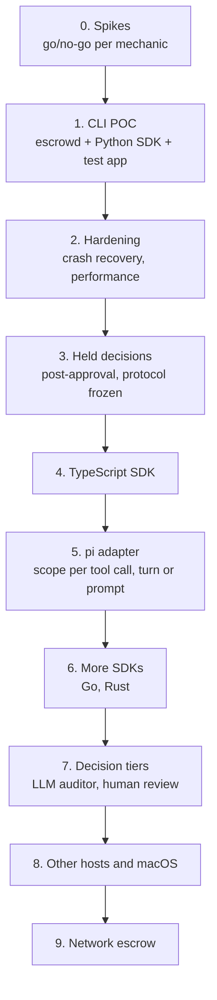
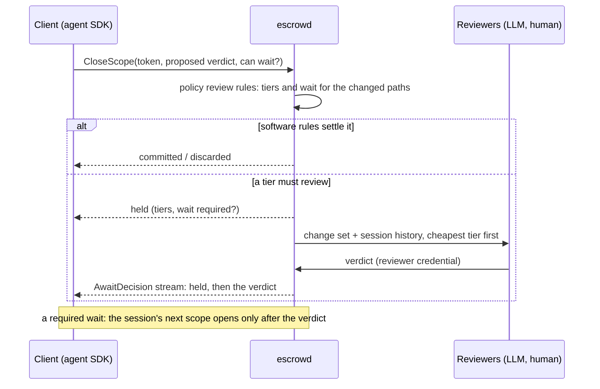

# Escrowed I/O for LLM Agent Tool Calls: Design Notes

Oct 3, 2026 · @André Bremer · Updated Oct 5, 2026

## Summary

The goal is to enforce code policies and standards on every LLM request, not at Git commit time. Hooks on the Write tool already do this, but they miss mutations made through bash, heredocs or Python scripts.

The fix is to stop watching tools and start watching the filesystem. The developer wraps work in a scope, the atomic boundary: every write inside it is captured by a FUSE layer and held in escrow until the scope closes and one decision commits or discards the whole change set. Reads are escrowed in the opposite direction: their data is held until the gate releases it to the caller, decided one read at a time because the caller is waiting. Code inside a scope sees a normal machine and never knows its writes are pending.

The plan starts small (a scope gate proved by a CLI test app) and grows into decision models, an audit log, SDKs in more languages, host adapters and network escrow.

**Status, Oct 5, 2026.** Phases 0 to 2 are done: escrowd (Rust), the Python SDK and the conformance suite run on Linux, with crash-safe commits and real repositories at about 1.5× native ([phase 0](phase-0-spikes.md), [phase 1](phase-1-poc.md), [phase 2](phase-2-hardening.md)). Phase 3, held decisions (a post-approval by independent reviewers, negotiated between client and daemon), is next ([plan](phase-3-held-decisions.md)); then the protocol freezes and phase 4 builds the TypeScript SDK on it ([plan](phase-4-typescript-sdk.md)). Known limits of what is built are in [LIMITATIONS.md](../LIMITATIONS.md).

## Core concepts

- **Scope = atomic boundary.** The developer defines the unit of work: a tool call, a turn or a whole request. Every side effect inside it is decided together, once.
- **Escrow.** Side effects are staged, not committed. A write returns success, and reading it back shows the new data, but nothing reaches the real filesystem (or network) until an auditor releases it. Copy-on-write for reality. Escrow runs both ways: writes are held on the way out until the scope's decision; reads are held on the way in until the gate releases their data to the caller. A blocked caller can't wait for the scope to close, so each read is decided when it happens.
- **Transparency.** The calling system, and the LLM, cannot tell the data is in escrow. It behaves like a normal virtual machine.
- **No special cases.** A Write tool call, a bash redirect, a Python heredoc and a `git commit` are all just mutations. All of them go into escrow.
- **Transitivity (deferred).** With flat scopes, no scope builds on another's uncommitted changes, so there is nothing to release in order. It returns if nested scopes do.
- **Priorities.** File I/O first, then network I/O. Together they cover most real side effects and both can be intercepted cleanly.

## Prior art

The mechanisms are well established; the application is where the value lies. Closest work found:

| Project | What it does | Relevance |
| --- | --- | --- |
| [AgentFS](https://github.com/tursodatabase/agentfs) (Turso, MIT, beta) | SQLite-backed filesystem with a FUSE copy-on-write overlay over a host directory; `agentfs run` adds user and mount namespaces; SDKs in TypeScript, Python, Rust and Go are explicit file APIs | Closest mechanism, but all-or-nothing: one overlay per session, `diff` only, no way to apply changes back, no scopes, snapshots or read gating |
| [BranchFS](https://arxiv.org/html/2602.08199v1) (Fork, Explore, Commit) | FUSE branches with per-file copy-on-write, mount namespaces, atomic commit where the first branch to commit wins | Closest to concurrent scopes with commit-time conflicts; no read tracking, no SDK |
| [Atomix](https://arxiv.org/html/2602.14849) | Records reads and effects per transaction, seals it when complete, commits only when no earlier conflicting work can arrive. Buffers bufferable effects; gates irreversible ones. | Closest to release ordering for network effects. |
| [Cordon](https://arxiv.org/html/2606.17573v1) | Shadow filesystem: staged file contents plus a JSON manifest per turn mapping paths to staged files or delete tombstones; explicit commit and abort. | Closest to buffered file writeback. |
| [Commit-Time Authorization](https://arxiv.org/html/2607.10487) | Checks that the authority behind an effect is still valid when it becomes durable | Informs what a decision function must re-check at commit |
| [Fault-Tolerant Sandboxing](https://arxiv.org/html/2512.12806) | Policy-based interception layer plus transactional filesystem snapshots for coding agents. | Same goal, snapshot-based rather than overlay-based. |
| [LayerFS](https://github.com/luojiyin1987/layerfs) | Disposable FUSE workspace per tool call with checkpoints; developer preview | Per-call workspaces; Rust only, needs CAP\_SYS\_ADMIN |
| [DeltaBox](https://arxiv.org/html/2605.22781v1) | Millisecond sandbox checkpoint and rollback; routes LLM API traffic through a separate proxy process. | Useful for checkpointing and network separation. |

**What is novel here.** The capture mechanism (a FUSE copy-on-write layer in Linux namespaces) is established. What none of these combine: a developer-defined scope as the atomic boundary with a decision function; transparent capture of ordinary in-process IO, attributed across concurrent async tasks by path tagging; one daemon behind SDKs in several languages; and reads allowed or denied as they happen.

## How Claude Code's sandbox works

Claude Code uses OS-level isolation for its Bash tool: bubblewrap on Linux, Seatbelt (`sandbox-exec`) on macOS ([docs](https://code.claude.com/docs/en/sandboxing), [engineering post](https://www.anthropic.com/engineering/claude-code-sandboxing)).

- **Filesystem.** Read broadly, write only inside the working directory. Writes elsewhere fail at the syscall level with `Operation not permitted`.
- **Network.** Traffic goes through a local proxy (relayed with `socat`) that checks a domain allowlist and returns 403 for denied domains. Tools that ignore proxy settings hit a kernel-level backstop that blocks non-loopback traffic.

**Lesson.** Even Anthropic pairs proxy interception with kernel enforcement, because arbitrary bash slips past a userspace library alone.

**Weakness for this use case.** The policy is static: you decide up front what is allowed, and the boundary is about *where* a write goes, not *what* it does. A Python heredoc writing inside the working directory is always allowed, whatever it writes. Escrow judges the actual staged effect instead of predicting it.

## Roadmap



Every phase reuses escrowd and the scope model from phase 1; later phases add languages, decision tiers, hosts and network capture. Phases 0 to 2 are done. Renumbered Oct 5, 2026: held decisions became phase 3, ahead of the protocol freeze, and the later phases moved down one. Exit criteria are under Implementation phases.

## Scopes: the atomic boundary

A scope is the one primitive: every write inside it is captured, and when it closes, one decision applies to the whole change set at once. The developer decides what a scope covers: one tool call, one turn or a whole request. Nothing fails at write time; the point is to gather all changes, then decide the next step atomically.


Everything between open and close is captured; the single decision at close picks one of four outcomes for the whole change set. Commit, discard and return to agent are built; hold is phase 3 (see [Held decisions](#held-decisions)).

- **One view per scope.** Concurrent tasks in a scope share an ordinary filesystem view, last write wins. Operations can carry labels (call ID, process) for the ledger and the decision; labels change nothing.
- **Snapshot at open.** A scope sees the project as it was when it opened, plus its own writes, and nothing from scopes that haven't committed.
- **One decision on close.** The decision function gets the change set (diff, reads, labels) and returns commit, discard, hold (LLM or human escalation) or return to agent (with reasons, so the agent can fix it and the scope continues).
- **Atomic commit.** Commit applies the whole change set to disk through a journal (record, apply, recover after a crash), so the project gets all of it or none.
- **Conflicts at commit.** Concurrent scopes are independent transactions. If anything a scope wrote has changed on disk since its snapshot, the conflict policy applies: `conflict.verdict` is `discard` (the default) or `return` (the scope reopens with its changes and the conflicting paths go back as reasons). `conflict.reads: true` also counts files the scope only read (2.7). It is off by default, so two scopes can each read a file the other changes and both commit (write skew); a host that needs serializable scopes turns it on.
- **Reads are escrowed inbound.** Their data is held until the gate releases it; the caller is blocked, so each read is decided when it happens rather than at close, and logged for the decision.

IO outside any scope is the developer's choice, set once at `escrow.init(unscoped=…)`:

| Mode | IO outside a scope | Fits |
| --- | --- | --- |
| `passthrough` | Real IO, not captured, not logged (one ledger line at start) | Trusted, legacy apps that only care about the work they wrap |
| `implicit` | Captured in a default scope, decided at exit or by `escrow.settle_unscoped()` | Setups where nothing may escape |
| `deny` | Writes fail with EROFS (`EscrowUnscopedError` from the SDK); reads pass | **Agent hosts (recommended)**: a missing boundary fails loudly |

`deny` is the documented mode for agent hosts: an agent's write outside its scope fails at once and names the fix, where `passthrough` would let it reach the project unlogged. In `implicit` and `deny` modes, each scope's outcome counts the changes that reached the unscoped mode while it was open (`s.outcome.unscoped`), a warning that IO escaped it (native code, `os.spawn*`).

Nested scopes, and the transitive release they would need, are deferred.

## Architecture

A local daemon owns capture and isolation; the SDK in each language only marks scopes and talks to it. The host app never calls bwrap.

- **escrowd** (Rust) owns the FUSE capture layer, the scopes, the journal, the gate and the ledger.
- **Launcher.** The app starts under it: `escrow run --project ./proj -- python app.py`. The SDK's `init()` can re-exec the program under it automatically.
- **SDK.** Talks to the daemon over a Unix socket (`ESCROW_SOCKET`) with gRPC from one schema (`proto/escrow/v1/escrow.proto`): `OpenScope` (returns the scope's id, views and token), `CloseScope` (returns the change set), `Decide`, `SettleUnscoped`, `GetChangeSet` and `Ping`. Children start through a second socket beside it (`<socket>.exec`), which passes stdio as file descriptors; SDKs use it through the `escrow exec` binary.

**Capture is FUSE, not overlayfs.** One running process can't switch its overlay upper per scope; a FUSE filesystem sees every open, read, write, rename and delete and can route each to the right scope, and gate reads synchronously.

**Attribution by path.** Async hosts run concurrent scopes on one thread, and Node runs file IO on a shared pool, so thread IDs can't tell scopes apart. The path is the only tag that reaches the filesystem with every operation:

1. **A virtual root per scope.** The daemon serves `/escrow/<scope-id>/` as the scope's snapshot plus its writes.
2. **In-process IO.** The SDK keeps the current scope in the language's async context (`contextvars` in Python, `AsyncLocalStorage` in Node, task-locals in Rust) and wraps the file API to rewrite `$PROJECT/x` to `/escrow/<scope>/x`. Go gets an explicit `scope.FS()` and `scope.Command()`.
3. **Subprocesses.** The SDK's wrapped `subprocess` / `child_process` runs the child through `escrow exec`, and the daemon starts it in bwrap with the scope's view mounted over `$PROJECT`, so bash, heredocs, absolute paths and grandchildren see ordinary paths.
4. **Children started without the SDK** inherit the launcher's default mount, which follows the `unscoped` mode.

## Isolation

FUSE captures project IO; bwrap contains everything else, so nothing reaches the project except through capture.

- **Only one way to the project.** The FUSE view is mounted over `$PROJECT`; the real directory is never mounted in the sandbox.
- **No uncaptured writes elsewhere.** The rest of the filesystem is read-only, with tmpfs for `/tmp` and home unless the policy's `roots:` routes them through FUSE (2.4).
- **Paths outside the project (2.4).** `$HOME` and `/tmp` can be served like the project, each scope with its own view (`<id>.home/`, `<id>.tmp/`) mounted over the root in its sandbox. A rule per path decides: `capture` (staged, committed with the project in one journaled generation), `ephemeral` (staged, always discarded), `passthrough` (bound directly, outside escrow, logged at sandbox start) and `deny` (EACCES on reads, listings and changes, logged; the default for unlisted paths). The project, passthrough and read paths inside a root are mount points the view never serves; escrowd's state, views and sockets are absent from it.
- **Network.** `--unshare-net`: no network in sandboxes. A proxy socket per scope as the only way out is phase 9.
- **Lifetime.** `--unshare-pid --die-with-parent`; a scope's processes stop when it closes (SIGTERM, then SIGKILL after the policy's `close.grace_ms`).
- **Tamper resistance.** The daemon, journal and ledger live outside the sandbox. The app gets only the RPC socket, no `/dev/fuse`, and nested user namespaces are disabled so it can't remount.
- **Platform.** Linux first; macOS would need macFUSE or FSKit for capture and Seatbelt for containment.

## Threat model

Added in 2.7 ([#15](https://github.com/rcrsr/escrowd/issues/15)). escrowd defends the project and the captured roots against the code a host runs, not against the host itself. Who is trusted for what:

| Actor | Reaches | Trusted? | What escrowd guarantees |
| --- | --- | --- | --- |
| The host (agent harness) | The daemon socket; opens scopes and holds their tokens | Yes: it makes the close-time decision | Its decision applies all or nothing; the ledger records every operation and decision |
| In-process code (libraries, harness extensions) | The host's memory, the socket, the SDK's `Scope` objects | Yes, for integrity: it shares the host's process | Its IO in a scope is captured by path. To close, decide or start children in a scope it needs that scope's token; the scope id, visible in every view path, is not enough. Code that reads the SDK's memory can take a token: the token stops misuse by id, not a hostile extension |
| Subprocesses (bash, scripts, tests, tools) | Their scope's views only, in bwrap | No | No write reaches the project or a captured root before the decision; reads of `read.deny` and `deny` paths fail and are logged; no socket, no token (stripped from the environment), no other scope's view, no real project directory, no `/dev/fuse`, no nested user namespaces. A child cannot decide its own scope or start children in another |
| IO outside any scope | The unscoped mode | Per mode | `deny` refuses project writes; `implicit` stages them in a default scope; `passthrough` lets them through unseen, with one ledger line at start saying so |

Outside the model: processes of the same user outside escrowd (they can write the project directly), passthrough binds and the network until phase 9 (outside escrow by design), native code and `mmap` in the host process (they fall to the unscoped mode; `deny` is the mode for agent hosts), and the change set itself: `GetChangeSet` needs no token, since it only shows a closed scope's diff with `read.deny` content withheld.

The rule that follows for adapters: **untrusted tool code runs as a subprocess**, where the sandbox holds it; in-process extensions are trusted. Phase 5's pi adapter runs bash and every tool that executes model-written code through `escrow exec`.

## Host developer experience

The host picks an `unscoped` mode, wraps work in scopes and supplies decision functions; code inside a scope is ordinary IO. The Python SDK below is as built in phases 1 and 2.

```python
# run with:  python app.py   (init() re-executes it under `escrow run`)
import asyncio, subprocess
from pathlib import Path
import escrow

escrow.init(project="./proj", unscoped="deny", policy="./escrow.policy.yaml")
PROJECT = Path("./proj").resolve()

async def gate(changes):
    if any(p.endswith(".env") for p in changes.paths):
        return escrow.discard("touches secrets")
    return escrow.commit()

async def write_docs():
    (PROJECT / "README.md").write_text("# Demo\n")
    return (PROJECT / "README.md").read_text()          # sees its own staged write

async def build():
    (PROJECT / "config.json").write_text('{"debug": true}')
    subprocess.run(["bash", "-c", "echo built > build.log"], cwd=PROJECT, check=True)

async def main():
    async def scoped(name, fn):
        async with escrow.scope(name, decide=gate) as s:
            await fn()
        return s.outcome

    a, b = await asyncio.gather(scoped("docs", write_docs), scoped("build", build))
    print(a.status, a.paths)   # committed ['README.md']
    print(b.status, b.paths)   # committed ['build.log', 'config.json']

asyncio.run(main())
```

| The developer does | They get |
| --- | --- |
| Closes a scope | `s.outcome`: status, paths, diff, reads, labels, the decision's reasons and the count of changes that escaped to the unscoped mode |
| Writes outside a scope in `deny` mode | `EscrowUnscopedError` pointing at the code that needs a scope |
| Reuses a file handle after its scope closed | `EscrowStaleHandleError` |
| Reads a path the policy denies | `PermissionError` (EACCES), logged with the scope |
| Wants to inspect | `escrow log <scope>` (the ledger), `escrow diff <scope>` (a closed scope's diff); `escrow review` to list and decide held scopes as a human reviewer (phase 3). Rerunning a decision is an SDK feature: the host runs its decide callback again on a change set it kept |

Policy files hold software rules that run in the daemon, identical across languages (today: read rules, path roots, close grace, diff caps, conflict policy; write rules come with the decision tiers); decision functions in the host language add LLM or human judgement, and the change set waits in escrow while they run. Adapters for existing harnesses (pi, LangGraph) come later and open scopes from the harness's lifecycle hooks.

## Risks and leaks

| Risk | Fix |
| --- | --- |
| Returned paths (`realpath`, `__file__`, error messages) show `/escrow/<scope>/…` | The SDK maps them back to the project path |
| A handle opened in one scope and written after it closed | The tag is fixed at open; the daemon refuses writes on handles of closed scopes (EBADF; `EscrowStaleHandleError` from the SDK) |
| Symlinks to absolute project paths | In a scope's sandbox the view is mounted at the project path, so the link resolves inside the scope. In the host process the kernel follows the link to the project path, which the unscoped mode serves: a write through it is refused (`deny`), staged in the default scope (`implicit`) or real (`passthrough`) |
| Native code or `mmap` doing its own IO | Falls to the `unscoped` mode; run that work in a subprocess for full capture |
| Long-lived processes outliving a scope (dev server, watcher) | Stopped when the scope closes; give them their own scope if they must run longer |
| Shared state outside the project (`~/.cache`, `.git/index.lock`, ports) | `roots:` rules (2.4): capture or ephemeral views of `$HOME` and `/tmp`, passthrough binds for content-addressed caches; a network namespace per scope |
| Secrets in `$HOME` (`~/.ssh`, `~/.aws`) reachable once `$HOME` is served | `deny` rules (and `deny` as the default for unlisted paths): reads, listings and changes get EACCES and a ledger line. Lookups pass, so a denied file's name, size and times stay visible |
| Code that learns a scope id (from a view path) closes or decides that scope | A per-scope token from `OpenScope`, required by close, decide and spawn (2.7); see [Threat model](#threat-model) |
| A served root contains escrowd's own state, views or sockets (the daemon must never touch its own view) | The root's rules hide them: absent from listings, ENOENT on lookup, no creates |
| FUSE overhead on every operation | Unprivileged cache flags (writeback cache, async read, parallel dirops), kernel caching of a scope's entries and pages, READDIRPLUS. Measured: real test suites at 1.06–1.53× native, warm `rg` about 3.5× (one OPEN and RELEASE round trip per file). Kernel FUSE passthrough (Linux 6.9+) needs `CAP_SYS_ADMIN`, so only through a root helper |
| Network effects outside capture | `--unshare-net` per scope, or a proxy that tags connections with the scope ID |
| FUSE writeback cache holds writes past the end of a scope | fsync every open handle of the scope before its decision runs; `syncfs` alone is not a barrier on plain FUSE (spike 0.4) |
| Inode numbers change on copy-up, confusing git, editors and build tools | Inode numbers derive from the base file's (`scope index << 48 \| st_ino`) and are pinned in the scope's store where they cannot be derived, so a file keeps its number through copy-up, rename and a daemon restart |
| Reads of a live base see other scopes' commits mid-scope | Each commit keeps pre-images of what it overwrites, so a scope reads the base as it was at open; each file's version is recorded on first read or change and checked at commit (decided in phase 0: reflink and btrfs snapshots cost more per open) |
| An editor outside escrowd writes a file while a commit applies | Apply re-checks each file's inode, size and mtime just before replacing or removing it; a change rolls the commit back as a conflict and keeps the editor's version. A write in the microseconds between that re-check and the rename still loses to the commit |
| A sandboxed process killed at close sends no FUSE flush, so its last writes arrive after it is gone | Close waits for the release of every handle held by a stopped sandbox or an exiting process before it freezes the scope (2.2) |
| An editor outside escrowd changes a base file that a scope's kernel cache holds | The next open drops the file's cached pages when its base version changed (2.3). The kernel keeps names, attributes and listings of a scope for up to 60 s, and with the writeback cache it keeps its own size of a file it has an inode for, so a changed size shows only once the kernel drops the inode |

## Recommendations

**Decided in phase 0 (spike 0.7): AgentFS rejected**; escrowd builds its own overlay (its OverlayFS rename leaves inode maps stale, which breaks git; 246 crates; Turso's engine is beta). The analysis that led there:

Build escrowd's own capture layer rather than adopting [AgentFS](https://github.com/tursodatabase/agentfs) as a platform; its design is all-or-nothing, and the scope, decision and atomic commit that make escrowd useful would all still have to be built. At most, embed its Rust overlay library as the per-scope store for staged changes, behind an interface we own, if the phase 0 spike shows it saves real work.

| Taking AgentFS as the base |  |
| --- | --- |
| **For** | A working FUSE overlay (whiteouts, copy-up, stable inodes) and namespace setup, MIT licensed; a crash-safe SQLite store where `diff` is a query; SDKs and CLI in four languages; a macOS route over NFS without a kernel extension |
| **Against** | No apply back to the project, so no decision or atomic commit; one overlay per session behind its own CLI instead of one daemon routing many scopes; SDKs are explicit file APIs, not transparent capture; reads go to the live base, so no snapshot at open; no read gating, policies or network containment; depends on Turso's beta engine, with schema migrations and `synchronous=OFF` |

Lessons to adopt from AgentFS's code (1 to 5 and 9 are built; 6 became pre-images at commit; 7 is phase 8; 8 is not planned):

1. **Pre-open the base before mounting.** Open handles to the project before mounting the FUSE view over `$PROJECT`, so reads of the base never loop back into our own mount.
2. **Stable inode numbers.** Map original inodes to copied-up ones so git, editors and build tools don't see files change identity.
3. **Whole-file copy-up** on first write for the POC; block-level copy-up later, only for large files.
4. **Flush before deciding.** If the FUSE writeback cache is on for speed, flush every handle of a scope before its decision runs.
5. **One SQLite file per scope** for staged changes: easy diffs, crash-safe, one file to discard. Our own journal still applies commits to the project.
6. **Real snapshots.** AgentFS has none; take a reflink or btrfs snapshot at open, or record each file's version on first read and check it at commit.
7. **macOS through a local NFS server** before macFUSE.
8. **ptrace path rewriting** (AgentFS's experimental reverie mode) as a slow fallback for native code that bypasses the SDK; never the default.
9. **Same isolation recipe, done with bwrap.** AgentFS hand-rolls user and mount namespaces and has no network isolation; we use bwrap and add `--unshare-net`.

## Implementation phases

Phase 1, a CLI test app proving the scope model on Linux, is the first deliverable; everything before it de-risks it, everything after it builds on escrowd unchanged.

| Phase | Measurable goal | Work |
| --- | --- | --- |
| 0. Spikes ([done](phase-0-spikes.md)) | A written go/no-go per mechanic, each backed by a run on the target kernel: FUSE over `$PROJECT` works unprivileged in bwrap; inode numbers survive copy-up; overhead measured against native on a clone, build and test run; AgentFS embed decided | FUSE view mounted over `$PROJECT` inside bwrap with pre-opened base handles; overhead benchmark; AgentFS overlay library embedded or rejected |
| 1. CLI POC ([done](phase-1-poc.md)) | All seven exit tests pass in CI on Linux in 10 consecutive runs, with zero misattributed operations in the ledger | escrowd, a minimal Python SDK and a CLI test app doing regular IO; the exit tests become the shared conformance suite |
| 2. Hardening ([done](phase-2-hardening.md)) | Zero partial commits across 1,000 runs killed at random points mid-commit; a real repo's test suite, and its whole agent pipeline including commit, runs under escrowd within 1.5× of native wall time; read-heavy agent work (`rg`, `git status`, `git log -p`) measured warm and cold (the 1.5× warm target was dropped in 2.8) | Crash recovery; stale-handle and unscoped-mode errors; writeback flush; performance work; path rules for `$HOME` and `/tmp`; change set diff; scope token and threat model ([plan](phase-2-hardening.md)) |
| 3. Held decisions | The five rules of the [model](../examples/held-decisions/model.py) hold in escrowd, each a conformance check: a wait the policy requires is enforced by the daemon; the opener's token cannot commit a held scope; verdicts only tighten across tiers, and a human override is in the ledger; a client that continues gets a conflict, not a silent overwrite; a reviewer gets the session's earlier change sets; each change names the processes that made it (a `git commit` attributes `.git/` to `/usr/bin/git`). The protocol is then frozen: a written spec, `buf breaking` in CI against the tag | Policy `review:` rules (tier and wait per path) and software write rules; a `held` outcome, a streamed `AwaitDecision`, a reviewer role with its own credential; sessions (ordered scopes of one agent) and their history; process attribution of every change (program, arguments, parent chain), with write rules that can name the programs allowed to change a path; `escrow review` for a human reviewer on the command line; the Python SDK's side; protocol spec and freeze ([plan](phase-3-held-decisions.md)) |
| 4. TypeScript SDK | The conformance suite, ported to TypeScript, passes against a TypeScript SDK and the same daemon, with no daemon changes since the freeze | TypeScript SDK with scopes in `AsyncLocalStorage` and wrapped `fs` / `child_process`; the suite ported to Vitest; an nx workspace driving every language's checks ([plan](phase-4-typescript-sdk.md)) |
| 5. pi adapter | pi completes 10 scripted coding tasks end to end with zero unscoped writes in the ledger, and in each task with a seeded violation the agent receives the denial and fixes it within the same prompt | A [pi](https://pi.dev) extension opens a scope per tool call, turn or prompt (configurable) from pi's lifecycle events; built-in bash, read, write and edit run inside it, captured by the TypeScript SDK without reimplementation; decisions return as tool results; parallel tool execution supported; untrusted tool code runs as subprocesses, per the [threat model](#threat-model) |
| 6. More SDKs | Go and Rust SDKs pass the conformance suite unchanged | Go explicit API (`scope.FS()`, `scope.Command()`); Rust; others by demand |
| 7. Decision tiers | On a labelled set of 100 change sets, software rules catch every violation a rule covers, the LLM tier's precision and recall are reported (with and without the session's history), and every held change set reaches a verdict or its policy's timeout outcome | An LLM auditor isolated from the acting agent, on phase 3's reviewer role; a human review interface beyond `escrow review`; rules that match across a session's change sets |
| 8. Other hosts and macOS | The conformance suite passes on macOS, and a second harness completes the phase 5 tasks with the same results as pi | Further harness adapters (LangGraph and others); macOS through NFS and Seatbelt |
| 9. Network escrow | Zero outbound requests leave before their scope commits, and a discarded scope sends nothing, verified from proxy logs across the conformance suite | Proxy per scope; sends held until commit; non-deferrable calls flagged |

The thresholds (10 runs, 1,000 crash runs, 1.5×, 10 tasks, 100 change sets) started as proposed targets; phase 0's measurements confirmed them, and phases 1 and 2 met them, with express A at 1.53× accepted within run-to-run noise and the read-heavy target dropped (both in 2.8).

Phase 1 exit tests (all pass, with an eighth for the snapshot at open):

1. Writes, reads, renames and deletes inside a scope leave the real project unchanged until the scope commits.
2. A write by a subprocess (`bash -c "echo x > f"`) is captured in the scope that started it.
3. Two concurrent async scopes on one thread, each writing a file and running `bash -c` to write another, land all four writes in the right scopes.
4. A discard leaves the project exactly as it was; a commit applies every change or none.
5. Two scopes writing the same path: the second to commit hits the conflict policy.
6. A denied read (`.env`) fails with EACCES and appears in the ledger.
7. Each `unscoped` mode behaves as specified.

## Decision models

Phase 7, on phase 3's [held decisions](#held-decisions). Route each staged effect to the cheapest layer that can clear it. All three share one interface: a scope's change set in, commit / discard / hold / return to agent plus reasons out.

1. **Software.** Deterministic policies and linters. Fast and free; clears the obvious cases.
2. **LLM.** Judgement calls that need semantics: does this change fit the task and the standards?
3. **Human.** High-stakes or ambiguous effects, irreversible sends, and anything the LLM flags but cannot resolve.

**Isolate the LLM auditor** from the acting agent: separate context and instructions, so a prompt injection that fools one does not fool both.

## Held decisions

Phase 3, from design review, Oct 5, 2026. Agent hosts already block on a *pre*-approval: a permission prompt before a tool runs, judged on a description of the effect. Escrow makes it a *post*-approval: the work runs in a scope, and independent reviewers judge the staged change set itself. A runnable model plays the protocol between client, escrowd and reviewers ([`examples/held-decisions/model.py`](../examples/held-decisions/model.py)); its five rules are phase 3's exit checks.



1. **Blocking is negotiated.** The policy's review rules say which tiers review which paths and whether the agent must wait; the client says whether it can wait (with a timeout) or would continue. The client continues only when both allow, and escrowd enforces a required wait itself: the session's next scope does not open until the held one is decided. Default: wait.
2. **Independence.** The scope's token lets its opener close the scope and *propose* a verdict; a held scope is decided only with a reviewer's credential, so the agent cannot approve its own change. The opener may still withdraw it (a discard only tightens).
3. **Monotonic verdicts.** Commit < return < discard. A change set goes through every tier its paths need, cheapest first; each tier can only tighten the verdict so far, and a lower tier's discard still goes up, since only a human may override it. An override is explicit and recorded in the ledger.
4. **Not waiting has a cost.** With flat scopes, the next scope opens on a snapshot without the held changes: the same file edited again conflicts at commit (it never overwrites silently), and work built on a held change is lost if the review discards it. Stacking scopes on held ones would avoid that and bring back nested scopes and transitive release; not planned.
5. **Cross-turn review.** Scopes of one agent form a session (ordered); a reviewer gets the session's earlier change sets and verdicts, so an effect split across turns (a helper in one, its call in the next) is judged whole.

Reviewers also see **who made each change**: escrowd attributes every operation to its process (the program the kernel ran, its arguments, its parent chain), so a reviewer can tell `git commit` rewriting `.git/index` from a script doing it. The program is trustworthy; the arguments are the process's own claim (added Oct 6, 2026).

Phase 7 then builds the real reviewers on this: an LLM auditor and a human review interface.

## Open questions and next steps

- [ ] Product or open framework? Undecided.
- [x] Journal: `<state>/journal.sqlite`; an unfinished commit rolls back from its pre-images at start, decided and built in phase 1 (1.4), crash-tested in 2.2.
- [x] Should conflict detection at commit cover the scope's reads as well as its writes? A policy option, off by default (`conflict.reads`), decided Oct 4, 2026; built in 2.7.
- [ ] Network: how to buffer sends that expect a live response; which calls are safe to defer?
- [ ] Non-deferrable effects (wall-clock time, external APIs with their own side effects): how to flag or gate them?
- [x] FUSE cost per operation, with and without passthrough: measured in phase 0 (0.6); plain FUSE meets 1.5× on test suites, passthrough needs `CAP_SYS_ADMIN`.
- [x] Unprivileged FUSE in user namespaces on the target hosts: verified in phase 0 (0.1, 0.2); Ubuntu 24.04+ needs escrowd's own bwrap and AppArmor profile.
- [x] Daemon language and protocol: Rust, gRPC over a Unix socket, decided Oct 3, 2026.
- [ ] Nested scopes and transitive release: when, if ever. Not needed for held decisions, which wait by default (see [Held decisions](#held-decisions)).
- [x] Held decisions: negotiated waiting, a reviewer credential, monotonic verdicts and session history, designed Oct 5, 2026 (see [Held decisions](#held-decisions)); built in phase 3.
- [x] Build the POC: escrowd, the Python SDK and the CLI test app; phase 1, done Oct 4, 2026.
- [x] Embed AgentFS's Rust overlay library, or write our own? Our own, decided in phase 0 (0.7).
- [x] Snapshot at open: pre-images at commit plus a per-file version check, decided in phase 0 (0.5).
