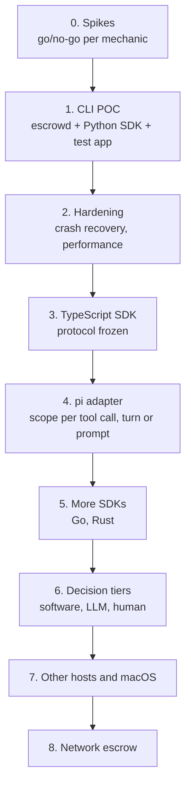
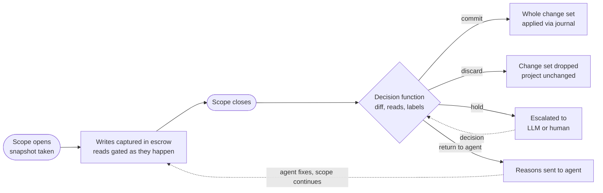

# Escrowed I/O for LLM Agent Tool Calls — Design Notes

Oct 3, 2026 · @André Bremer

## Summary

The goal is to enforce code policies and standards on every LLM request, not at Git commit time. Hooks on the Write tool already do this, but they miss mutations made through bash, heredocs or Python scripts.

The fix is to stop watching tools and start watching the filesystem. The developer wraps work in a scope, the atomic boundary: every write inside it is captured by a FUSE layer and held in escrow until the scope closes and one decision commits or discards the whole change set. Reads are escrowed in the opposite direction: their data is held until the gate releases it to the caller, decided one read at a time because the caller is waiting. Code inside a scope sees a normal machine and never knows its writes are pending.

The plan starts small (a scope gate proved by a CLI test app) and grows into decision models, an audit log, SDKs in more languages, host adapters and network escrow.

## Core concepts

- **Scope = atomic boundary.** The developer defines the unit of work: a tool call, a turn or a whole request. Every side effect inside it is decided together, once.
- **Escrow.** Side effects are staged, not committed. A write returns success, and reading it back shows the new data, but nothing reaches the real filesystem (or network) until an auditor releases it. Copy-on-write for reality. Escrow runs both ways: writes are held on the way out until the scope's decision; reads are held on the way in until the gate releases their data to the caller. A blocked caller can't wait for the scope to close, so each read is decided when it happens.
- **Transparency.** The calling system, and the LLM, cannot tell the data is in escrow. It behaves like a normal virtual machine.
- **No special cases.** A Write tool call, a bash redirect, a Python heredoc and a `git commit` are all just mutations. All of them go into escrow.
- **Transitivity (deferred).** With flat scopes, no scope builds on another's uncommitted changes, so there is nothing to release in order. It returns if nested scopes do.
- **Priorities.** File I/O first, then network I/O. Together they cover most real side effects and both can be intercepted cleanly.

## Prior art

The mechanisms are well established; the application is where the value lies. Closest work found:

| Project | What it does | Relevance |
| --- | --- | --- |
| [AgentFS](https://github.com/tursodatabase/agentfs) (Turso, MIT, beta) | SQLite-backed filesystem with a FUSE copy-on-write overlay over a host directory; `agentfs run` adds user and mount namespaces; SDKs in TypeScript, Python, Rust and Go are explicit file APIs | Closest mechanism, but all-or-nothing: one overlay per session, `diff` only, no way to apply changes back, no scopes, snapshots or read gating |
| [BranchFS](https://arxiv.org/html/2602.08199v1) (Fork, Explore, Commit) | FUSE branches with per-file copy-on-write, mount namespaces, atomic commit where the first branch to commit wins | Closest to concurrent scopes with commit-time conflicts; no read tracking, no SDK |
| [Atomix](https://arxiv.org/html/2602.14849) | Records reads and effects per transaction, seals it when complete, commits only when no earlier conflicting work can arrive. Buffers bufferable effects; gates irreversible ones. | Closest to release ordering for network effects. |
| [Cordon](https://arxiv.org/html/2606.17573v1) | Shadow filesystem: staged file contents plus a JSON manifest per turn mapping paths to staged files or delete tombstones; explicit commit and abort. | Closest to buffered file writeback. |
| [Commit-Time Authorization](https://arxiv.org/html/2607.10487) | Checks that the authority behind an effect is still valid when it becomes durable | Informs what a decision function must re-check at commit |
| [Fault-Tolerant Sandboxing](https://arxiv.org/html/2512.12806) | Policy-based interception layer plus transactional filesystem snapshots for coding agents. | Same goal, snapshot-based rather than overlay-based. |
| [LayerFS](https://github.com/luojiyin1987/layerfs) | Disposable FUSE workspace per tool call with checkpoints; developer preview | Per-call workspaces; Rust only, needs CAP\_SYS\_ADMIN |
| [DeltaBox](https://arxiv.org/html/2605.22781v1) | Millisecond sandbox checkpoint and rollback; routes LLM API traffic through a separate proxy process. | Useful for checkpointing and network separation. |

**What is novel here.** The capture mechanism (a FUSE copy-on-write layer in Linux namespaces) is established. What none of these combine: a developer-defined scope as the atomic boundary with a decision function; transparent capture of ordinary in-process IO, attributed across concurrent async tasks by path tagging; one daemon behind SDKs in several languages; and reads allowed or denied as they happen.

## How Claude Code's sandbox works

Claude Code uses OS-level isolation for its Bash tool: bubblewrap on Linux, Seatbelt (`sandbox-exec`) on macOS ([docs](https://code.claude.com/docs/en/sandboxing), [engineering post](https://www.anthropic.com/engineering/claude-code-sandboxing)).

- **Filesystem.** Read broadly, write only inside the working directory. Writes elsewhere fail at the syscall level with `Operation not permitted`.
- **Network.** Traffic goes through a local proxy (relayed with `socat`) that checks a domain allowlist and returns 403 for denied domains. Tools that ignore proxy settings hit a kernel-level backstop that blocks non-loopback traffic.

**Lesson.** Even Anthropic pairs proxy interception with kernel enforcement, because arbitrary bash slips past a userspace library alone.

**Weakness for this use case.** The policy is static: you decide up front what is allowed, and the boundary is about *where* a write goes, not *what* it does. A Python heredoc writing inside the working directory is always allowed, whatever it writes. Escrow judges the actual staged effect instead of predicting it.

## Roadmap



Every phase reuses escrowd and the scope model from phase 1; later phases add languages, decision tiers, hosts and network capture. Exit criteria are under Implementation phases.

## Scopes: the atomic boundary

A scope is the one primitive: every write inside it is captured, and when it closes, one decision applies to the whole change set at once. The developer decides what a scope covers: one tool call, one turn or a whole request. Nothing fails at write time; the point is to gather all changes, then decide the next step atomically.



Everything between open and close is captured; the single decision at close picks one of four outcomes for the whole change set.

- **One view per scope.** Concurrent tasks in a scope share an ordinary filesystem view, last write wins. Operations can carry labels (call ID, process) for the ledger and the decision; labels change nothing.
- **Snapshot at open.** A scope sees the project as it was when it opened, plus its own writes, and nothing from scopes that haven't committed.
- **One decision on close.** The decision function gets the change set (diff, reads, labels) and returns commit, discard, hold (LLM or human escalation) or return to agent (with reasons, so the agent can fix it and the scope continues).
- **Atomic commit.** Commit applies the whole change set to disk through a journal (record, apply, recover after a crash), so the project gets all of it or none.
- **Conflicts at commit.** Concurrent scopes are independent transactions. If anything a scope wrote has changed on disk since its snapshot, the conflict policy applies; the default is discard.
- **Reads are escrowed inbound.** Their data is held until the gate releases it; the caller is blocked, so each read is decided when it happens rather than at close, and logged for the decision.

IO outside any scope is the developer's choice, set once at `escrow.init(unscoped=…)`:

| Mode | IO outside a scope | Fits |
| --- | --- | --- |
| `passthrough` | Real IO, not captured; optionally logged as unscoped | Hosts that only care about the work they wrap |
| `implicit` | Captured in a default scope, decided at exit or by `escrow.settle_unscoped()` | Setups where nothing may escape |
| `deny` | Writes fail with EROFS; reads pass | Strict hosts that want a missing boundary to fail loudly |

Nested scopes, and the transitive release they would need, are deferred.

## Architecture

A local daemon owns capture and isolation; the SDK in each language only marks scopes and talks to it. The host app never calls bwrap.

- **escrowd** (Rust or Go) owns the FUSE capture layer, the scopes, the journal, the gate and the ledger.
- **Launcher.** The app starts under it: `escrow run --project ./proj -- python app.py`. The SDK's `init()` can re-exec the program under it automatically.
- **SDK.** Talks to the daemon over a Unix socket (path in an environment variable) with a small protocol: `open_scope`, `close_scope` (returns the change set and decision), `spawn`, `settle_unscoped`. JSON-RPC or gRPC from one schema keeps each language's SDK to a few hundred lines.

**Capture is FUSE, not overlayfs.** One running process can't switch its overlay upper per scope; a FUSE filesystem sees every open, read, write, rename and delete and can route each to the right scope, and gate reads synchronously.

**Attribution by path.** Async hosts run concurrent scopes on one thread, and Node runs file IO on a shared pool, so thread IDs can't tell scopes apart. The path is the only tag that reaches the filesystem with every operation:

1. **A virtual root per scope.** The daemon serves `/escrow/<scope-id>/` as the scope's snapshot plus its writes.
2. **In-process IO.** The SDK keeps the current scope in the language's async context (`contextvars` in Python, `AsyncLocalStorage` in Node, task-locals in Rust) and wraps the file API to rewrite `$PROJECT/x` to `/escrow/<scope>/x`. Go gets an explicit `scope.FS()` and `scope.Command()`.
3. **Subprocesses.** The SDK's wrapped `subprocess` / `child_process` asks the daemon to start the child in bwrap with the scope's view mounted over `$PROJECT`, so bash, heredocs, absolute paths and grandchildren see ordinary paths.
4. **Children started without the SDK** inherit the launcher's default mount, which follows the `unscoped` mode.

## Isolation

FUSE captures project IO; bwrap contains everything else, so nothing reaches the project except through capture.

- **Only one way to the project.** The FUSE view is mounted over `$PROJECT`; the real directory is never mounted in the sandbox.
- **No uncaptured writes elsewhere.** The rest of the filesystem is read-only, with tmpfs for `/tmp` and home, or those routed through FUSE too if they matter.
- **Network.** `--unshare-net`, with the daemon's proxy socket as the only way out.
- **Lifetime.** `--unshare-pid --die-with-parent`; a scope's processes stop when it closes.
- **Tamper resistance.** The daemon, journal and ledger live outside the sandbox. The app gets only the RPC socket, no `/dev/fuse`, and nested user namespaces are disabled so it can't remount.
- **Platform.** Linux first; macOS would need macFUSE or FSKit for capture and Seatbelt for containment.

## Host developer experience

The host picks an `unscoped` mode, wraps work in scopes and supplies decision functions; code inside a scope is ordinary IO. Names below are a sketch.

```python
# run with:  escrow run --project ./proj -- python app.py
import asyncio, subprocess
from pathlib import Path
import escrow

escrow.init(project="./proj", unscoped="deny", policy="./escrow.policy.yaml")
PROJECT = Path("./proj").resolve()

async def gate(changes):
    if any(p.endswith(".env") for p in changes.paths):
        return escrow.discard("touches secrets")
    return escrow.commit()

async def write_docs():
    (PROJECT / "README.md").write_text("# Demo\n")
    return (PROJECT / "README.md").read_text()          # sees its own staged write

async def build():
    (PROJECT / "config.json").write_text('{"debug": true}')
    subprocess.run(["bash", "-c", "echo built > build.log"], cwd=PROJECT, check=True)

async def main():
    async def scoped(name, fn):
        async with escrow.scope(name, decide=gate) as s:
            await fn()
        return s.outcome

    a, b = await asyncio.gather(scoped("docs", write_docs), scoped("build", build))
    print(a.status, a.paths)   # committed ['README.md']
    print(b.status, b.paths)   # committed ['build.log', 'config.json']

asyncio.run(main())
```

| The developer does | They get |
| --- | --- |
| Closes a scope | `s.outcome`: status, diff, reads, labels and the decision's reasons |
| Writes outside a scope in `deny` mode | `EscrowUnscopedError` pointing at the code that needs a scope |
| Reuses a file handle after its scope closed | `EscrowStaleHandleError` |
| Reads a path the policy denies | `PermissionError` (EACCES), logged with the scope |
| Wants to inspect | `escrow log <scope>`, `escrow diff <scope>`, `escrow replay <scope>` to rerun a decision |

Policy files hold software rules that run in the daemon, identical across languages; decision functions in the host language add LLM or human judgement, and the change set waits in escrow while they run. Adapters for existing harnesses (pi, LangGraph) come later and open scopes from the harness's lifecycle hooks.

## Risks and leaks

| Risk | Fix |
| --- | --- |
| Returned paths (`realpath`, `__file__`, error messages) show `/escrow/<scope>/…` | The SDK maps them back to the project path |
| A handle opened in one scope and written after it closed | The tag is fixed at open; the daemon refuses writes on handles of closed scopes |
| Symlinks to absolute project paths | The daemon resolves them inside the scope's view |
| Native code or `mmap` doing its own IO | Falls to the `unscoped` mode; run that work in a subprocess for full capture |
| Long-lived processes outliving a scope (dev server, watcher) | Stopped when the scope closes; give them their own scope if they must run longer |
| Shared state outside the project (`~/.cache`, `.git/index.lock`, ports) | Route those paths through FUSE too, and a network namespace per scope |
| FUSE overhead on every operation | Unprivileged cache flags (writeback cache, async read, parallel dirops) by default; kernel FUSE passthrough (Linux 6.9+) needs `CAP_SYS_ADMIN`, so only through a root helper if needed; measure in phase 0 |
| Network effects outside capture | `--unshare-net` per scope, or a proxy that tags connections with the scope ID |
| FUSE writeback cache holds writes past the end of a scope | fsync every open handle of the scope before its decision runs; `syncfs` alone is not a barrier on plain FUSE (spike 0.4) |
| Inode numbers change on copy-up, confusing git, editors and build tools | Keep an origin-inode table so a file keeps its inode number after copy-up |
| Reads of a live base see other scopes' commits mid-scope | Snapshot at open (reflink or btrfs), or record each file's version on first read and check it at commit |

## Recommendations

Build escrowd's own capture layer rather than adopting [AgentFS](https://github.com/tursodatabase/agentfs) as a platform; its design is all-or-nothing, and the scope, decision and atomic commit that make escrowd useful would all still have to be built. At most, embed its Rust overlay library as the per-scope store for staged changes, behind an interface we own, if the phase 0 spike shows it saves real work.

| Taking AgentFS as the base |  |
| --- | --- |
| **For** | A working FUSE overlay (whiteouts, copy-up, stable inodes) and namespace setup, MIT licensed; a crash-safe SQLite store where `diff` is a query; SDKs and CLI in four languages; a macOS route over NFS without a kernel extension |
| **Against** | No apply back to the project, so no decision or atomic commit; one overlay per session behind its own CLI instead of one daemon routing many scopes; SDKs are explicit file APIs, not transparent capture; reads go to the live base, so no snapshot at open; no read gating, policies or network containment; depends on Turso's beta engine, with schema migrations and `synchronous=OFF` |

Lessons to adopt from AgentFS's code:

1. **Pre-open the base before mounting.** Open handles to the project before mounting the FUSE view over `$PROJECT`, so reads of the base never loop back into our own mount.
2. **Stable inode numbers.** Map original inodes to copied-up ones so git, editors and build tools don't see files change identity.
3. **Whole-file copy-up** on first write for the POC; block-level copy-up later, only for large files.
4. **Flush before deciding.** If the FUSE writeback cache is on for speed, flush every handle of a scope before its decision runs.
5. **One SQLite file per scope** for staged changes: easy diffs, crash-safe, one file to discard. Our own journal still applies commits to the project.
6. **Real snapshots.** AgentFS has none; take a reflink or btrfs snapshot at open, or record each file's version on first read and check it at commit.
7. **macOS through a local NFS server** before macFUSE.
8. **ptrace path rewriting** (AgentFS's experimental reverie mode) as a slow fallback for native code that bypasses the SDK; never the default.
9. **Same isolation recipe, done with bwrap.** AgentFS hand-rolls user and mount namespaces and has no network isolation; we use bwrap and add `--unshare-net`.

## Implementation phases

Phase 1, a CLI test app proving the scope model on Linux, is the first deliverable; everything before it de-risks it, everything after it builds on escrowd unchanged.

| Phase | Measurable goal | Work |
| --- | --- | --- |
| 0. Spikes | A written go/no-go per mechanic, each backed by a run on the target kernel: FUSE over `$PROJECT` works unprivileged in bwrap; inode numbers survive copy-up; overhead measured against native on a clone, build and test run; AgentFS embed decided | FUSE view mounted over `$PROJECT` inside bwrap with pre-opened base handles; overhead benchmark; AgentFS overlay library embedded or rejected |
| 1. CLI POC | All seven exit tests pass in CI on Linux in 10 consecutive runs, with zero misattributed operations in the ledger | escrowd, a minimal Python SDK and a CLI test app doing regular IO; the exit tests become the shared conformance suite |
| 2. Hardening | Zero partial commits across 1,000 runs killed at random points mid-commit; a real repo's test suite runs under escrowd within 1.5× of native wall time | Crash recovery; stale-handle and unscoped-mode errors; writeback flush; snapshot at open; performance work |
| 3. TypeScript SDK | The conformance suite, ported to TypeScript, passes against the same daemon with no daemon changes | Protocol schema frozen; TypeScript SDK with scopes in `AsyncLocalStorage` and wrapped `fs` / `child_process`; `escrow log`, `diff`, `replay` |
| 4. pi adapter | pi completes 10 scripted coding tasks end to end with zero unscoped writes in the ledger, and in each task with a seeded violation the agent receives the denial and fixes it within the same prompt | A [pi](https://pi.dev) extension opens a scope per tool call, turn or prompt (configurable) from pi's lifecycle events; built-in bash, read, write and edit run inside it, captured by the TypeScript SDK without reimplementation; decisions return as tool results; parallel tool execution supported |
| 5. More SDKs | Go and Rust SDKs pass the conformance suite unchanged | Go explicit API (`scope.FS()`, `scope.Command()`); Rust; others by demand |
| 6. Decision tiers | On a labelled set of 100 change sets, software rules catch every violation a rule covers, the LLM tier's precision and recall are reported, and a held change set never blocks the agent | Hold and escalate; change sets wait in escrow during review; the LLM auditor isolated from the acting agent |
| 7. Other hosts and macOS | The conformance suite passes on macOS, and a second harness completes the phase 4 tasks with the same results as pi | Further harness adapters (LangGraph and others); macOS through NFS and Seatbelt |
| 8. Network escrow | Zero outbound requests leave before their scope commits, and a discarded scope sends nothing, verified from proxy logs across the conformance suite | Proxy per scope; sends held until commit; non-deferrable calls flagged |

The thresholds (10 runs, 1,000 crash runs, 1.5×, 10 tasks, 100 change sets) are proposed starting targets, to confirm after phase 0 measurements.

Phase 1 exit tests:

1. Writes, reads, renames and deletes inside a scope leave the real project unchanged until the scope commits.
2. A write by a subprocess (`bash -c "echo x > f"`) is captured in the scope that started it.
3. Two concurrent async scopes on one thread, each writing a file and running `bash -c` to write another, land all four writes in the right scopes.
4. A discard leaves the project exactly as it was; a commit applies every change or none.
5. Two scopes writing the same path: the second to commit hits the conflict policy.
6. A denied read (`.env`) fails with EACCES and appears in the ledger.
7. Each `unscoped` mode behaves as specified.

## Decision models

Route each staged effect to the cheapest layer that can clear it. All three share one interface: a scope's change set in, commit / discard / hold / return to agent plus reasons out.

1. **Software.** Deterministic policies and linters. Fast and free; clears the obvious cases.
2. **LLM.** Judgement calls that need semantics: does this change fit the task and the standards?
3. **Human.** High-stakes or ambiguous effects, irreversible sends, and anything the LLM flags but cannot resolve.

Because effects wait in escrow, a slow human review delays commit without blocking the agent.

**Isolate the LLM auditor** from the acting agent: separate context and instructions, so a prompt injection that fools one does not fool both.

## Open questions and next steps

- [ ] Product or open framework? Undecided.
- [ ] Journal: where it lives, and how recovery replays a half-applied commit.
- [ ] Should conflict detection at commit cover the scope's reads as well as its writes?
- [ ] Network: how to buffer sends that expect a live response; which calls are safe to defer?
- [ ] Non-deferrable effects (wall-clock time, external APIs with their own side effects): how to flag or gate them?
- [ ] FUSE cost per operation, with and without passthrough, on the POC workload.
- [ ] Verify unprivileged FUSE in user namespaces, kernel and bwrap versions on the target hosts.
- [ ] Daemon language (Rust or Go) and protocol (JSON-RPC or gRPC).
- [ ] Nested scopes and transitive release: when, if ever.
- [ ] Build the POC: escrowd, the Python SDK and the CLI test app.
- [ ] Embed AgentFS's Rust overlay library as the per-scope store, or write our own? Decide in phase 0.
- [ ] Snapshot at open: reflink or btrfs snapshot, or a per-file version check at commit?
