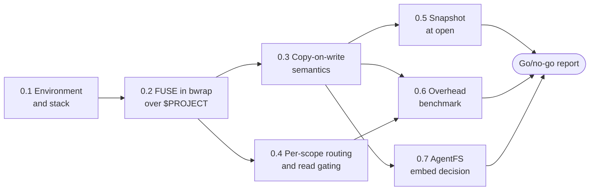

# Phase 0: Spikes Plan

Oct 3, 2026 · Andre Bremer · Draft

Phase 0 ends with a written go/no-go for each risky mechanic in the [escrowd proposal](escrowd-proposal.md), each backed by a run on the target kernel. Phase 1 (CLI POC) starts only when every sub-phase below reads "go", or has a recorded fallback.

## Exit criteria (from the proposal)

- FUSE over `$PROJECT` works unprivileged inside bwrap.
- Inode numbers survive copy-up.
- Overhead is measured against native on a clone, build and test run.
- AgentFS embed is decided.

Sub-phases 0.4 and 0.5 add two checks the proposal lists as risks but not as phase 0 exits: per-scope routing with read gating, and snapshot at open. Both carry phase 1 exit tests (3, 5 and 6), so they are proved here first.

## Sub-phases



0.4 runs in parallel with 0.3; 0.5, 0.6 and 0.7 run in parallel once 0.3 is done.

| # | Sub-phase | Goal (go when…) | Output |
| --- | --- | --- | --- |
| 0.1 | Environment and stack | Supported Linux distributions listed with kernel, bwrap, libfuse, user-namespace policy and filesystem; protocol chosen or deferred | Host matrix; stack decision note |
| 0.2 | FUSE in bwrap over `$PROJECT` | A mirroring FUSE view, mounted by the daemon through `fusermount3` without root, is bind-mounted over `$PROJECT` inside bwrap; bash, git and python inside see ordinary paths; the daemon never touches the view path (it would deadlock) and reads the base through pre-opened handles; a daemon restart is detected (the sandbox's bind turns stale and returns ENOTCONN) | Spike binary; run log |
| 0.3 | Copy-on-write semantics | Write, rename, delete (whiteout) and mkdir inside the view leave the real project byte-identical; `stat` inode numbers stay stable across copy-up; `git status` and an editor save behave as on native | Spike binary; test script |
| 0.4 | Per-scope routing and read gating | Two virtual roots `/escrow/<a>/` and `/escrow/<b>/` stage writes separately; two concurrent asyncio tasks on one thread, via a Python `contextvars` path-rewrite shim, land every write in the right scope; a denied read returns EACCES synchronously and is logged; with the writeback cache on, a flush delivers every dirty page before a close | Spike binary; Python shim; test script |
| 0.5 | Snapshot at open | A scope opened before another scope's commit does not see that commit; mechanism chosen: reflink (XFS, btrfs), btrfs subvolume snapshot, or per-file version check at commit | Decision note with timings per mechanism |
| 0.6 | Overhead benchmark | Wall time for `git clone`, `npm ci` and `npm test` of express `v5.2.1` measured native, plain FUSE with the cache flags below, and (optionally) FUSE with kernel passthrough through a privileged helper; plain FUSE compared with the proposal's 1.5× target for phase 2 | Benchmark script; results table |
| 0.7 | AgentFS embed decision | `agentfs_sdk::OverlayFS` (crate `agentfs-sdk`), wrapped in our own fuser adapter, either passes 0.3's test script behind our store interface, or is rejected with reasons | Decision note |

### Kernel passthrough needs privilege

FUSE passthrough (Linux 6.9+) lets reads and writes after open skip the daemon. The kernel allows it only for a server holding `CAP_SYS_ADMIN` in the initial user namespace; the check is in `fuse_backing_open()` and still stands on current kernels ([backing.c](https://raw.githubusercontent.com/torvalds/linux/master/fs/fuse/backing.c)). An unprivileged daemon cannot use it. AgentFS does not use it either: every read and write goes through its daemon, and it cuts round trips with init flags that need no privilege (`cli/src/fuse.rs`, commit `0a014eb`).

Plain FUSE with those flags is the default design and the configuration 0.6 judges:

| Init flag | Effect |
| --- | --- |
| `FUSE_WRITEBACK_CACHE` | Kernel buffers writes and flushes later; 0.4's flush-before-decision check covers it |
| `FUSE_ASYNC_READ` | Parallel reads |
| `FUSE_PARALLEL_DIROPS` | Concurrent lookup and readdir in one directory |
| `FUSE_CACHE_SYMLINKS` | Cached readlink |
| `FUSE_NO_OPENDIR_SUPPORT` | No opendir/releasedir round trips |

Passthrough is a fallback only if plain FUSE misses the 1.5× target: the daemon passes its `/dev/fuse` fd over `SCM_RIGHTS` to a small root helper that issues the ioctl, at the cost of a root component at install time. The proposal's risk table (`escrowd-proposal.md`, FUSE overhead row) needs this caveat.

### AgentFS embedding

The overlay is a library type, `agentfs_sdk::OverlayFS`, in [`agentfs-sdk`](https://github.com/tursodatabase/agentfs) 0.6.4 on crates.io (MIT, beta). It joins a read-only base with a SQLite-backed delta, and keeps whiteouts and a copy-up inode origin table. Its FUSE and NFS front ends live only in the CLI crate, on a vendored copy of `fuser`. Embedding it means writing our own FUSE adapter over its `FileSystem` trait. Overlay inode numbers come from an in-memory counter, so stability across remounts is untested; 0.3's script checks it.

## Code layout

Spike code lives in this repo under `spikes/`, one Cargo workspace member per sub-phase. It is throwaway: phase 1 rewrites what passes into `escrowd`, so nothing outside `spikes/` depends on it.

```
spikes/
├── Cargo.toml          # workspace
├── 02-fuse-bwrap/
├── 03-cow/
├── 04-routing/         # + python/ for the contextvars shim
├── 05-snapshot/
├── 06-bench/
├── 07-agentfs/
└── results/            # run logs and benchmark tables cited by the go/no-go report
```

The FUSE crate is [`fuser`](https://github.com/cberner/fuser) 0.18.0 (July 2026, maintained). It supports passthrough (`BackingId`, `opened_passthrough`) and the writeback cache flag.

## Hosts

| Role | Host | Phase 0 use |
| --- | --- | --- |
| Dev | WSL2 (below) | Writing and first runs of every spike |
| Target 1 | General Linux distributions | Every go/no-go must hold on native Linux, not only on WSL2 |
| Target 2 | macOS | Out of phase 0 runs; capture and containment come in phase 7. Phase 0 records any choice that would block macOS |

General Linux widens 0.1: the host matrix covers the distributions users run, not one kernel. The minimum kernel is 6.9; older kernels are out of scope.

### Ubuntu user-namespace restriction

Ubuntu 24.04 and later set `kernel.apparmor_restrict_unprivileged_userns=1`. An unconfined process still creates a user namespace, but lands in the `unprivileged_userns` profile, which denies every capability, so bwrap cannot mount. Ubuntu 24.04 ships no profile for `/usr/bin/bwrap`; 25.04 and later enable `bwrap-userns-restrict`, which covers only `/usr/bin/bwrap`. Sources: [24.04 release notes](https://discourse.ubuntu.com/t/noble-numbat-release-notes/39890), [bwrap-userns-restrict](https://gitlab.com/apparmor/apparmor/-/raw/master/profiles/apparmor/profiles/extras/bwrap-userns-restrict).

Approach, so one install works on 24.04 LTS and later:

1. escrowd ships its own bwrap at a fixed path (for example `/usr/lib/escrowd/bwrap`) plus an AppArmor profile for that path allowing `userns`, `mount` and the capabilities bwrap needs. The package installs it once with root.
2. The profile runs everything bwrap execs under a child profile that denies every capability, as `unpriv_bwrap` does in `bwrap-userns-restrict`. A plain `flags=(unconfined) { userns, }` profile is not enough: AppArmor keeps an unconfined-mode profile across exec, so sandboxed processes would inherit the right to create capable namespaces and remount ([domain.c](https://raw.githubusercontent.com/torvalds/linux/master/security/apparmor/domain.c)).
3. Children may still create a user namespace, but it has no capabilities, so they cannot mount over the FUSE view. This meets the proposal's tamper-resistance goal.
4. Any user who can run `/usr/lib/escrowd/bwrap` gets the same permission; the profile must stay as narrow as bwrap's needs.
5. Never ask users to set the sysctl to 0: it removes the protection system-wide.
6. 0.2 verifies this on stock Ubuntu 24.04 and 25.10: with the profile, the bind mount works and a sandboxed `unshare -Urm mount` fails; without it, bwrap fails to mount.

## Current dev host (measured Oct 3, 2026)

| Item | Value | Effect on phase 0 |
| --- | --- | --- |
| Kernel | 6.18.33.2-microsoft-standard-WSL2 | Has FUSE passthrough; using it needs the root helper |
| User namespaces | `max_user_namespaces` = 257151 | Unprivileged bwrap is possible |
| bubblewrap | 0.9.0 | None |
| libfuse | fusermount3 3.14.0; `/dev/fuse` mode 0666 | None |
| Project filesystem | ext4 | No reflink; 0.5 needs an XFS or btrfs test volume, or the per-file version check |
| XFS and btrfs tools | xfsprogs 6.6.0, btrfs-progs 6.6.3 | Loopback images can be made; mounting them needs sudo once per boot |
| Toolchains | Rust (cargo 1.93.1) installed; Go not installed | Rust spikes need no setup |

## Open questions

- [x] Is WSL2 a target host? No: WSL2 is the dev host; targets are general Linux, then macOS.
- [x] Daemon language: Rust, decided Oct 3, 2026. It matches AgentFS for 0.7, and `fuser` covers passthrough and writeback cache.
- [ ] Which native Linux machines or VMs run the 0.1 matrix, and which distributions must pass? Ubuntu 24.04 and 25.10 at minimum.
- [ ] Is a root helper for FUSE passthrough acceptable? Only asked if plain FUSE misses the 1.5× target in 0.6.
- [ ] Protocol: gRPC over a Unix socket is recommended. grpc-go, grpcio, grpc-js and tonic all support Unix sockets, and one schema generates every SDK. JSON-RPC avoids protobuf but needs hand-rolled framing in Rust and Python.
- [x] Benchmark repo for 0.6: [express](https://github.com/expressjs/express) at tag `v5.2.1`, decided Oct 3, 2026. It has the heaviest small-file load of the candidates. Steps: `git clone`, `npm ci` (stands in for the build), `npm test`. The npm cache is pre-warmed so runs are offline. Dev host has Node 24.18.0 and npm 11.16.0.
- [x] XFS and btrfs tools installed Oct 3, 2026. 0.5 creates 2 GB loopback images of each outside the repo (`~/escrowd-volumes/`) and mounts them with sudo.
