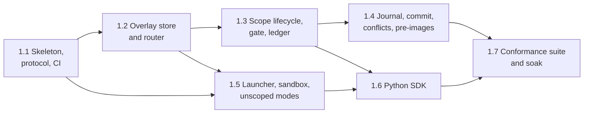

# Phase 1: CLI POC Plan

Oct 3, 2026 · Andre Bremer · Draft

**Status, Oct 3, 2026: 1.1 done** (12 / 12 checks on the dev host and in CI on `ubuntu-24.04` and `ubuntu-26.04`, [PR #1](https://github.com/rcrsr/escrowd/pull/1)). Next: 1.2.

Phase 1 delivers escrowd, a minimal Python SDK and a CLI test app. Together they prove the scope model from the [escrowd proposal](escrowd-proposal.md) on Linux. Phase 0 cleared every mechanic this phase relies on ([go/no-go report](../spikes/results/phase-0-report.md)). Phase 1 turns the spikes into product code and adds the parts phase 0 never built: the RPC socket, the journal, commit, conflicts, the launcher and unscoped modes.

## Exit criteria

From the proposal: **all seven exit tests pass in CI on Linux (`ubuntu-24.04` and `ubuntu-26.04` runners) in 10 consecutive runs, with zero misattributed operations in the ledger.** The tests become the shared conformance suite that phases 3 and 5 port to other SDKs.

1. Writes, reads, renames and deletes inside a scope leave the real project unchanged until the scope commits.
2. A write by a subprocess (`bash -c "echo x > f"`) is captured in the scope that started it.
3. Two concurrent async scopes on one thread each write a file and run `bash -c` to write another; all four writes land in the right scopes.
4. A discard leaves the project exactly as it was; a commit applies every change or none.
5. Two scopes write the same path: the second to commit hits the conflict policy.
6. A denied read (`.env`) fails with EACCES and appears in the ledger.
7. Each `unscoped` mode behaves as specified.

This plan adds two checks, as phase 0 added 0.4 and 0.5 (accepted Oct 3, 2026):

8. **Snapshot at open.** A scope opened before another scope commits keeps reading the base as it was when it opened. The 0.5 decision made the pre-image layer a phase 1 deliverable.
9. **Host matrix.** The suite passes once on each phase 0 Lima host (Ubuntu 24.04, Ubuntu 26.04, Debian 13, Fedora 44), since CI covers only Ubuntu.

"Zero misattributed operations" is checked mechanically. Every test operation writes a path and content tagged with its scope; the suite fails if any ledger entry names a scope that did not perform it.

## Scope shift from the proposal

The proposal lists stale-handle errors, unscoped-mode errors, writeback flush and snapshot at open under phase 2. Exit tests 4, 5 and 7 and check 8 need a minimal version of each now; phase 2 hardens them:

| Item | Phase 1 | Phase 2 |
| --- | --- | --- |
| Unscoped modes | All three modes work; `deny` surfaces raw EROFS | `EscrowUnscopedError` pointing at the caller |
| Flush before decision | fsync of the SDK's open files, then wait for the scope's sandboxes to exit | Same, measured under crash and load |
| Snapshot at open | Pre-image layer plus per-file version check | Optional btrfs subvolume fast path; performance |
| Stale handles | Daemon refuses writes on handles of closed scopes (EBADF) | `EscrowStaleHandleError` in each SDK |
| Crash recovery | Journal written and replayed on daemon start; tested by hand | 1,000 killed runs, zero partial commits |

## Sub-phases



1.5 starts once 1.2 is done and runs in parallel with 1.3 and 1.4.

| # | Sub-phase | Goal (done when…) | Exit tests |
| --- | --- | --- | --- |
| 1.1 | Skeleton, protocol and CI (**done**, Oct 3, 2026) | Workspace builds; the protocol schema exists; a Python client completes a `ping` round trip to the daemon over the Unix socket; CI on `ubuntu-24.04` and `ubuntu-26.04` installs escrowd's bwrap and AppArmor profile and runs an empty suite | None |
| 1.2 | Overlay store and router | One FUSE mount serves many scopes, created and dropped over RPC instead of `mkdir`; whiteouts, opaque directories and the per-scope version table persist in each scope's store; the 0.3 (14) and 0.4 (17) spike checks pass when ported to the new daemon | 1 (staging half) |
| 1.3 | Scope lifecycle, gate and ledger | `open_scope`, `close_scope` and `decide` work end to end: close flushes and returns the change set (diff, reads, labels); discard drops the store; read rules load from a policy file; every operation lands in the ledger with its scope | 1, 6 |
| 1.4 | Journal, commit, conflicts, pre-images | Commit applies the whole change set through the journal, or none of it if any step fails; a changed base file triggers the conflict policy (default discard); open scopes keep their snapshot through the pre-image layer; a fault injected at each apply step leaves the base byte-identical; the daemon rolls back an unfinished journal on start | 4, 5, 8 |
| 1.5 | Launcher, sandbox, unscoped modes | `escrow run --project P -- cmd` starts the daemon and runs `cmd` in bwrap with the unscoped view over `$PROJECT`; the spawn helper starts a scope's child in its own sandbox with ordinary `Popen` semantics; `passthrough`, `implicit` and `deny` behave as the proposal's table says | 2, 7 |
| 1.6 | Python SDK | `escrow.init`, `escrow.scope(...)` as an async context manager and decide callbacks work; scopes live in `contextvars`; wrapped `open`, `os.*`, `pathlib` and `subprocess` attribute IO by path; `s.outcome` reports status, paths and reasons | 3, 6 |
| 1.7 | Conformance suite and soak | The test app and the nine checks above run as one pytest suite; CI passes it 10 consecutive times; each Lima host passes it once | All |

## Design for each sub-phase

### 1.1 Skeleton, protocol and CI

Layout, all outside `spikes/` (which nothing may depend on):

```
Cargo.toml                 # root workspace; exclude = ["spikes"]
crates/escrowd/            # library + daemon: fuse, router, store, journal, gate, ledger, rpc
crates/escrow-cli/         # `escrow` binary: run, daemon, exec (spawn helper), log, diff
proto/escrow.proto         # the one protocol schema (gRPC)
packaging/ubuntu/          # bwrap copy + escrowd_bwrap AppArmor profile, from spike 0.2
sdk/python/                # uv project, package `escrow`
tests/conformance/         # pytest suite (exit tests 1–7, checks 8–9)
examples/test-app/         # CLI test app doing regular IO
```

The protocol is gRPC over the Unix socket (tonic in the daemon, grpcio in Python) and carries six calls: `ping`, `open_scope`, `close_scope` (flush, return the change set), `decide` (commit, discard or return to agent), `spawn` and `settle_unscoped`. The daemon socket path reaches children in `ESCROW_SOCKET`.

### 1.2 Overlay store and router

The store ports spike 0.4's router (itself built on 0.3's overlay), keeping every verified constraint: lower st_ino within a scope with the scope index + 1 in bits 48 and up, hard-link-safe inode table, pre-opened base fd, and the unprivileged init flags. New in phase 1:

- Each scope gets a directory under `$XDG_STATE_HOME/escrowd/<project-id>/scopes/<scope-id>/` holding its upper tree and a SQLite metadata store (rusqlite).
- The metadata store records whiteouts, opaque directories and the base version (inode, size, mtime, ctime) of each path the scope read or changed. The version table feeds the conflict check in 1.4.
- Upper-only inode numbers are allocated from a counter kept in the store, so they survive a daemon restart (a carried limit of the spikes).
- The base is reached through dirfd syscalls (`openat`, `fstatat`) instead of `/proc/self/fd/<fd>/<rel>` paths. Phase 0 named this a phase 2 speed fix; doing it now avoids porting the `/proc` code twice.

### 1.3 Scope lifecycle, gate and ledger

`close_scope` runs these steps in order:

1. The SDK fsyncs the scope's open files, then calls `close_scope` (`syncfs` is not a barrier on plain FUSE).
2. The daemon stops the scope's sandboxes and waits for them to exit; `close` on exit flushes their writes.
3. The daemon freezes the scope: it rejects new opens and writes until the decision.
4. The daemon builds the change set from the scope's store and ledger, then returns it.

`decide` then commits (1.4), discards (drop the store) or returns reasons to the caller and reopens the scope. Hold needs escalation and waits for phase 6. The read gate takes deny globs from a YAML policy file instead of the spike's hard-coded `.env` rule. Ledger lines keep the spike format (`scope=… op=… path=… decision=…`) in an append-only file next to the scope stores, readable by `escrow log`.

### 1.4 Journal, commit, conflicts, pre-images

Commits are serialized per project: one commit lock, so two scopes never pass the conflict check together. Commit order for one scope:

1. **Conflict check**: compare each recorded base version with the current base file; any mismatch applies the conflict policy (default: discard, with the paths as reasons).
2. **Journal**: write the intent (every path, its new content location and its pre-image) to the journal, then fsync it.
3. **Pre-images**: before each base file is overwritten or deleted, copy its old version into the base generation layer; a path the commit creates gets an absent marker. Earlier-opened scopes read through the generation, and rollback restores from it.
4. **Apply**: write each new file to a temporary name beside its target (recorded in the journal), fsync, then `rename` over the target; apply deletes and directory renames.
5. **Mark done**: record completion in the journal, then drop the scope's store.

If a step fails, the journal rolls the applied part back from the pre-images and removes leftover temporary files. On start, the daemon finds unfinished journals and rolls them back the same way. A generation is dropped once no open scope still reads through it.

The version check cannot stop an editor outside escrowd from writing a file between the check and the rename; phase 1 accepts that window.

### 1.5 Launcher, sandbox and unscoped modes

`escrow run` starts one daemon for its project and stops it on exit. The daemon mounts its FUSE view under `$XDG_RUNTIME_DIR/escrowd/` (Ubuntu 26.04 confines `fusermount3`). The app runs in bwrap with `--disable-userns`, `--unshare-pid` and `--die-with-parent`. On Ubuntu it uses escrowd's bwrap and AppArmor profile from spike 0.2.

The app's sandbox sees two bind mounts from the view:

| Mount inside the sandbox | Serves |
| --- | --- |
| `$PROJECT` | The unscoped root: real IO for `passthrough` (logged as unscoped), the default scope for `implicit` (decided at exit or by `settle_unscoped`), read-only (EROFS) for `deny` |
| `/escrow` | One directory per open scope, the targets of the SDK's path rewrite |

Subprocesses need a second sandbox per scope, but `--disable-userns` stops the app from running bwrap itself. The wrapped `Popen` therefore runs `escrow exec --scope <id> -- cmd` as the real child. `escrow exec` sends its stdin, stdout and stderr over `SCM_RIGHTS`, plus its cwd and environment, to the daemon. The daemon starts `cmd` in bwrap with the scope's view over `$PROJECT`. `escrow exec` relays signals and exits with the child's status; the daemon kills the child if `escrow exec` dies. Pipes, exit codes and `kill` keep working because the caller holds a real child process.

### 1.6 Python SDK

The SDK grows from spike 0.4's `escrow_shim.py`: the same `contextvars` scope, the same wrappers for `builtins.open`, `io.open`, `os.*` and pathlib, and `subprocess.Popen` rewritten to call `escrow exec`. New in phase 1:

- `escrow.init(project, unscoped, policy)` re-execs the program under `escrow run` when `ESCROW_SOCKET` is unset.
- `escrow.scope(name, decide=...)` opens the scope over RPC, runs the body, closes the scope and calls the decide callback with the change set.
- `s.outcome` reports status, paths, diff, reads and reasons.
- Paths returned by `os.path.realpath` and `os.getcwd` map back from `/escrow/<scope>/…` to the project path.

The SDK stays stdlib-only except for the protocol's client library, and targets the pinned Python (3.14.8).

### 1.7 Conformance suite and soak

`examples/test-app/` is a small CLI that does each exit test's IO with ordinary Python file and subprocess calls; the pytest suite drives it and checks the base, the change sets and the ledger. CI runs the suite 10 times in a row in one job on each of `ubuntu-24.04` and `ubuntu-26.04`; the job fails on the first failed run. Each Lima host runs it once with `limactl shell escrow-<host>` (after `vm.drop_caches=3`), and its log goes to `tests/conformance/results/`. Matrix VMs have no toolchain: they use the host's mise-installed uv and Python through the read-only home mount, as the 0.6 benchmark used Node, with the virtualenv under `/var/tmp`.

## Carried limits

Out of phase 1, by design:

- Whole-file copy-up; block-level copy-up only if large files demand it.
- Native code and `mmap` doing their own IO fall to the `unscoped` mode.
- No network capture (`--unshare-net` blocks the network; the proxy is phase 8).
- Nested scopes stay deferred.
- One daemon per `escrow run`; a long-lived per-user daemon waits until a harness needs one.

## Open questions

- [x] Protocol: gRPC over the Unix socket (tonic, grpcio), decided Oct 3, 2026. One schema generates every SDK in phases 3 and 5.
- [x] Per-scope metadata store: one SQLite file per scope (rusqlite), decided Oct 3, 2026 (proposal lesson 5: easy diffs, one file to discard, crash-safe for phase 2).
- [x] Checks 8 (snapshot at open) and 9 (Lima host matrix) join the phase 1 exit criteria, decided Oct 3, 2026.
- [x] Conflict check on reads: deferred, decided Oct 3, 2026. Phase 1 checks writes only and records each read's base version for a later decision.
- [x] GitHub Actions runner `ubuntu-26.04`: GA (x64 and arm64), checked Oct 3, 2026 ([runner-images](https://github.com/actions/runner-images)); CI runs on it and `ubuntu-24.04`. `ubuntu-latest` still means 24.04.
