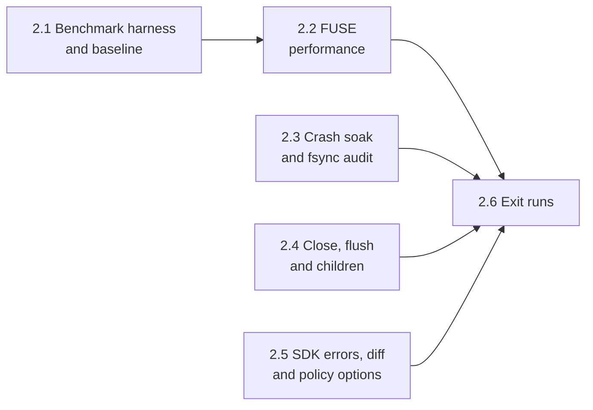

# Phase 2: Hardening Plan

Oct 4, 2026 · Andre Bremer · Draft

Phase 2 takes the phase 1 POC to something an agent harness can lean on: commits that survive a crash at any point, a real repository's test suite at near-native speed, and errors that tell the caller what went wrong. It changes no part of the scope model; phase 3 freezes the protocol on top of it, so protocol changes land here or not at all.

Phase 1 ended with all seven exit tests and checks 8 and 9 passing (121 checks, 10 consecutive CI runs per runner, four Lima hosts; [plan](phase-1-poc.md)). The [0.6 benchmark](../spikes/results/0.6-summary.md) measured the spike, not escrowd.

## Exit criteria

From the proposal: **zero partial commits across 1,000 runs killed at random points mid-commit; a real repo's test suite runs under escrowd within 1.5× of native wall time.**

This plan makes each one measurable and adds three checks:

1. **Crash soak.** 1,000 runs, each SIGKILLing the daemon at a random time inside a commit. After restart and recovery, the project's fingerprint equals either the pre-commit or the post-commit fingerprint in every run; 0 runs leave anything else.
2. **Real repo speed.** The test suites of two real repositories run under `escrow run`, inside a scope that commits, at ≤ 1.5× native wall time (median of 7 runs, benchmark VM): express `v5.2.1` (as 0.6) and `attrs`.
3. **Error surfaces.** The SDK raises `EscrowUnscopedError` for writes refused by the `deny` mode and `EscrowStaleHandleError` for writes on a handle of a closed scope. Both subclass the `OSError` the caller gets today, so existing `except OSError` code keeps working.
4. **No regression.** The phase 1 conformance suite still passes 10 consecutive times on each CI runner and once on each Lima host.
5. **Crash soak on the host matrix.** 100 runs of check 1 on each Lima host, since a kill lands differently on 9p, sshfs and local disks.

## Sub-phases

2.1, 2.3, 2.4 and 2.5 are independent; 2.2 needs 2.1's baseline.

| # | Sub-phase | Goal (done when…) | Checks |
| --- | --- | --- | --- |
| 2.1 | Benchmark harness and baseline | `bench/` runs both repositories natively and under `escrow run` (release build) in the benchmark VM and prints per-step medians; the baseline for escrowd is recorded | 2 (baseline) |
| 2.2 | FUSE performance | Both test suites ≤ 1.5× native; workload B (cold read of a tree already in the base) improves on its baseline by a measured amount | 2 |
| 2.3 | Crash soak and fsync audit | `tests/soak/crash.py` runs N random kills and reports 0 partial commits in 1,000 runs on the dev host; every rename and create on the commit path is followed by the directory fsync it needs | 1 |
| 2.4 | Close, flush and children | A closing scope sends SIGTERM, waits a grace period (2 s default), then SIGKILLs; flush before decision is measured under load (no write lost in 1,000 closes with a busy writer) | 4 |
| 2.5 | SDK errors, diff and policy options | `EscrowUnscopedError` and `EscrowStaleHandleError` raised as specified; the change set carries a content diff per modified text file, and `s.outcome.diff` exposes it; the policy sets the conflict policy (discard or return) and the read-conflict check; passthrough mode writes one ledger line at start | 3 |
| 2.6 | Exit runs | Checks 1–5 pass together; logs in `tests/soak/results/` and `bench/results/` | All |

## Design for each sub-phase

### 2.1 Benchmark harness and baseline

The 0.6 harness (`spikes/06-bench/`) moves to `bench/`, which may not depend on `spikes/`. Differences from 0.6:

- **escrowd, not the spike.** The FUSE modes become `escrow run --unscoped deny` with the workload inside one SDK scope (or `escrow exec --scope`) that commits at the end; commit time counts.
- **Release build.** Benchmarks run `target/release/escrow`; fault injection is compiled out there.
- **Shared state outside the project.** 0.6 found that pnpm needs a writable store and metadata cache. The policy gains `sandbox.write`: host paths bound writable and unescrowed (the pnpm store, `~/.cache/pnpm`). Writes there are outside escrow by design; the ledger records each such bind at scope open.
- **Workloads.** A (clone, install, test from an empty project) and B (status, read every file, test with the tree in the base), as 0.6, for express and `attrs` (offline install with `uv sync --frozen` from a prefilled uv cache, bound with `sandbox.write`).
- Runs in the `escrow-bench` VM (4 vCPUs, 4 GiB) and on the dev host; 7 runs, medians, per-step and total ratios against native.

### 2.2 FUSE performance

0.6 put the cost in cold lookups, opens and reads (5–30× per operation in any FUSE, bindfs included). Phase 1 already uses dirfd syscalls instead of `/proc` paths. In order, each measured against 2.1's baseline before the next:

1. **Locks.** `Views` holds one `Mutex<Tables>` for the inode table and open files of every scope, and each scope's store (whiteouts, opaque directories, versions) sits behind one `Mutex`, taken on every lookup. Shard the tables and make the store's read-mostly sets read-locked, so `--threads` helps.
2. **READDIRPLUS**, so a listing returns attributes and saves a lookup per entry.
3. **Cache lifetimes.** Longer entry and attribute timeouts for base entries, invalidated by commit (the kernel notifier added in 1.5); `FOPEN_KEEP_CACHE` for files whose version has not changed.

Kernel passthrough stays a root-helper fallback, out of scope: it removes data-path cost but not lookup and open round trips.

### 2.3 Crash soak and fsync audit

Phase 1 tested recovery with fault points (5 steps, error and abort modes). Phase 2 kills at random times:

- `tests/soak/crash.py N`: seed a project with a change set large enough that the commit takes ≥ 200 ms (thousands of files, nested directories, renames, deletes, mode changes), start `escrow daemon`, commit, SIGKILL at a uniform random delay within the measured commit duration, restart, wait for recovery, compare the fingerprint with the pre and post fingerprints. Any third state fails the run and keeps its directory.
- **fsync audit.** Review every step on the commit path: the journal row before the pre-image, the pre-image before the apply, the temp file before its rename, and the parent directory after each rename, create and unlink. Kill-based tests cannot catch a missing directory fsync (the page cache survives a process kill); this review can.
- CI runs 50 iterations per PR that touches `crates/escrowd/src/{commit,journal,snapshot}.rs` (a `soak` paths filter; CI stays PR-only). 1,000 run on the dev host by hand at the end of 2.3 and in 2.6; 100 per Lima host (check 5).

### 2.4 Close, flush and children

- **Grace period.** Close sends SIGTERM to the scope's children, waits (default 2 s, set in the policy), then SIGKILLs. Writes made during the grace period land in the change set.
- **Flush under load.** A writer appends continuously while the scope closes; every byte written before close returns must be in the change set, across 1,000 closes.
- **Close timing.** Report close latency at the 50th and 99th percentiles with 0, 1 and 10 running children.

### 2.5 SDK errors, diff and policy options

- **`EscrowUnscopedError(PermissionError)`**: the SDK's wrappers catch EROFS on a project path outside any scope in `deny` mode and re-raise with the path and the advice to open a scope. Native code still sees the raw EROFS.
- **`EscrowStaleHandleError(OSError)`**: EBADF from a write on a file the SDK opened in a scope that has since closed. The SDK tracks each file's scope already (`Scope._files`).
- **Change set diff**: phase 1 deferred it because a closed scope refuses new opens. The daemon computes a unified diff per modified text file at close (size cap, binary files flagged) and returns it in the change set; this is a protocol change, so it lands before phase 3 freezes the schema. `s.outcome.diff` exposes it; `escrow log` prints it.
- **Conflict policy**: `conflict: discard` (default) or `return`. Return keeps the scope and sends the conflicting paths back as reasons (outcome status `conflict`, verdict return), so the agent can redo the work in a new scope. Rebase stays out.
- **Read conflicts**: `conflict.reads: true` (default false) also fails the commit when a file the scope only read changed in the base since the scope read it; phase 1 already records those versions.
- **Passthrough in the ledger**: one `op=passthrough` line at start, so the ledger shows IO went unescrowed; the IO itself stays unlogged (logging it would route it through FUSE).

### 2.6 Exit runs

Checks 1 to 5 run on the final commit; logs go to `tests/soak/results/` and `bench/results/`, and the status line gets the PR link.

## Carried limits

Out of phase 2, by design:

- Whole-file copy-up; block-level copy-up only if a workload in 2.1 shows large-file cost.
- No power-loss testing: process kills only (the fsync audit covers what kills cannot).
- Native code and `mmap` doing their own IO still fall to the `unscoped` mode.
- No network capture (phase 8); nested scopes stay deferred.
- One daemon per `escrow run`.

## Open questions

- [x] Python repository for check 2: `attrs`, decided Oct 4, 2026 (pure Python, offline install with `uv sync --frozen`; `requests` needs a local httpbin).
- [x] Conflict check on reads: a policy option, off by default, decided Oct 4, 2026 (on by default would reject scopes that never wrote the changed file). Built in 2.5.
- [x] Conflict policy: discard (default) or return to agent, decided Oct 4, 2026; rebase stays out of phase 2. Built in 2.5.
- [x] btrfs snapshot fast path: dropped, decided Oct 4, 2026. Scope open records one generation number; pre-images cost at commit, which a snapshot at open would not save.
- [x] Passthrough in the ledger: one line at start, IO unlogged, decided Oct 4, 2026. Built in 2.5.
- [x] Crash soak in CI: 50 runs on PRs touching the commit path, decided Oct 4, 2026; 1,000 and the Lima runs by hand.
- [x] Grace period before SIGKILL at close: 2 s, set in the policy, decided Oct 4, 2026.
- [x] Package stores: `sandbox.write`, writable unescrowed binds logged at scope open, decided Oct 4, 2026.
