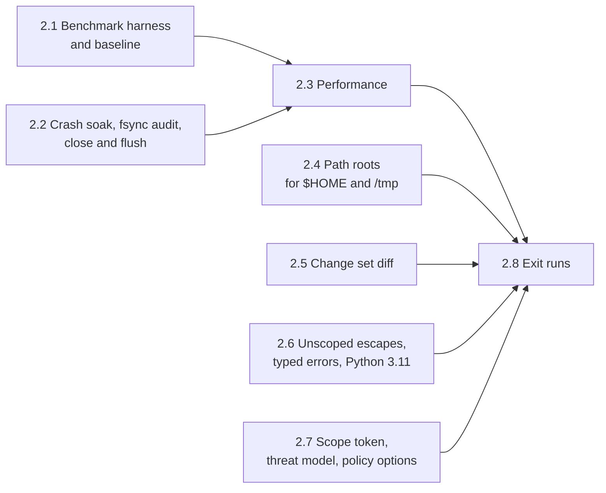

# Phase 2: Hardening Plan

Oct 4, 2026 · Andre Bremer · Draft

**Status, Oct 4, 2026: 2.1 done**: baseline for workloads A, B and C on the dev host and the benchmark VM at `564c36f`; suite 126 / 126 in CI on both runners ([PR #17](https://github.com/rcrsr/escrowd/pull/17)). **2.2 done**, Oct 4, 2026: 1,000 crash runs with 0 partial commits and 1,000 closes under load with 0 lost writes on the dev host; suite 132 / 132 and 50 crash runs with 0 partial in CI on both runners ([PR #18](https://github.com/rcrsr/escrowd/pull/18)). **2.3 done**, Oct 5, 2026: in the benchmark VM every A and B workload's wall is ≤ 1.5× native (express A and B 1.46×, attrs 1.09× and 1.07×; express A was 13.32×) and workload C warm is under native in sum (`rg` 3.55×, kept); 1,000 crash runs with 0 partial and 1,000 closes with 0 lost on the dev host; suite 138 / 138 in CI on both runners ([PR #19](https://github.com/rcrsr/escrowd/pull/19)). **2.4 built**, Oct 5, 2026: `roots:` serves `$HOME` and `/tmp` through per-scope views with capture, ephemeral, passthrough and deny rules; one generation commits every root; suite 157 / 157 on the dev host, 50 crash runs with 0 partial; **done** with CI passing on both runners ([PR #20](https://github.com/rcrsr/escrowd/pull/20)). **2.5 built**, Oct 5, 2026: `ChangeSet.diff` in git's format against the scope's snapshot, `GetChangeSet` and `escrow diff`, `s.outcome.diff`; `git apply` of the diff on the snapshot yields the staged tree; suite 165 / 165 on the dev host; **done** with CI passing on both runners ([PR #21](https://github.com/rcrsr/escrowd/pull/21)). **2.6 built**, Oct 5, 2026: `os.system`, `os.posix_spawn*` and `os.chdir` run in the scope, `EscrowUnscopedError` and `EscrowStaleHandleError`, `s.outcome.unscoped`, the SDK on Python 3.11+; suite 170 / 170 on the dev host on Python 3.14 and 3.11; CI pending. Plan revised Oct 4, 2026 for issues [#11](https://github.com/rcrsr/escrowd/issues/11)–[#16](https://github.com/rcrsr/escrowd/issues/16).

Phase 2 takes the phase 1 POC to something an agent harness can lean on: commits that survive a crash at any point, real repositories at near-native speed, paths outside the project under the same rules as the project, and errors that tell the caller what went wrong. Phase 3 freezes the protocol on top of it, so every protocol change (path roots, diff, scope token, policy options) lands here or waits for a protocol version bump.

Phase 1 ended with all seven exit tests and checks 8 and 9 passing (121 checks, 10 consecutive CI runs per runner, four Lima hosts; [plan](phase-1-poc.md)). The [0.6 benchmark](../spikes/results/0.6-summary.md) measured the spike, not escrowd.

## Exit criteria

From the proposal: **zero partial commits across 1,000 runs killed at random points mid-commit; a real repo's test suite runs under escrowd within 1.5× of native wall time.**

This plan makes each one measurable and adds checks from the issues:

1. **Crash soak.** 1,000 runs, each SIGKILLing the daemon at a random time inside a commit. After restart and recovery, the project's fingerprint equals either the pre-commit or the post-commit fingerprint in every run; 0 runs leave anything else. 100 more runs on each Lima host, since a kill lands differently on 9p, sshfs and local disks.
2. **Real repo speed.** In the benchmark VM (median of 7 runs), express `v5.2.1` and `attrs` 26.1.0 run their test suites at ≤ 1.5× native, and every workload's wall time (daemon start, steps, commit, unmount) is ≤ 1.5× native.
3. **Read-heavy speed** ([#13](https://github.com/rcrsr/escrowd/issues/13)). Workload C (`rg`, `git status`, `git log -p -n 50`) runs warm at ≤ 1.5× native; cold is reported with no target.
4. **Paths outside the project** ([#11](https://github.com/rcrsr/escrowd/issues/11)). `$HOME` and `/tmp` follow the policy's root rules (capture, ephemeral, passthrough, deny), with #11's acceptance checks in the conformance suite.
5. **Diff in the change set** ([#12](https://github.com/rcrsr/escrowd/issues/12)). The change set's diff equals `diff -ru` between the scope's snapshot and its staged tree.
6. **Unscoped escapes and errors** ([#14](https://github.com/rcrsr/escrowd/issues/14), [#16](https://github.com/rcrsr/escrowd/issues/16)). `os.system` and `os.posix_spawn*` inside a scope are captured in it; the SDK raises `EscrowUnscopedError` and `EscrowStaleHandleError` (both subclass the `OSError` callers get today); the SDK passes the suite on Python 3.11 and 3.14.
7. **Scope token** ([#15](https://github.com/rcrsr/escrowd/issues/15)). Only the holder of a scope's token can close it, decide it or start children in it; a call without the token fails.
8. **No regression.** The conformance suite passes 10 consecutive times on each CI runner (`ci:repeat` label, `ci-repeat.yml`) and once on each Lima host.

## Sub-phases



Order, decided Oct 4, 2026: 2.1, 2.2, 2.3, then 2.4 to 2.7, then 2.8. 2.2 comes before 2.3 because the fastest commit fix (dropping per-file fsyncs) depends on 2.2's fsync audit.

| # | Sub-phase | Goal (done when…) | Checks |
| --- | --- | --- | --- |
| 2.1 | Benchmark harness and baseline | `bench/` runs workloads A, B and C for both repositories natively, in the sandbox and under escrow, on the dev host and in the benchmark VM; the baseline is recorded; `sandbox.write` binds package stores | 2, 3 (baseline) |
| 2.2 | Crash soak, fsync audit, close and flush | 0 partial commits in 1,000 random kills on the dev host; every step on the commit path has the fsync it needs; close sends SIGTERM, waits 2 s, then SIGKILLs; no write lost in 1,000 closes with a busy writer | 1 |
| 2.3 | Performance | Every workload's wall ≤ 1.5× native in the VM (baseline: up to 13.35×, commit-bound); workload C warm ≤ 1.5× | 2, 3 |
| 2.4 | Path roots for `$HOME` and `/tmp` | The policy's `roots:` rules hold for both roots; the SDK rewrites `~/` paths; capture commits with the project in one journaled commit; `sandbox.write` becomes the passthrough list | 4 |
| 2.5 | Change set diff | `ChangeSet.diff` against the snapshot, renames as renames, binary and large files summarized; `s.outcome.diff`, `escrow diff <scope>` | 5 |
| 2.6 | Unscoped escapes, typed errors, Python 3.11 | `os.system`, `os.posix_spawn*` and `os.chdir` into the project handled; unscoped operations counted in `s.outcome`; typed errors; SDK on 3.11+ | 6 |
| 2.7 | Scope token, threat model, policy options | Token required on close, decide and exec; threat-model section in the proposal; conflict policy, read conflicts, passthrough ledger line | 7 |
| 2.8 | Exit runs | Checks 1–8 pass together; logs in `tests/soak/results/` and `bench/results/` | All |

## Design for each sub-phase

### 2.1 Benchmark harness and baseline

The 0.6 harness (`spikes/06-bench/`) moves to `bench/`, which may not depend on `spikes/`. Differences from 0.6:

- **escrowd, not the spike**, release build (`target/release/escrow`; fault injection is compiled out there).
- **Shared state outside the project.** 0.6 found that pnpm needs a writable store and metadata cache. The policy gains `sandbox.write`: host paths bound writable and outside escrow. 2.4 folds it into the passthrough rule of `roots:`.
- **Workloads**, for express and `attrs`:
  - A, from an empty project: clone, install, test.
  - B, with the tree in the base: `git status`, read every file, test.
  - C, read-heavy ([#13](https://github.com/rcrsr/escrowd/issues/13)), on CPython `v3.14.8` (about 5,000 files; a shallow mirror with 100 commits) with the tree in the base: `rg` for a common token, `git status`, `git log -p -n 50`, each run cold (first touch after mount) and then warm (same commands again in the same scope). express and attrs are too small for it: every step takes under 0.1 s, so fixed costs and noise set the ratio.
- Runs in the `escrow-bench` VM (4 vCPUs, 4 GiB) and on the dev host; 7 runs, medians, per-step and wall ratios against native.
- **Ride-alongs**: the conformance suite stops depending on the host's git config (`GIT_CONFIG_GLOBAL=/dev/null`, `GIT_CONFIG_SYSTEM=/dev/null`; #11's first acceptance item); a CI job builds and tests on Rust stable next to the 1.93.1 pin, not required by the CI Gate (#16).

As built (Oct 4, 2026):

- `bench/run.sh` runs three modes: `native`, `sandbox` (`escrow run --unscoped passthrough`: daemon and bwrap, the project bound directly) and `escrow` (`--unscoped implicit --on-exit commit`: every write in one scope, committed at exit). The implicit scope replaces the planned SDK scope: it is a scope like any other and needs no Python wrapper around a shell workload. Each run reports its steps and `wall`, the whole run as the caller sees it (daemon start, mount, steps, commit, unmount). `bench/summarize.py` prints medians and ratios, flags test-count mismatches, and drops runs with a negative step (WSL steps its wall clock).
- `bench/lima.sh` runs it in `escrow-bench`: the host passes node, pnpm, uv and Python by resolved path. attrs runs without `tests/test_pyright.py`, which needs pyright on PATH. Logs: `bench/results/`.
- Workload C runs as `cpython:C` in the `JOBS` list (default `express:A express:B attrs:A attrs:B cpython:C`); ripgrep 15.2.0 is pinned in `mise.toml`. The log header names the commit and marks an uncommitted tree `-dirty`.
- Ride-alongs: `conftest.py` sets `GIT_CONFIG_GLOBAL` and `GIT_CONFIG_SYSTEM` to `/dev/null` for the suite and its children; with a global config that signs commits through a missing program, `test_overlay.py` fails 14 of 14 without it and passes 14 of 14 with it. CI gains `Rust (stable, advisory)`: clippy and tests with `RUSTUP_TOOLCHAIN=stable`, `continue-on-error`, outside the CI Gate.
- `sandbox.write` in the policy: host paths bound read-write into every sandbox, outside escrow. The daemon creates each one and refuses to start if one overlaps the project, the state directory or the mount. Each sandbox start writes one `op=sandbox-write path=<absolute path>` ledger line per path. Five conformance checks; suite: 126.

Baseline at `564c36f`, benchmark VM (Ubuntu 24.04, kernel 6.8, 4 vCPUs), 7 runs, medians, escrow / native (logs: `bench/results/bench-ubuntu-24.04.log`, `wsl-dev-host.log`):

| Repo | Workload | Test step | Timed steps | Wall |
| --- | --- | --- | --- | --- |
| express | A (clone, install, test) | 1.23× | 1.97× | **13.32×** (2.23 s → 29.72 s) |
| express | B (status, read all, test) | 1.24× | 2.01× | 2.16× |
| attrs | A | 1.08× | 1.15× | 1.73× |
| attrs | B | 1.06× | 1.10× | 1.13× |
| cpython | C (read-heavy) | – | 2.91× | 3.17× |

Workload C per step, VM (dev host in brackets):

| Step | Cold | Warm |
| --- | --- | --- |
| `rg -c return .` | 16.41× (28.73×) | **8.53×** (9.47×) |
| `git status` | 3.77× (22.94×) | 0.41× (2.72×) |
| `git log -p -n 50` | 1.76× (2.58×) | **1.90×** (2.45×) |

Dev host (WSL2, 28 CPUs): test steps 1.01–1.10×, wall 1.19–1.86× for A and B, 10.36× for C.

Notes on the numbers: `git status` warm runs faster under escrow than natively in the VM because the first status in the scope rewrites the index (staged in the scope), while the native tree keeps rehashing racily clean entries; treat status as reported, not targeted. 3 of 105 VM runs and 4 of 105 dev host runs had a negative step (the wall clock stepped) and are dropped; 2.3 switches the timer to a monotonic clock.

Findings:

1. **The test suites already meet 1.5×** in both places (1.03–1.30×). The cost is elsewhere.
2. **Commit dominates express A**: about 25 s of its 29.7 s wall in the VM (11 s on the dev host) commit about 8,800 files. `apply` fsyncs each file it writes (`copy_entry(…, sync = true)`), then runs `syncfs` over the whole filesystem anyway.
3. **Cold reads stay expensive**: read every file 17–35×, `git status` 4–6×, `pnpm install` 19× (VM), as 0.6 measured.
4. **The sandbox is free**: `sandbox` mode is within 0.97–1.06× of native wall.
5. **Warm reads miss the target**: warm `rg` 8.5× and warm `git log -p` 1.9× in the VM, against ≤ 1.5×. Cached entries and attributes (2.3 item 4) are the lever: a warm run still pays a FUSE round trip per lookup.
6. **express flakes in `sandbox` mode on the dev host only**: workload B lost 3–25 tests in 4 of 7 runs (`server.address()` returns null in `res.render` tests). No FUSE is involved in that mode, the VM passed all runs, and `escrow` mode passed all runs on both; not yet explained.

### 2.2 Crash soak, fsync audit, close and flush

Phase 1 tested recovery with fault points (5 steps, error and abort modes). Phase 2 kills at random times:

- `tests/soak/crash.py N`: seed a project with a change set large enough that the commit takes ≥ 200 ms (thousands of files, nested directories, renames, deletes, mode changes), start `escrow daemon`, commit, SIGKILL at a uniform random delay within the measured commit duration, restart, wait for recovery, compare the fingerprint with the pre and post fingerprints. Any third state fails the run and keeps its directory.
- **fsync audit.** Review every step on the commit path: the journal row before the pre-image, the pre-image before the apply, the temp file before its rename, and the parent directory after each rename, create and unlink. Kill-based tests cannot catch a missing directory fsync (the page cache survives a process kill); this review can. It answers whether a prepared generation's rollback from pre-images covers a crash between the renames and the final `syncfs`, which 2.3's commit work needs.
- **Editor race** (#16): the conflict check runs before apply, so an editor can write a file between the check and its rename. Re-check each target's version immediately before its rename; a mismatch rolls the commit back as a conflict. Document what remains in the proposal's risk table.
- **Close and flush.** Close sends SIGTERM to the scope's children, waits (2 s default, set in the policy), then SIGKILLs; writes made during the grace period land in the change set. A writer appends continuously while the scope closes; every byte written before close returns must be in the change set, across 1,000 closes. Report close latency at the 50th and 99th percentiles with 0, 1 and 10 running children.
- CI runs 50 crash iterations per PR that touches `crates/escrowd/src/{commit,journal,snapshot}.rs` (a `soak` paths filter; CI stays PR-only). 1,000 run on the dev host by hand at the end of 2.2 and in 2.8; 100 per Lima host.

As built (Oct 4, 2026):

- **fsync audit.** The journal commits each state change with `synchronous = FULL` (WAL). Pre-images are copied without per-file fsync, then `syncfs` on the state filesystem runs before `prepared`. Apply fsyncs each new file before its rename and runs `syncfs` on the project filesystem before `done`. Any crash before `done` rolls back from the pre-images, so **the per-file fsync in apply is redundant**: 2.3 may drop it. One defect: rollback and GC removed a generation's pre-image files before forgetting it in the journal, so a crash between the two left a prepared generation without its pre-images, and the next start failed its rollback. Both now forget first; start sweeps generation directories the journal no longer names.
- **Editor race.** Apply re-checks each file's inode, size and mtime (not ctime: removing a hard link changes the other links' ctime) against the journal just before removing or replacing it. A mismatch rolls back only the paths apply reached, leaves the raced path and everything under it as the editor left it, logs `op=conflict` and returns the conflict outcome. Rollback keeps a directory the commit created if the editor put a file in it, and ignores ENOTDIR for temporary files under a path the editor turned into a file. The window left is between the re-check and the rename; the proposal's risk table says so. `ESCROWD_FAULT=race:<n>` plays the editor at apply step n (debug builds).
- **Close lost writes (found by the load check, present since phase 1).** A process killed by a signal sends no FUSE flush: its dirty pages reach the daemon only with the release, which the kernel sends as the process exits, after its sandbox's bwrap can already be reaped. Close froze the scope first and refused those writes with EBADF: a writer that had reported 68,463 writes left an empty file. Close now waits (up to 5 s) until the scope holds no handle opened by a process in a stopped sandbox's process group or by a process that is exiting or gone. Handles of live processes outside the sandboxes (the SDK's app) do not hold it up; the SDK fsyncs those. FUSE opens record the opener's pid for this.
- **Grace period.** `close.grace_ms` in the policy (default 2000): SIGTERM to each command in the scope's sandboxes, then SIGKILL after the grace period. A command that handles SIGTERM keeps its last writes. When the sandbox's main command exits, bwrap's init exits and the kernel kills the rest of the sandbox, so the grace period is the main command's to use.
- **Checks** (suite: 132): an editor write at every apply step of the small scenario (conflict and survives, or commits when the step is a directory or link); a second crash at every restore step of a recovery; the orphan sweep; the grace period kept and expired; 10 closes under a busy writer (the writer is a shell's grandchild: with `exec`, the sandbox outlives the writer's exit and the bug does not show).
- **Soaks**: `tests/soak/crash.py N` (2,000 files, one scope, a kill at a uniform delay within the measured commit time, a second kill during recovery in a quarter of the runs) and `tests/soak/close.py N` (closes under a busy writer, then close latency). CI runs `crash.py 50` in the conformance job when the commit path changes (`soak` paths filter).

Dev host results (`tests/soak/results/`):

| Soak | Runs | Result |
| --- | --- | --- |
| Crash mid-commit | 1,000 (258 with a second kill during recovery) | 819 rolled back, 181 committed, **0 partial** |
| Close under a busy writer | 1,000 | **0 lost** acknowledged writes |
| Close latency, 0 / 1 / 10 children | 50 each | p50 1.5 / 7.0 / 27.8 ms, p99 2.1 / 7.7 / 30.8 ms |

The commit in the crash soak takes 148 ms on the dev host (debug build), short of the 200 ms aimed for; the kills still spread across it, and the VM runs in 2.8 are slower.

### 2.3 Performance

0.6 put the cost in cold lookups, opens and reads (5–30× per operation in any FUSE, bindfs included); 2.1 adds commit, which dominates a large change set. Phase 1 already uses dirfd syscalls instead of `/proc` paths. In order, each measured against 2.1's baseline before the next:

1. **Commit.**
   - Drop the per-file fsync in `apply` if 2.2's audit shows recovery covers it.
   - Rename instead of copy when the upper and the project share a filesystem and the file is new or fully rewritten. The file keeps its inode, so file watchers see a rename rather than a delete and a create (#16), and the data is not copied twice. Otherwise copy with `copy_file_range`, or reflink where the filesystem allows.
   - Batch journal writes into one transaction per generation.
   - Target: express A wall ≤ 1.5× in the VM.
   - Benchmark timer: a monotonic clock instead of `date +%s.%N` (WSL steps the wall clock; 7 of 210 baseline runs were dropped).
2. **Locks.** `Views` holds one `Mutex<Tables>` for the inode table and open files of every scope, and each scope's store (whiteouts, opaque directories, versions) sits behind one `Mutex`, taken on every lookup. Shard the tables and make the store's read-mostly sets read-locked, so `--threads` helps.
3. **READDIRPLUS**, so a listing returns attributes and saves a lookup per entry.
4. **Cache lifetimes.** Longer entry and attribute timeouts for base entries, invalidated by commit (the kernel notifier added in 1.5); `FOPEN_KEEP_CACHE` for files whose version has not changed. This is what workload C's warm runs measure.

Kernel passthrough stays a root-helper fallback, out of scope: it removes data-path cost but not lookup and open round trips.

As built (Oct 4, 2026), each step measured in the benchmark VM (logs in `bench/results/bench-ubuntu-24.04-2.3-*.log`):

1. **Commit.** Express A's commit spent 11 of its 11.6 s in apply: 9,114 entries at 1.2 ms each, the per-file fsync that 2.2 showed redundant. Dropped. A new or rewritten file is hard-linked from the upper beside its target and renamed over it (copied across filesystems); the upper keeps its link, so a rollback still has it. A base file the scope only renamed (same type, mode, mtime and bytes) is renamed in the project and keeps its inode (#16); it waits under a temporary name at the project root while the removes run, and a rollback restores it from its pre-image. Generation allocation joins `begin`, GC forgets every finished generation and the rollback copies in one transaction, the state filesystem is synced only when pre-images were copied, and a released upper file starts its writeback at once (`sync_file_range` on a background thread), so the flush before `done` finds little left. Express A wall: 13.32× → 2.22×.
2. **Locks and the store.** Profiling the FUSE handlers (no `perf` on the WSL kernel) put the cost in the scope store, not the inode table: every new entry wrote its counter and pin to SQLite, every first read its version, statements were re-parsed on each call, prefix queries scanned whole tables (`substr`), and rename scanned the inode table. Now: cached statements; index ranges for prefix queries; pins of upper-only numbers, the counter and first reads written behind (with the next base-derived pin, every 4,096 changes, at close and at shutdown; a daemon killed in between renumbers upper-only entries, which no process can see across the dead mount, and drops those reads from the change set); a read-write lock on the store, so lookups share it; a lock-free ledger (one `O_APPEND` write per line); rename and unlink scan tables only for directories and hard links. Scope stores are created in one transaction and skip the WAL checkpoint on close; a dropped scope's directory moves to `<state>/trash/` and is deleted on a background thread (joined at shutdown, swept at start); the last settle of `escrow run` opens no new unscoped scope.
3. **READDIRPLUS**, with listings built lazily (inode numbers only for the entries that fit the reply), and no FLUSH: the handler did nothing, so it answers ENOSYS and the kernel stops sending it.
4. **Cache lifetimes.** A snapshot scope changes only through its own requests, so its entries, attributes, absent names (negative entries) and listings (`FOPEN_CACHE_DIR`) are cached for 60 s; the mount root and the deny root keep 1 s, and the unscoped root, which resets in place, caches no absent names (kernel 7.0 keeps a negative entry through its invalidation; found by CI on Ubuntu 26.04). A file keeps its pages (`FOPEN_KEEP_CACHE`) while its base version is unchanged; the first read-only open of a base file of up to 128 KiB stores its pages ahead of the reads (`FUSE_NOTIFY_STORE`), saving the READ round trip. A reset unscoped root invalidates the names its scope created or deleted. Found while testing, present since phase 0: with the writeback cache the kernel keeps its own size of a file it has an inode for, so an editor's change to a base file's size reaches a scope only once the kernel drops the inode (risk table, carried limits).

Wall time over native in the benchmark VM, median of 7 runs (`bench/results/`):

| Workload | 2.1 baseline | 1. Commit | 2.–4. Locks, store, cache | Final |
| --- | --- | --- | --- | --- |
| express A | 13.32× | 2.22× | 1.56× | **1.46×** |
| express B | 2.16× | 2.03× | 1.71× | **1.46×** |
| attrs A | 1.73× | 1.17× | 1.09× | **1.09×** |
| attrs B | 1.13× | 1.13× | 1.12× | **1.07×** |
| cpython C (no target) | 3.17× | 3.99× | 3.15× | 1.76× |

The test suites run at 1.14× (express A), 1.11× (express B), 1.05× and 1.03× (attrs). Workload C warm takes 0.209 s against 0.286 s native: `git log -p` 1.03×, `git status` 0.29× (native `git status` re-hashes the index's racily clean entries right after the clone and swings between 0.012 and 0.204 s across logs), `rg` **3.55×**. Every file `rg` reads costs an OPEN and a RELEASE round trip, even with its pages cached; removing them needs the kernel's no-open mode, which would also drop the per-open gate check, the ledger's open records and the handle tracking that close relies on (2.2). Kept, decided Oct 5, 2026 (open questions).

The soaks after 2.3 on the dev host (`tests/soak/results/*-2.3.log`): 1,000 crash runs (259 with a second kill during recovery), 806 rolled back, 194 committed, **0 partial**; 1,000 closes under a busy writer, **0 lost**; close latency p50 1.4 / 5.9 / 25.8 ms with 0 / 1 / 10 children.

The benchmark VM runs nested in WSL2 and shares the host's disk: while other work loads the host, runs stall for 10–70 s in every mode (native too). The final log has no stalled run; earlier logs keep theirs. Express A in the final run spends about 0.4 s outside its steps (start, commit of 9,114 entries, unmount).

### 2.4 Path roots for `$HOME` and `/tmp`

From [#11](https://github.com/rcrsr/escrowd/issues/11). Sandboxes mount `$HOME` as an empty tmpfs today, so tools that need user config (git above all) break inside a scope. Each root is served through the same FUSE layer as the project, with a rule per path:

| Rule | Reads | Writes | Typical paths |
| --- | --- | --- | --- |
| `capture` | gated and logged | staged in the scope, decided and committed with it | `~/.gitconfig`, `~/.bashrc`, tool config |
| `ephemeral` | gated and logged | per-scope scratch layer, always discarded | history files, temp state |
| `passthrough` | logged at sandbox start | real, shared, not captured | package caches: `~/.cache/pip`, `~/.npm`, the pnpm store |
| `deny` | EACCES | EACCES | `~/.ssh`, `~/.aws`, `~/.gnupg` |

```yaml
roots:
  home:
    default: capture
    deny: [~/.ssh, ~/.aws, ~/.gnupg]
    passthrough: [~/.cache/pip, ~/.npm]
    ephemeral: [~/.bash_history]
  tmp: { default: ephemeral }
  other:
    passthrough: [/var/tmp/escrow-bench-cache/store]  # replaces sandbox.write
```

- Each scope gets one view per root (`/escrow/<id>/home/…` beside the project view); scope children get the scope's home view over `$HOME` and its tmp view over `/tmp`. The SDK rewrites `~/x` to the scope's home view, as it does project paths.
- A `capture` commit applies project and home changes in one journaled commit; conflicts and pre-images work per root.
- Unlisted paths follow the root's default; paths outside every root and the system directories stay absent (deny by default). `passthrough` binds directly, outside FUSE, as `sandbox.write` does today; `sandbox.write` and `sandbox.read` move under `roots.other`.
- Acceptance, from #11: a scope edits `~/.gitconfig` and it commits and discards with the project change; `git commit` with a signing helper works when the helper's path is listed; two concurrent scopes run `npm install` against a passthrough cache; reading `~/.ssh/id_ed25519` fails with EACCES and is logged. The proposal's Isolation section and risk table are updated.

As built (Oct 5, 2026):

- **Views.** A scope has one view per served root: `<mount>/<id>/` (the project, unchanged), `<id>.home/` and `<id>.tmp/`. Each view is its own handle (upper, store, inode prefix); open, close, return, commit and discard act on all of them. The unscoped scope gets them too, with fixed root inodes (`2 + root index`) so bind mounts survive its resets. Scope children and the app's sandbox (implicit and deny modes) get the views mounted over `$HOME` and `/tmp`; `HOME` is set to the daemon's.
- **Rules.** `roots.home` and `roots.tmp` take `default` (default `deny`) and `capture`, `ephemeral`, `passthrough` and `deny` lists; the longest listed path wins. An absent root keeps the empty tmpfs. `default: passthrough` with no lists binds the root whole. Denied paths pass lookups (the kernel needs them to reach a listed child), and get EACCES on open, readdir, readlink and every change, with a `decision=deny` ledger line and a denied read in the change set. The project, passthrough and read paths inside a root are stubs: visible, listed empty, never served or changed, since sandboxes bind over them. The state, the mount and the sockets inside a root are absent (ENOENT; creates too). Ephemeral paths stay writable in the deny-mode unscoped scope.
- **Change set.** Paths show as the policy writes them: project-relative, `~/…` in `$HOME`, absolute in `/tmp` (ledger, change set, outcome). Ephemeral paths never appear: a rename out of one is a create, a rename into one a delete. A view whose rules capture nothing skips the change set walk.
- **Commit.** One generation over every root: the journal's entries, directory times and rollback copies carry a root column (a journal from before roots migrates on open), each root keeps its pre-images in `<state>/generations[-home|-tmp]/`, and recovery opens `$HOME` and `/tmp` even when the policy no longer serves them. A conflict in any root drops the whole scope. A view of a root the policy stopped serving is dropped at start, with a `decision=discard` ledger line.
- **Sandbox.** Binds apply shallowest first, so the project, passthrough and read paths inside `$HOME` land on top of the home view. `sandbox.read` and `sandbox.write` are now `roots.other.read` and `roots.other.passthrough`; passthrough lists of `home` and `tmp` join them (created at start, refused if they overlap the project, state or mount). The ledger keeps `op=sandbox-write` per bind.
- **Protocol 3.** `OpenScopeResponse.roots` lists each served root (host path, view, direct paths). The SDK rewrites a path under a root to the scope's view unless it is under a direct path; the project matches first, since it may lie inside `$HOME`. `realpath` and `getcwd` map views back.
- **Checks** (suite 138 → 157): #11's acceptance (`~/.gitconfig` commits and discards with a project change; `git commit` signs with a helper only when its path is listed; two scopes write a passthrough cache at once; `~/.ssh/id_ed25519` gets EACCES and is logged), plus ephemeral paths, conflicts across roots, the project inside `$HOME`, hidden state, `/tmp` as a per-scope scratch layer, the SDK's rewrite, `escrow run` settling `$HOME` at exit and serving the roots in each unscoped mode, and the fault test at every commit step with project and `$HOME` changes in one commit (error and crash). The suite isolates itself from the host's git config (`GIT_CONFIG_GLOBAL=/dev/null`) since 2.1.

### 2.5 Change set diff

From [#12](https://github.com/rcrsr/escrowd/issues/12); phase 1 deferred it because a closed scope refuses new opens. The daemon builds the diff from the scope's store when it builds the change set on close:

- a unified diff per modified text file against the scope's snapshot (not the live base), so another scope's commit never shows up in it;
- renames as renames; created and deleted files in full up to the size cap, summarized above it;
- binary and over-cap files summarized (size, hash), the cap set in the policy;
- exposed as `ChangeSet.diff` (protocol), `s.outcome.diff` and `change_set.diff` (SDK), and `escrow diff <scope>`.
- Conformance check: the diff equals `diff -ru` between the snapshot and the staged tree.

As built (Oct 5, 2026):

- **Format.** git's extended unified diff (`diff --git a/<path> b/<path>`, `new file mode`, `deleted file mode`, `rename from`/`rename to`, `old mode`/`new mode`, 3 lines of context), paths as the change set shows them (`a/~/.gitconfig` in `$HOME`), C-quoted as git does. git's format and not `diff -ru`'s: it carries renames, modes and symlinks, needs no timestamps, and `git apply` checks it. Modes use git's three (100644, 100755, 120000), since `git apply` rejects others; a permission change they cannot show (0644 to 0600) is a `# escrow: mode of b/<path>: 100644 -> 100600` line at the end, where `git apply` ignores it. A type change is a delete and a create; directories and special files have no section.
- **Snapshot.** Old content comes from the scope's `Base` (the live base plus the pre-images of later commits), new content from the scope's upper tree; a rename onto an existing file deletes that file first. Built by `diff.rs` (`similar` 3.2, Myers with a 1 s timeout per file, `sha2` 0.11 for the hashes) in the RPC close, so `escrow run --on-exit` and the benchmarks pay nothing.
- **Summaries.** A file with a NUL byte or invalid UTF-8 is `Binary files … differ (<size> bytes, sha256 <hex> -> …)`; a file over `diff.file_bytes` (default 256 KiB) on either side is `Files … differ (…)`. A path under `read.deny` shows its mode only: `Files a/.env and b/.env: content withheld (read.deny)`, since the daemon reads the base without the gate. The diff stops before the section that would pass `diff.max_bytes` (default 1 MiB) and ends with `# escrow: <n> more changed file(s) left out of the diff`.
- **Protocol 4.** `ChangeSet.diff` on `CloseScope` and `SettleUnscoped`; `GetChangeSet(scope_id)` returns a closed, undecided scope's change set without closing an open one (FAILED_PRECONDITION). The SDK has `change_set.diff` and `s.outcome.diff`, and lifts grpcio's 4 MiB receive limit. `escrow diff [--socket S | --project P] <scope>` prints the diff (a tonic client over the Unix socket).
- **Checks** (suite 157 → 165): `git apply` of the diff on a copy of the snapshot yields the staged tree's files and links, with every changed path in a header or a mode note (the scenario's edits, a hunk mid-file, no final newline, rename with an edit, rename over a file, a space in a name); another scope's commit stays out; binary, non-UTF-8 and over-cap files summarized with their SHA-256; `diff.max_bytes` truncation; `.env` withheld; `~/.gitconfig` in `$HOME`; `escrow diff` and `GetChangeSet` on open, closed and decided scopes; `s.outcome.diff` and the decide callback's `cs.diff`.

### 2.6 Unscoped escapes, typed errors, Python 3.11

From [#14](https://github.com/rcrsr/escrowd/issues/14) and [#16](https://github.com/rcrsr/escrowd/issues/16):

- **`os.system` and `os.posix_spawn*`** inside a scope run through `escrow exec`, like `Popen`.
- **`os.chdir` into the project** inside a scope moves into the scope's view (the SDK maps `getcwd` back), or raises a clear error when no scope is current in `deny` mode.
- **Unscoped operations in the outcome**: at close, the daemon counts the unscoped scope's operations while the scope was open; `s.outcome.unscoped` reports the count as a warning.
- **`EscrowUnscopedError(PermissionError)`**: the SDK's wrappers catch EROFS on a project path outside any scope in `deny` mode and re-raise with the path and the advice to open a scope. Native code still sees the raw EROFS.
- **`EscrowStaleHandleError(OSError)`**: EBADF from a write on a file the SDK opened in a scope that has since closed. The SDK tracks each file's scope already (`Scope._files`).
- **Python 3.11+**: the SDK drops 3.12+ syntax and APIs; CI runs the suite on 3.11 and 3.14. The daemon is unaffected.
- **`deny` as the documented mode for agent hosts**: the proposal, the README and the examples use it; passthrough stays for trusted, legacy apps.

As built (Oct 5, 2026):

- **`os.system`** in a scope runs `/bin/sh -c` through `escrow exec` (via the SDK's `Popen`) and returns a wait status, as `os.system` does. **`os.posix_spawn` and `os.posix_spawnp`** spawn `escrow exec` instead, with the child's path and arguments after `--`; file actions apply to `escrow exec` (stdio redirects reach the child, `POSIX_SPAWN_OPEN` paths are rewritten into the view), and the returned PID's exit status is the child's. A spawn of `escrow` itself (subprocess's own `posix_spawn` path) passes through.
- **`os.chdir`** is wrapped like the other path functions: in a scope, a project path moves the process into the scope's view, so native code's relative paths land in the scope; `os.getcwd` and `os.path.realpath` map back. After the decision the SDK moves the working directory to the same project path, or its nearest existing ancestor when a discard dropped it. Outside a scope `chdir` is plain: reads pass in every mode, and `deny` refuses the writes.
- **`EscrowUnscopedError(EscrowError, PermissionError)`** replaces EROFS from `open`, the `os` path functions, `rename`/`replace`/`link` and `symlink` on a project path outside any scope in `deny` mode; errno, filename and `except OSError` keep working. Paths in served roots and calls with `dir_fd` keep the raw EROFS.
- **`EscrowStaleHandleError(EscrowError, OSError)`**: files opened in a scope get guarded `write`, `writelines`, `flush`, `truncate` and `close`, and `os.write`, `os.fsync`, `os.fdatasync` and `os.ftruncate` find the file by descriptor; EBADF after the scope closed becomes the typed error. With the writeback cache, `flush` usually succeeds and `fsync` or `close` reports it.
- **`s.outcome.unscoped`** (`ChangeSet.unscoped_ops`, protocol 5): the daemon counts every change to a captured path the unscoped scope was asked for (allowed in `implicit`, EROFS in `deny`; rename and link once), from scope open (or reopen) to close; `passthrough` has no unscoped scope and reports 0. A nonzero count also raises an `EscrowUnscopedWarning` at close.
- **Python 3.11+**: `requires-python`, ruff's `target-version` and ty's `python-version` say 3.11; the one 3.12+ dependency was `_client.py`'s unquoted forward reference (deferred annotations). CI adds a 3.11 conformance job on `ubuntu-24.04` (`UV_PYTHON`), so the SDK's processes run on 3.11 too.
- **Docs**: the proposal's mode table recommends `deny` for agent hosts; the test app's README says so (its checks still run every mode).
- **Checks** (suite 165 → 170): `os.system` (status and exit code), `posix_spawnp`, `posix_spawn` with a redirect into the project; native `creat` after `chdir` lands in the scope and the working directory returns after commit; `EscrowUnscopedError` (errno, filename, `PermissionError`) and a non-project EROFS left alone; a write and fsync after close raise `EscrowStaleHandleError`; native IO to the project in `implicit` mode counts in `s.outcome.unscoped` with a warning. The whole suite passes on Python 3.11.

### 2.7 Scope token, threat model, policy options

- **Scope token** ([#15](https://github.com/rcrsr/escrowd/issues/15)): `OpenScope` returns a random token with the scope id; `CloseScope`, `Decide` and the exec socket's `SpawnRequest` must carry it. The SDK keeps it on the `Scope` object. Code that learns a scope id (from a path) cannot decide that scope. A protocol change, so it lands before phase 3.
- **Threat model**: a section in the proposal on what escrowd guarantees against untrusted subprocesses (sandboxed, no socket) and in-process code (trusted; can reach the socket, but needs a scope's token to decide it). The phase 4 plan references it: untrusted tool code runs as subprocesses.
- **Conflict policy**: `conflict: discard` (default) or `return`. Return keeps the scope and sends the conflicting paths back as reasons (outcome status `conflict`, verdict return), so the agent can redo the work in a new scope. Rebase stays out.
- **Read conflicts**: `conflict.reads: true` (default false) also fails the commit when a file the scope only read changed in the base since the scope read it; phase 1 already records those versions.
- **Passthrough in the ledger**: one `op=passthrough` line at start, so the ledger shows IO went unescrowed; the IO itself stays unlogged (logging it would route it through FUSE).

### 2.8 Exit runs

Checks 1 to 8 run on the final commit; logs go to `tests/soak/results/` and `bench/results/`, and the status line gets the PR link.

## Carried limits

All known limits are collected in [LIMITATIONS.md](../LIMITATIONS.md). Out of phase 2, by design:

- Whole-file copy-up; block-level copy-up only if a workload in 2.1 shows large-file cost.
- No power-loss testing: process kills only (the fsync audit covers what kills cannot).
- With the writeback cache, the kernel keeps its own size of a file it has an inode for: an editor outside escrowd that changes a base file's size is seen by a scope only once the kernel drops the inode (since phase 0; found in 2.3).
- Native code and `mmap` doing their own IO still fall to the `unscoped` mode; passthrough IO stays unlogged.
- No network capture (phase 8); nested scopes stay deferred.
- One daemon per `escrow run`.

## Open questions

- [x] Python repository for check 2: `attrs`, decided Oct 4, 2026 (pure Python, offline install with `uv sync --frozen`; `requests` needs a local httpbin).
- [x] Conflict check on reads: a policy option, off by default, decided Oct 4, 2026 (on by default would reject scopes that never wrote the changed file). Built in 2.7.
- [x] Conflict policy: discard (default) or return to agent, decided Oct 4, 2026; rebase stays out of phase 2. Built in 2.7.
- [x] btrfs snapshot fast path: dropped, decided Oct 4, 2026. Scope open records one generation number; pre-images cost at commit, which a snapshot at open would not save.
- [x] Passthrough in the ledger: one line at start, IO unlogged, decided Oct 4, 2026, and kept after #14, Oct 4, 2026: logging every operation would route passthrough through FUSE at capture cost. `deny` becomes the documented mode for agent hosts. Built in 2.6 and 2.7.
- [x] Crash soak in CI: 50 runs on PRs touching the commit path, decided Oct 4, 2026; 1,000 and the Lima runs by hand.
- [x] Grace period before SIGKILL at close: 2 s, set in the policy, decided Oct 4, 2026.
- [x] Package stores: `sandbox.write`, writable unescrowed binds logged at sandbox start, decided Oct 4, 2026. Folded into `roots:` as the passthrough rule in 2.4, decided Oct 4, 2026.
- [x] Paths outside the project (#11): full `roots:` rules (capture, ephemeral, passthrough, deny) for `$HOME` and `/tmp` in phase 2, decided Oct 4, 2026, since the SDK's `~/` rewrite and the protocol must settle before phase 3. Built in 2.4.
- [x] Scope token (#15): built in phase 2, decided Oct 4, 2026 (a protocol change; after phase 3 it would need a version bump). Built in 2.7.
- [x] Read-heavy workload (#13): workload C joins 2.1; warm ≤ 1.5×, cold reported, decided Oct 4, 2026.
- [x] Python 3.11+ for the SDK (#16): phase 2, decided Oct 4, 2026; CI tests 3.11 and 3.14. Built in 2.6.
- [x] Rust stable (#16): a CI job on stable, not required by the CI Gate, decided Oct 4, 2026. Ride-along in 2.1.
- [x] `rg` warm (3.55× after 2.3): keep the OPEN and RELEASE round trips, decided Oct 5, 2026. The kernel's no-open mode would remove both but also the per-open gate check, the ledger's open records and the handles close waits on (2.2).
- [x] Path roots layout: one view per root beside the project's (`<id>.home/`, `<id>.tmp/`), not under it, so `<mount>/<id>/` stays the project and phase 1 paths keep working; decided Oct 5, 2026.
- [x] An absent `roots.home` keeps the empty tmpfs, and an unlisted path in a served root is denied (`default: deny`): serving `$HOME` is opt-in and exposes only what the policy names; decided Oct 5, 2026.
- [x] Lookups under a `deny` rule pass (names, sizes, times visible) so listed paths inside a denied directory stay reachable; contents, listings and changes get EACCES; decided Oct 5, 2026.
- [x] In `passthrough` unscoped mode the app's `$HOME` and `/tmp` stay tmpfs: no unscoped scope exists to serve them; scopes still get their views. Decided Oct 5, 2026.
- [x] Diff format: git's extended unified format, not `diff -ru`'s (renames, modes, symlinks, no timestamps; `git apply` checks it), so check 5 is "`git apply` of the diff on the snapshot yields the staged tree"; decided Oct 5, 2026.
- [x] Diff caps: `diff.file_bytes` 256 KiB per file and `diff.max_bytes` 1 MiB in all, in the policy; decided Oct 5, 2026.
- [x] `read.deny` paths in the diff: mode only, no content, size or hash (a hash of a short secret can be brute-forced); decided Oct 5, 2026.
- [x] `escrow diff` reads a closed, undecided scope only: an open scope's upper tree changes under the walk and the kernel may hold unflushed pages; decided Oct 5, 2026.
- [x] `os.chdir` into the project with no scope: allowed in every mode (reads pass; `deny` refuses the writes with `EscrowUnscopedError`), not an error; decided Oct 5, 2026.
- [x] Unscoped count: changes to captured paths only (not reads, not ephemeral paths), kept in the daemon's memory, every source included (another task's IO counts too); a warning, not a decision input; decided Oct 5, 2026.
- [x] Python 3.11 in CI: one extra conformance job on `ubuntu-24.04`, not a full matrix; decided Oct 5, 2026.
- [x] Sub-phase order: crash soak and audit first, then performance, path roots, diff, escapes and errors, token and policy, exit runs; decided Oct 4, 2026.
