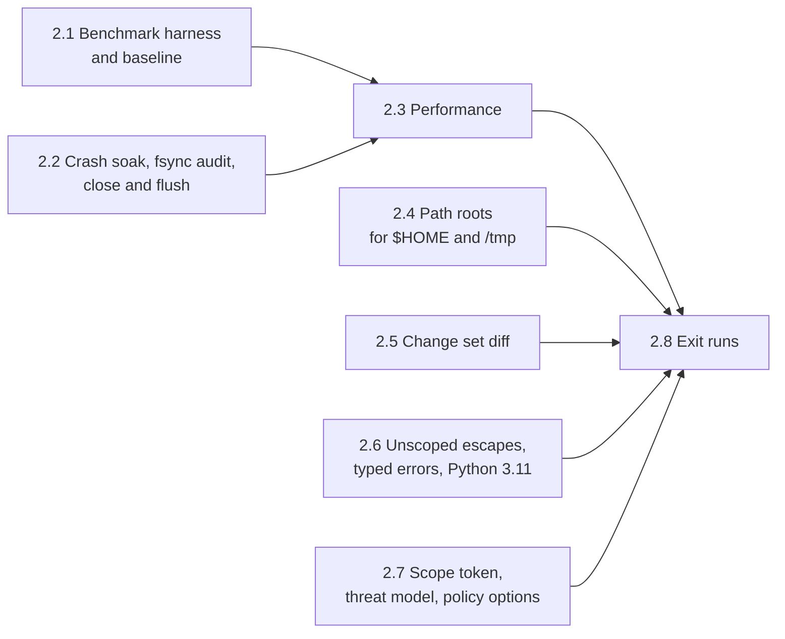

# Phase 2: Hardening Plan

Oct 4, 2026 · Andre Bremer · Draft

**Status, Oct 4, 2026: 2.1 done**: baseline for workloads A, B and C on the dev host and the benchmark VM at `564c36f`; suite 126 / 126 in CI on both runners ([PR #17](https://github.com/rcrsr/escrowd/pull/17)). Next: 2.2. Plan revised Oct 4, 2026 for issues [#11](https://github.com/rcrsr/escrowd/issues/11)–[#16](https://github.com/rcrsr/escrowd/issues/16).

Phase 2 takes the phase 1 POC to something an agent harness can lean on: commits that survive a crash at any point, real repositories at near-native speed, paths outside the project under the same rules as the project, and errors that tell the caller what went wrong. Phase 3 freezes the protocol on top of it, so every protocol change (path roots, diff, scope token, policy options) lands here or waits for a protocol version bump.

Phase 1 ended with all seven exit tests and checks 8 and 9 passing (121 checks, 10 consecutive CI runs per runner, four Lima hosts; [plan](phase-1-poc.md)). The [0.6 benchmark](../spikes/results/0.6-summary.md) measured the spike, not escrowd.

## Exit criteria

From the proposal: **zero partial commits across 1,000 runs killed at random points mid-commit; a real repo's test suite runs under escrowd within 1.5× of native wall time.**

This plan makes each one measurable and adds checks from the issues:

1. **Crash soak.** 1,000 runs, each SIGKILLing the daemon at a random time inside a commit. After restart and recovery, the project's fingerprint equals either the pre-commit or the post-commit fingerprint in every run; 0 runs leave anything else. 100 more runs on each Lima host, since a kill lands differently on 9p, sshfs and local disks.
2. **Real repo speed.** In the benchmark VM (median of 7 runs), express `v5.2.1` and `attrs` 26.1.0 run their test suites at ≤ 1.5× native, and every workload's wall time (daemon start, steps, commit, unmount) is ≤ 1.5× native.
3. **Read-heavy speed** ([#13](https://github.com/rcrsr/escrowd/issues/13)). Workload C (`rg`, `git status`, `git log -p -n 50`) runs warm at ≤ 1.5× native; cold is reported with no target.
4. **Paths outside the project** ([#11](https://github.com/rcrsr/escrowd/issues/11)). `$HOME` and `/tmp` follow the policy's root rules (capture, ephemeral, passthrough, deny), with #11's acceptance checks in the conformance suite.
5. **Diff in the change set** ([#12](https://github.com/rcrsr/escrowd/issues/12)). The change set's diff equals `diff -ru` between the scope's snapshot and its staged tree.
6. **Unscoped escapes and errors** ([#14](https://github.com/rcrsr/escrowd/issues/14), [#16](https://github.com/rcrsr/escrowd/issues/16)). `os.system` and `os.posix_spawn*` inside a scope are captured in it; the SDK raises `EscrowUnscopedError` and `EscrowStaleHandleError` (both subclass the `OSError` callers get today); the SDK passes the suite on Python 3.11 and 3.14.
7. **Scope token** ([#15](https://github.com/rcrsr/escrowd/issues/15)). Only the holder of a scope's token can close it, decide it or start children in it; a call without the token fails.
8. **No regression.** The conformance suite passes 10 consecutive times on each CI runner and once on each Lima host.

## Sub-phases



Order, decided Oct 4, 2026: 2.1, 2.2, 2.3, then 2.4 to 2.7, then 2.8. 2.2 comes before 2.3 because the fastest commit fix (dropping per-file fsyncs) depends on 2.2's fsync audit.

| # | Sub-phase | Goal (done when…) | Checks |
| --- | --- | --- | --- |
| 2.1 | Benchmark harness and baseline | `bench/` runs workloads A, B and C for both repositories natively, in the sandbox and under escrow, on the dev host and in the benchmark VM; the baseline is recorded; `sandbox.write` binds package stores | 2, 3 (baseline) |
| 2.2 | Crash soak, fsync audit, close and flush | 0 partial commits in 1,000 random kills on the dev host; every step on the commit path has the fsync it needs; close sends SIGTERM, waits 2 s, then SIGKILLs; no write lost in 1,000 closes with a busy writer | 1 |
| 2.3 | Performance | Every workload's wall ≤ 1.5× native in the VM (baseline: up to 13.35×, commit-bound); workload C warm ≤ 1.5× | 2, 3 |
| 2.4 | Path roots for `$HOME` and `/tmp` | The policy's `roots:` rules hold for both roots; the SDK rewrites `~/` paths; capture commits with the project in one journaled commit; `sandbox.write` becomes the passthrough list | 4 |
| 2.5 | Change set diff | `ChangeSet.diff` against the snapshot, renames as renames, binary and large files summarized; `s.outcome.diff`, `escrow diff <scope>` | 5 |
| 2.6 | Unscoped escapes, typed errors, Python 3.11 | `os.system`, `os.posix_spawn*` and `os.chdir` into the project handled; unscoped operations counted in `s.outcome`; typed errors; SDK on 3.11+ | 6 |
| 2.7 | Scope token, threat model, policy options | Token required on close, decide and exec; threat-model section in the proposal; conflict policy, read conflicts, passthrough ledger line | 7 |
| 2.8 | Exit runs | Checks 1–8 pass together; logs in `tests/soak/results/` and `bench/results/` | All |

## Design for each sub-phase

### 2.1 Benchmark harness and baseline

The 0.6 harness (`spikes/06-bench/`) moves to `bench/`, which may not depend on `spikes/`. Differences from 0.6:

- **escrowd, not the spike**, release build (`target/release/escrow`; fault injection is compiled out there).
- **Shared state outside the project.** 0.6 found that pnpm needs a writable store and metadata cache. The policy gains `sandbox.write`: host paths bound writable and outside escrow. 2.4 folds it into the passthrough rule of `roots:`.
- **Workloads**, for express and `attrs`:
  - A, from an empty project: clone, install, test.
  - B, with the tree in the base: `git status`, read every file, test.
  - C, read-heavy ([#13](https://github.com/rcrsr/escrowd/issues/13)), on CPython `v3.14.8` (about 5,000 files; a shallow mirror with 100 commits) with the tree in the base: `rg` for a common token, `git status`, `git log -p -n 50`, each run cold (first touch after mount) and then warm (same commands again in the same scope). express and attrs are too small for it: every step takes under 0.1 s, so fixed costs and noise set the ratio.
- Runs in the `escrow-bench` VM (4 vCPUs, 4 GiB) and on the dev host; 7 runs, medians, per-step and wall ratios against native.
- **Ride-alongs**: the conformance suite stops depending on the host's git config (`GIT_CONFIG_GLOBAL=/dev/null`, `GIT_CONFIG_SYSTEM=/dev/null`; #11's first acceptance item); a CI job builds and tests on Rust stable next to the 1.93.1 pin, not required by the CI Gate (#16).

As built (Oct 4, 2026):

- `bench/run.sh` runs three modes: `native`, `sandbox` (`escrow run --unscoped passthrough`: daemon and bwrap, the project bound directly) and `escrow` (`--unscoped implicit --on-exit commit`: every write in one scope, committed at exit). The implicit scope replaces the planned SDK scope: it is a scope like any other and needs no Python wrapper around a shell workload. Each run reports its steps and `wall`, the whole run as the caller sees it (daemon start, mount, steps, commit, unmount). `bench/summarize.py` prints medians and ratios, flags test-count mismatches, and drops runs with a negative step (WSL steps its wall clock).
- `bench/lima.sh` runs it in `escrow-bench`: the host passes node, pnpm, uv and Python by resolved path. attrs runs without `tests/test_pyright.py`, which needs pyright on PATH. Logs: `bench/results/`.
- Workload C runs as `cpython:C` in the `JOBS` list (default `express:A express:B attrs:A attrs:B cpython:C`); ripgrep 15.2.0 is pinned in `mise.toml`. The log header names the commit and marks an uncommitted tree `-dirty`.
- Ride-alongs: `conftest.py` sets `GIT_CONFIG_GLOBAL` and `GIT_CONFIG_SYSTEM` to `/dev/null` for the suite and its children; with a global config that signs commits through a missing program, `test_overlay.py` fails 14 of 14 without it and passes 14 of 14 with it. CI gains `Rust (stable, advisory)`: clippy and tests with `RUSTUP_TOOLCHAIN=stable`, `continue-on-error`, outside the CI Gate.
- `sandbox.write` in the policy: host paths bound read-write into every sandbox, outside escrow. The daemon creates each one and refuses to start if one overlaps the project, the state directory or the mount. Each sandbox start writes one `op=sandbox-write path=<absolute path>` ledger line per path. Five conformance checks; suite: 126.

Baseline at `564c36f`, benchmark VM (Ubuntu 24.04, kernel 6.8, 4 vCPUs), 7 runs, medians, escrow / native (logs: `bench/results/bench-ubuntu-24.04.log`, `wsl-dev-host.log`):

| Repo | Workload | Test step | Timed steps | Wall |
| --- | --- | --- | --- | --- |
| express | A (clone, install, test) | 1.23× | 1.97× | **13.32×** (2.23 s → 29.72 s) |
| express | B (status, read all, test) | 1.24× | 2.01× | 2.16× |
| attrs | A | 1.08× | 1.15× | 1.73× |
| attrs | B | 1.06× | 1.10× | 1.13× |
| cpython | C (read-heavy) | – | 2.91× | 3.17× |

Workload C per step, VM (dev host in brackets):

| Step | Cold | Warm |
| --- | --- | --- |
| `rg -c return .` | 16.41× (28.73×) | **8.53×** (9.47×) |
| `git status` | 3.77× (22.94×) | 0.41× (2.72×) |
| `git log -p -n 50` | 1.76× (2.58×) | **1.90×** (2.45×) |

Dev host (WSL2, 28 CPUs): test steps 1.01–1.10×, wall 1.19–1.86× for A and B, 10.36× for C.

Notes on the numbers: `git status` warm runs faster under escrow than natively in the VM because the first status in the scope rewrites the index (staged in the scope), while the native tree keeps rehashing racily clean entries; treat status as reported, not targeted. 3 of 105 VM runs and 4 of 105 dev host runs had a negative step (the wall clock stepped) and are dropped; 2.3 switches the timer to a monotonic clock.

Findings:

1. **The test suites already meet 1.5×** in both places (1.03–1.30×). The cost is elsewhere.
2. **Commit dominates express A**: about 25 s of its 29.7 s wall in the VM (11 s on the dev host) commit about 8,800 files. `apply` fsyncs each file it writes (`copy_entry(…, sync = true)`), then runs `syncfs` over the whole filesystem anyway.
3. **Cold reads stay expensive**: read every file 17–35×, `git status` 4–6×, `pnpm install` 19× (VM), as 0.6 measured.
4. **The sandbox is free**: `sandbox` mode is within 0.97–1.06× of native wall.
5. **Warm reads miss the target**: warm `rg` 8.5× and warm `git log -p` 1.9× in the VM, against ≤ 1.5×. Cached entries and attributes (2.3 item 4) are the lever: a warm run still pays a FUSE round trip per lookup.
6. **express flakes in `sandbox` mode on the dev host only**: workload B lost 3–25 tests in 4 of 7 runs (`server.address()` returns null in `res.render` tests). No FUSE is involved in that mode, the VM passed all runs, and `escrow` mode passed all runs on both; not yet explained.

### 2.2 Crash soak, fsync audit, close and flush

Phase 1 tested recovery with fault points (5 steps, error and abort modes). Phase 2 kills at random times:

- `tests/soak/crash.py N`: seed a project with a change set large enough that the commit takes ≥ 200 ms (thousands of files, nested directories, renames, deletes, mode changes), start `escrow daemon`, commit, SIGKILL at a uniform random delay within the measured commit duration, restart, wait for recovery, compare the fingerprint with the pre and post fingerprints. Any third state fails the run and keeps its directory.
- **fsync audit.** Review every step on the commit path: the journal row before the pre-image, the pre-image before the apply, the temp file before its rename, and the parent directory after each rename, create and unlink. Kill-based tests cannot catch a missing directory fsync (the page cache survives a process kill); this review can. It answers whether a prepared generation's rollback from pre-images covers a crash between the renames and the final `syncfs`, which 2.3's commit work needs.
- **Editor race** (#16): the conflict check runs before apply, so an editor can write a file between the check and its rename. Re-check each target's version immediately before its rename; a mismatch rolls the commit back as a conflict. Document what remains in the proposal's risk table.
- **Close and flush.** Close sends SIGTERM to the scope's children, waits (2 s default, set in the policy), then SIGKILLs; writes made during the grace period land in the change set. A writer appends continuously while the scope closes; every byte written before close returns must be in the change set, across 1,000 closes. Report close latency at the 50th and 99th percentiles with 0, 1 and 10 running children.
- CI runs 50 crash iterations per PR that touches `crates/escrowd/src/{commit,journal,snapshot}.rs` (a `soak` paths filter; CI stays PR-only). 1,000 run on the dev host by hand at the end of 2.2 and in 2.8; 100 per Lima host.

### 2.3 Performance

0.6 put the cost in cold lookups, opens and reads (5–30× per operation in any FUSE, bindfs included); 2.1 adds commit, which dominates a large change set. Phase 1 already uses dirfd syscalls instead of `/proc` paths. In order, each measured against 2.1's baseline before the next:

1. **Commit.**
   - Drop the per-file fsync in `apply` if 2.2's audit shows recovery covers it.
   - Rename instead of copy when the upper and the project share a filesystem and the file is new or fully rewritten. The file keeps its inode, so file watchers see a rename rather than a delete and a create (#16), and the data is not copied twice. Otherwise copy with `copy_file_range`, or reflink where the filesystem allows.
   - Batch journal writes into one transaction per generation.
   - Target: express A wall ≤ 1.5× in the VM.
   - Benchmark timer: a monotonic clock instead of `date +%s.%N` (WSL steps the wall clock; 7 of 210 baseline runs were dropped).
2. **Locks.** `Views` holds one `Mutex<Tables>` for the inode table and open files of every scope, and each scope's store (whiteouts, opaque directories, versions) sits behind one `Mutex`, taken on every lookup. Shard the tables and make the store's read-mostly sets read-locked, so `--threads` helps.
3. **READDIRPLUS**, so a listing returns attributes and saves a lookup per entry.
4. **Cache lifetimes.** Longer entry and attribute timeouts for base entries, invalidated by commit (the kernel notifier added in 1.5); `FOPEN_KEEP_CACHE` for files whose version has not changed. This is what workload C's warm runs measure.

Kernel passthrough stays a root-helper fallback, out of scope: it removes data-path cost but not lookup and open round trips.

### 2.4 Path roots for `$HOME` and `/tmp`

From [#11](https://github.com/rcrsr/escrowd/issues/11). Sandboxes mount `$HOME` as an empty tmpfs today, so tools that need user config (git above all) break inside a scope. Each root is served through the same FUSE layer as the project, with a rule per path:

| Rule | Reads | Writes | Typical paths |
| --- | --- | --- | --- |
| `capture` | gated and logged | staged in the scope, decided and committed with it | `~/.gitconfig`, `~/.bashrc`, tool config |
| `ephemeral` | gated and logged | per-scope scratch layer, always discarded | history files, temp state |
| `passthrough` | logged at sandbox start | real, shared, not captured | package caches: `~/.cache/pip`, `~/.npm`, the pnpm store |
| `deny` | EACCES | EACCES | `~/.ssh`, `~/.aws`, `~/.gnupg` |

```yaml
roots:
  home:
    default: capture
    deny: [~/.ssh, ~/.aws, ~/.gnupg]
    passthrough: [~/.cache/pip, ~/.npm]
    ephemeral: [~/.bash_history]
  tmp: { default: ephemeral }
  other:
    passthrough: [/var/tmp/escrow-bench-cache/store]  # replaces sandbox.write
```

- Each scope gets one view per root (`/escrow/<id>/home/…` beside the project view); scope children get the scope's home view over `$HOME` and its tmp view over `/tmp`. The SDK rewrites `~/x` to the scope's home view, as it does project paths.
- A `capture` commit applies project and home changes in one journaled commit; conflicts and pre-images work per root.
- Unlisted paths follow the root's default; paths outside every root and the system directories stay absent (deny by default). `passthrough` binds directly, outside FUSE, as `sandbox.write` does today; `sandbox.write` and `sandbox.read` move under `roots.other`.
- Acceptance, from #11: a scope edits `~/.gitconfig` and it commits and discards with the project change; `git commit` with a signing helper works when the helper's path is listed; two concurrent scopes run `npm install` against a passthrough cache; reading `~/.ssh/id_ed25519` fails with EACCES and is logged. The proposal's Isolation section and risk table are updated.

### 2.5 Change set diff

From [#12](https://github.com/rcrsr/escrowd/issues/12); phase 1 deferred it because a closed scope refuses new opens. The daemon builds the diff from the scope's store when it builds the change set on close:

- a unified diff per modified text file against the scope's snapshot (not the live base), so another scope's commit never shows up in it;
- renames as renames; created and deleted files in full up to the size cap, summarized above it;
- binary and over-cap files summarized (size, hash), the cap set in the policy;
- exposed as `ChangeSet.diff` (protocol), `s.outcome.diff` and `change_set.diff` (SDK), and `escrow diff <scope>`.
- Conformance check: the diff equals `diff -ru` between the snapshot and the staged tree.

### 2.6 Unscoped escapes, typed errors, Python 3.11

From [#14](https://github.com/rcrsr/escrowd/issues/14) and [#16](https://github.com/rcrsr/escrowd/issues/16):

- **`os.system` and `os.posix_spawn*`** inside a scope run through `escrow exec`, like `Popen`.
- **`os.chdir` into the project** inside a scope moves into the scope's view (the SDK maps `getcwd` back), or raises a clear error when no scope is current in `deny` mode.
- **Unscoped operations in the outcome**: at close, the daemon counts the unscoped scope's operations while the scope was open; `s.outcome.unscoped` reports the count as a warning.
- **`EscrowUnscopedError(PermissionError)`**: the SDK's wrappers catch EROFS on a project path outside any scope in `deny` mode and re-raise with the path and the advice to open a scope. Native code still sees the raw EROFS.
- **`EscrowStaleHandleError(OSError)`**: EBADF from a write on a file the SDK opened in a scope that has since closed. The SDK tracks each file's scope already (`Scope._files`).
- **Python 3.11+**: the SDK drops 3.12+ syntax and APIs; CI runs the suite on 3.11 and 3.14. The daemon is unaffected.
- **`deny` as the documented mode for agent hosts**: the proposal, the README and the examples use it; passthrough stays for trusted, legacy apps.

### 2.7 Scope token, threat model, policy options

- **Scope token** ([#15](https://github.com/rcrsr/escrowd/issues/15)): `OpenScope` returns a random token with the scope id; `CloseScope`, `Decide` and the exec socket's `SpawnRequest` must carry it. The SDK keeps it on the `Scope` object. Code that learns a scope id (from a path) cannot decide that scope. A protocol change, so it lands before phase 3.
- **Threat model**: a section in the proposal on what escrowd guarantees against untrusted subprocesses (sandboxed, no socket) and in-process code (trusted; can reach the socket, but needs a scope's token to decide it). The phase 4 plan references it: untrusted tool code runs as subprocesses.
- **Conflict policy**: `conflict: discard` (default) or `return`. Return keeps the scope and sends the conflicting paths back as reasons (outcome status `conflict`, verdict return), so the agent can redo the work in a new scope. Rebase stays out.
- **Read conflicts**: `conflict.reads: true` (default false) also fails the commit when a file the scope only read changed in the base since the scope read it; phase 1 already records those versions.
- **Passthrough in the ledger**: one `op=passthrough` line at start, so the ledger shows IO went unescrowed; the IO itself stays unlogged (logging it would route it through FUSE).

### 2.8 Exit runs

Checks 1 to 8 run on the final commit; logs go to `tests/soak/results/` and `bench/results/`, and the status line gets the PR link.

## Carried limits

Out of phase 2, by design:

- Whole-file copy-up; block-level copy-up only if a workload in 2.1 shows large-file cost.
- No power-loss testing: process kills only (the fsync audit covers what kills cannot).
- Native code and `mmap` doing their own IO still fall to the `unscoped` mode; passthrough IO stays unlogged.
- No network capture (phase 8); nested scopes stay deferred.
- One daemon per `escrow run`.

## Open questions

- [x] Python repository for check 2: `attrs`, decided Oct 4, 2026 (pure Python, offline install with `uv sync --frozen`; `requests` needs a local httpbin).
- [x] Conflict check on reads: a policy option, off by default, decided Oct 4, 2026 (on by default would reject scopes that never wrote the changed file). Built in 2.7.
- [x] Conflict policy: discard (default) or return to agent, decided Oct 4, 2026; rebase stays out of phase 2. Built in 2.7.
- [x] btrfs snapshot fast path: dropped, decided Oct 4, 2026. Scope open records one generation number; pre-images cost at commit, which a snapshot at open would not save.
- [x] Passthrough in the ledger: one line at start, IO unlogged, decided Oct 4, 2026, and kept after #14, Oct 4, 2026: logging every operation would route passthrough through FUSE at capture cost. `deny` becomes the documented mode for agent hosts. Built in 2.6 and 2.7.
- [x] Crash soak in CI: 50 runs on PRs touching the commit path, decided Oct 4, 2026; 1,000 and the Lima runs by hand.
- [x] Grace period before SIGKILL at close: 2 s, set in the policy, decided Oct 4, 2026.
- [x] Package stores: `sandbox.write`, writable unescrowed binds logged at sandbox start, decided Oct 4, 2026. Folded into `roots:` as the passthrough rule in 2.4, decided Oct 4, 2026.
- [x] Paths outside the project (#11): full `roots:` rules (capture, ephemeral, passthrough, deny) for `$HOME` and `/tmp` in phase 2, decided Oct 4, 2026, since the SDK's `~/` rewrite and the protocol must settle before phase 3. Built in 2.4.
- [x] Scope token (#15): built in phase 2, decided Oct 4, 2026 (a protocol change; after phase 3 it would need a version bump). Built in 2.7.
- [x] Read-heavy workload (#13): workload C joins 2.1; warm ≤ 1.5×, cold reported, decided Oct 4, 2026.
- [x] Python 3.11+ for the SDK (#16): phase 2, decided Oct 4, 2026; CI tests 3.11 and 3.14. Built in 2.6.
- [x] Rust stable (#16): a CI job on stable, not required by the CI Gate, decided Oct 4, 2026. Ride-along in 2.1.
- [x] Sub-phase order: crash soak and audit first, then performance, path roots, diff, escapes and errors, token and policy, exit runs; decided Oct 4, 2026.
