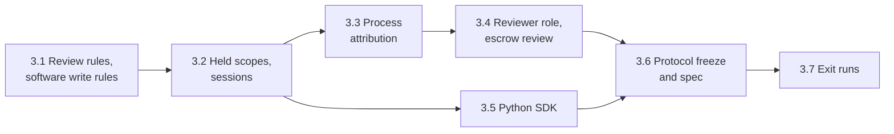

# Phase 3: Held Decisions and Protocol Freeze Plan

Oct 5, 2026 · Andre Bremer · Draft

**Status, Oct 6, 2026: 3.1 to 3.5 built**; 3.6 next. Phase 2 is done ([plan](phase-2-hardening.md), exit runs in [PR #25](https://github.com/rcrsr/escrowd/pull/25)).

Today an agent host blocks on a *pre*-approval: a permission prompt before a tool runs, judged on a description of the effect. Phase 3 makes escrow's decision a *post*-approval: the work runs in a scope, and independent reviewers judge the staged change set, with the client and escrowd negotiating whether the agent waits. The design is in the proposal ([Held decisions](escrowd-proposal.md#held-decisions)); a runnable model plays it ([`examples/held-decisions/model.py`](../examples/held-decisions/model.py)). Phase 3 builds it into escrowd and the Python SDK, attributes every change to the process that made it so reviewers can judge who changed what (added Oct 6, 2026), then freezes the protocol, so phase 4's TypeScript SDK and phase 7's reviewers build on a fixed v1.

## Exit criteria

1. **The model's rules hold in escrowd**, each a conformance check:
   1. A wait the policy requires is enforced by the daemon: the session's next scope does not open until the held one is decided, whatever the client asked.
   2. The opener's token cannot commit a held scope; the opener can withdraw it.
   3. Verdicts only tighten across tiers; a human override of a lower tier's verdict is explicit and in the ledger.
   4. A client that continues past a held scope gets a conflict on the same file, never a silent overwrite.
   5. A reviewer gets the session's earlier change sets and verdicts.
2. **Changes are attributed.** Each change in a change set names the processes that made it (program, command line, parent chain), and the ledger records the process of every operation: a `git commit` run through `escrow exec` attributes the `.git/` changes to `/usr/bin/git` with its arguments, started by the shell that ran it. A write rule can name the programs allowed to change a path.
3. **A human can review.** `escrow review` lists held scopes, shows a change set with its diff and session history, and decides one; the software tier's write rules run in the daemon.
4. **Holds are durable.** A held scope, its pending tiers and its verdict so far survive a daemon restart; the crash soak (100 runs on the dev host) kills the daemon while scopes are held and loses none.
5. **Protocol frozen.** `proto/escrow/v1/escrow.proto`, the exec socket and the `escrow exec` interface are tagged `protocol-v1` (protocol 7), specified in `docs/protocol.md`, and guarded in CI by `buf breaking` against the tag.
6. **No regression.** The suite passes 10 consecutive times on each CI runner (`ci:repeat`) and once on each Lima host; the Python SDK on 3.11 and 3.14.

## Sub-phases



| # | Sub-phase | Goal (done when…) | Checks |
| --- | --- | --- | --- |
| 3.1 | Review rules, software write rules | The policy's `review:` rules (path pattern, tier, wait required or optional) and write rules (paths or content a change set must not have) run at close; a change set that needs no tier above software is decided at once | 1.3, 3 |
| 3.2 | Held scopes, sessions | `CloseScope` takes a proposed verdict and whether the client can wait; a `held` outcome; `OpenScope` takes a session and waits behind a required hold; held state durable across a restart | 1.1, 1.4, 4 |
| 3.3 | Process attribution | Every operation records its process (cached per process: program, command line, parent chain); each change in the change set lists its writers; the ledger names them; write rules can match on the program | 2 |
| 3.4 | Reviewer role, `escrow review` | A reviewer credential separate from scope tokens; calls to list held scopes, read one with its session history and writers, and give a tier's verdict (monotonic, overrides ledgered); `AwaitDecision` streams a scope's status to its client; `escrow review` for a human | 1.2, 1.3, 1.5, 3 |
| 3.5 | Python SDK | `escrow.scope(…, wait=…)` proposes the decide callback's verdict, waits or continues, and resolves `s.outcome` from the stream; a `held` status; the test app and SDK checks cover it; `s.outcome` shows each change's writers | 1, 2 |
| 3.6 | Protocol freeze and spec | The protocol review below, `docs/protocol.md`, `buf lint` and `buf breaking` in CI, the tag, the `daemon-frozen` check phase 4 runs under | 5 |
| 3.7 | Exit runs | Checks 1–6 on the final commit | All |

## Design for each sub-phase

### 3.1 Review rules, software write rules

```yaml
review:
  - {paths: ["src/auth/**"], tier: human, wait: required}
  - {paths: ["src/**"], tier: llm, wait: required}
  - {paths: ["docs/**"], tier: llm, wait: optional}
write:
  deny: ["**/*.pem"]           # a change set touching these is discarded (software tier)
  deny_content: ["BEGIN PRIVATE KEY"]
```

The first matching rule gives a path its top tier; a change set goes through every tier from software up to the highest any path needs. Without a `review:` section nothing is held, as today: the host's decide callback still decides, which keeps phase 2's behavior for hosts that do not opt in.

**As built (Oct 6, 2026).** `crates/escrowd/src/review.rs`; the policy keys are in `policy.rs`.

- **When.** The daemon reviews at close. `ChangeSet.review` carries the software tier's verdict, its reasons, the tiers above software and `wait_required`. `GetChangeSet` and `SettleUnscoped` return it too.
- **Write rules.** `write.deny` matches the path a change shows, and a rename's source. `write.deny_content` scans every regular file a change writes, in 64 KiB chunks. Each hit is a ledger line: `op=write-deny` or `op=write-content`, `decision=deny`.
- **A hit discards.** The change set needs no tier then, as in the model. Decide turns a commit or a return into a discard and sends the rule reasons back.
- **Tiers.** Patterns follow `read.deny`: no `/` matches the name at any depth. A path with no matching rule needs software only. `wait` defaults to `required`. It counts only for paths that need a tier above software.
- **Until 3.2.** No scope is held yet. Decide refuses to commit a change set that needs a tier (`FAILED_PRECONDITION`, naming the tiers); a return or a discard still decides it. Without `review:` and `write:` rules, Decide skips the review, as in phase 2.
- **Protocol.** `Review` and `Tier` are new messages, and `ChangeSet.review` is field 7. The change is additive, so `PROTOCOL_VERSION` stays 6 until the freeze.
- **SDK.** The Python SDK exposes `ChangeSet.review` as `escrow.Review`, so a decide callback sees it. The rest of the SDK's side is 3.5.
- **Checks.** `tests/conformance/test_review.py` has 8 tests, plus unit tests in `review.rs`, `gate.rs` and `policy.rs`.

### 3.2 Held scopes, sessions

- **Close with a proposal.** The opener proposes a verdict (its decide callback's) and says whether it can wait. A proposed discard or return is applied at once (it only tightens); a proposed commit runs the software tier, then holds if a higher tier is needed.
- **Sessions.** `OpenScopeRequest.session` orders an agent's scopes. A required hold blocks the session's next `OpenScope` until the verdict (the call waits, up to the client's deadline, then fails with `FAILED_PRECONDITION` naming the held scope; the held scope stays held). A reviewer's `return` reopens the scope and unblocks the session. Scopes without a session are unordered, as today.
- **The unscoped scope.** `SettleUnscoped` runs the same review rules, so IO outside scopes in `implicit` mode meets the same reviewers.
- **Durability.** The held state, the pending tiers, each tier's verdict and the session go into the scope's store; recovery at start keeps them.

**As built (Oct 6, 2026).**

- **The proposal goes on `Decide`, not `CloseScope`.** This differs from the design above. A decide callback needs the change set before it can propose, so close stays as it was. `Decide`'s verdict is the proposal, and `DecideRequest.wait` says whether the client waits.
- **Holding.** A commit of a change set that needs a tier above software returns `OUTCOME_STATUS_HELD`, with `Outcome.tiers` (still to review) and `Outcome.wait`. `wait` is set when a rule requires waiting or the client asked to wait. A discard or a return the software tier does not tighten is applied at once, as in 3.1.
- **Independence.** A held scope's opener gets `PERMISSION_DENIED` on a commit or a return. It can discard (withdraw) the scope, as in the model.
- **Sessions.** `OpenScopeRequest.session` (field 3) is kept in the scope's store. An open in a session that has a scope held with a wait blocks until a decision wakes it. At the client's `grpc-timeout`, less 100 ms, it fails with `FAILED_PRECONDITION` naming the held scope, which stays held.
- **Durability.** The hold (`hold_tiers`, `hold_wait`) and the session are in the scope's `meta` table, written at once. A restarted daemon keeps the hold, the block and the opener's token. Each tier's verdict comes with the reviewers (3.4).
- **Ledger.** A hold writes `op=hold decision=<tiers>[,wait]`.
- **Checks.** `tests/conformance/test_held.py` has 8 tests: rules 1.1 and 1.2 (opener side), the restart, the unscoped scope and optional waits. Rule 1.4, a conflict after continuing, needs a reviewer's commit, so its check comes with 3.4. The crash soak with held scopes runs in 3.7.
- **Python client.** `open_scope(session=)` and `decide(wait=)`. The SDK's `escrow.scope` is unchanged until 3.5, apart from the `held` status.

### 3.3 Process attribution

FUSE gives every request the caller's process ID, in the daemon's PID namespace, so `/proc/<pid>` works for sandboxed processes too; escrowd already keeps each file handle's opener (2.2, for close). Phase 3 turns it into attribution:

- **Who.** At the first operation of a process, escrowd reads `/proc/<pid>/exe` (and the binary's device and inode), `cmdline`, and the parent chain up to the scope's sandbox (or the host process for in-process IO), and caches it by PID and start time, so a reused PID is never confused with the old process. One lookup per process, not per operation; 3.3 measures the cost in the benchmark (target: no workload slower by more than 2%).
- **Which operations.** Opens for writing, creates, renames, unlinks, links and attribute changes carry the caller. Data writes do not: with the writeback cache they reach escrowd from the kernel, after the process wrote, so a write counts toward the process that opened the file, as do `mmap` writes.
- **In the change set.** Each `Change` gains `writers`: the processes that made it, the source of a rename included, each with its program, binary identity, arguments, PID and parent chain. A process appears once per change set, referenced by id from each change.
- **In the ledger.** Each line gains `proc=<id>`; a `proc` line, written once per process, holds its program, arguments (truncated to 4 KiB) and parent.
- **In the policy.** A write rule can name the programs allowed to change a path, matched on the binary's identity, not its name or arguments:

  ```yaml
  write:
    only_by:
      - {paths: [".git/**"], programs: ["/usr/bin/git"]}
  ```

- **What a reviewer can trust**, written in the spec beside the fields: the program and its inode are what the kernel ran; the arguments are what the process says about itself (any process can rewrite its own `argv`, so a script can call itself `git`); writes through a descriptor another process opened, or inherited from a parent, count toward the opener; in-process SDK IO names the host process, and tells tool calls apart only through the scope's labels.

**As built (Oct 6, 2026).**

- **Lookup.** `proc.rs` resolves FUSE's thread ID to its process (`Tgid`) and caches both by PID and start time (`/proc/<pid>/stat` field 22). A cached thread's start time is read again at most every 20 ms: a thread ID is reused only after the kernel's PID allocator wraps around `pid_max`, which cannot happen that fast. Exec keeps the PID and start time, so each change also compares the binary's device and inode with the cached ones (one `stat` of `/proc/<tid>/exe`, 1.5 µs). A fork (its parent's binary and arguments, not exec'd yet) has its arguments read again too, so a shell that execs a command after opening a redirect names each program; so does a process read mid-exec, whose arguments are still empty. CI caught both: the missing exec check, then the mid-exec read (6 failures in 300 local runs of the unit test before the fix, 0 in 1,000 after). A new process reads `exe`, the binary's `stat`, `cmdline` and its parents once. Each process gets a random 63-bit id, so ledger lines never collide across daemon runs. The caches hold 4,096 entries each; past that, dead processes go.
- **The chain** stops before the daemon (every sandbox's bwrap is its child), after a session leader (the host app's shell), or after 16 parents. A kernel thread or a vanished task names no process.
- **Which operations.** Create, open for writing, mkdir, symlink, link, rename, unlink, rmdir and setattr resolve the caller, including when the rule denies them. Reads, lookups and listings do not, so a read costs nothing new. A data write counts toward the opener; the process that closes a written file also shows, since the kernel sends the file's times (a setattr) in its name.
- **Writers.** Each view's store keeps `writers` (path to process ids) and `procs` (each process with its parent's id), written behind like first reads and flushed at close, so a held scope keeps them across a restart. A rename moves the writers of its source (and, for a directory, of everything under it) and adds the renamer to both paths. A change takes the writers at its path and its rename source; a change with none (a base file deleted with its directory) takes its nearest ancestor's.
- **Protocol.** `Change.writers` (field 4) holds process ids; `ChangeSet.processes` (field 8) holds each writer and its chain as `Process {id, pid, program, dev, ino, args, parent}`. `program` is the path as the process's own mount namespace shows it. Additive, so `PROTOCOL_VERSION` stays 6.
- **Ledger.** Change lines gain `proc=<16 hex digits>` before `decision`. A `proc` line comes before the first line that names it, with parents first: `<ms> proc=<id> pid=<pid> parent=<id|-> exe=<path> ino=<dev>:<ino> args=<arg>,<arg>,…`, arguments percent-encoded (`,` too) and cut at 4 KiB. `escrow log SCOPE` prints the `proc` lines its scope's lines name.
- **`write.only_by`.** Each program path is resolved at daemon start to its device and inode; a missing program fails the start. A change to a matching path (either path of a rename) breaks the rule when any writer's binary is not listed, or when it has no recorded writer. The reason is `write.only_by: <path> changed by <program>`, the ledger op `write-only-by`. A copy of an allowed binary is a different inode, so it is refused.
- **Python SDK.** `Change.writers`, `ChangeSet.processes` and `ChangeSet.writers(change)`, so a decide callback sees who made each change. `escrow.Process` is exported.
- **Checks.** `tests/conformance/test_attribution.py` has 11 tests: a sandboxed command and its parent chain, an exec in the same process, exit criterion 2's `git commit`, in-process IO naming the host process, a rename's writers, the ledger's `proc` lines, `escrow log SCOPE`, `write.only_by` (allowed program, another program, a copy of the allowed binary, the host process), a missing program, writers across a restart, and the SDK's view.
- **Cost.** Within the 2% target on the dev host (`bench/results/ab-3.2-vs-3.3.txt`, 7 alternating rounds, escrow mode): express A total 1.014×, attrs A 1.015×; install, the step with the most creates, 1.04× and 1.00× best of 7 (medians 1.16× and 1.08× on a loaded host). A first build that read `/proc/<tid>/stat` on every change (6.6 µs) made express A's install 1.14× slower (median), so a cached thread's start time is now read at most every 20 ms. The benchmark VM runs it again in 3.7.

### 3.4 Reviewer role, `escrow review`

- **Credential.** Reviewers connect to a third socket (`<socket>.review`), created mode 0600 and never bound into a sandbox; scope tokens give no access there, and the review socket gives no scope rights (decided Oct 5, 2026).
- **Calls.** `ListHeld`, `GetHeld` (change set with its writers, diff, the session's earlier change sets and verdicts), `Review(scope, tier, verdict, reasons, override)`. Monotonic: a verdict looser than the one so far fails unless `override` and the tier is human; the ledger records each verdict and every override.
- **`AwaitDecision(scope, token)`** streams `held(tier)` updates, then the outcome; the client's existing `Decide` stays for unheld scopes.
- **`escrow review`**: `list`, `show <scope>` (diff, writers and history), `commit|discard|return <scope> [--reason …] [--override]`. It is the human tier until phase 7's review interface.

**As built (Oct 6, 2026).**

- **The review socket.** `<socket>.review` serves the `Reviewer` service only, and the protocol socket serves `Escrow` only: each answers the other's calls with `UNIMPLEMENTED`. It is bound under a temporary name, set to mode 0600, then renamed into place, so no other user can connect in between. Sandboxes hide it, as they hide the other two sockets.
- **Calls.** `ListHeld` returns the held scopes, oldest hold first, each with its name, labels, session, pending tiers, wait, verdict so far and tier reviews. `GetHeld` adds the change set (writers and diff) and the session's last 20 decisions. `Review(scope, tier, verdict, reasons, override)` gives a tier's verdict.
- **Tier order.** The tier must be pending. An LLM reviews only when it is the next tier. A human may review while the LLM tier is still pending, and the human's verdict then stands for it too. Without this, every LLM-tier hold would stall until phase 7 brings an LLM reviewer. The software tier is not a reviewer (`INVALID_ARGUMENT`).
- **Monotonic verdicts.** Order: commit < return < discard. A looser verdict than the one so far fails with `PERMISSION_DENIED`, unless the tier is human and `override` is set. Each verdict is a ledger line `op=review-<tier> decision=<verdict>`; an override adds `op=override decision=<from>-to-<to>` before it. A discard goes on to the human tier, as in the model.
- **Deciding.** After the last pending tier the daemon applies the verdict so far, as `Decide` would: a commit can conflict (rule 1.4), a return reopens the scope with each tier's reasons (`llm: …`), and every outcome unblocks the session. Until then the hold keeps the verdicts in the scope's store (`reviews` table, `hold_verdict`), so they survive a restart. Reviews and an opener's withdrawal of a held scope run one at a time.
- **History.** `<state>/history.sqlite` keeps each decision of a scope that has a session or was held: its change set with the diff, the outcome and the tier reviews, as a `Decided` message. Each session keeps its newest 100 decisions, and scopes without a session keep 100 in all.
- **`AwaitDecision(scope, token)`.** It streams `OUTCOME_STATUS_HELD` with the pending tiers, again after each review, then the final outcome, and ends. A scope decided already, or reopened by a return, gets its last outcome from the history, after a restart too. A scope that is not held fails with `FAILED_PRECONDITION`. The token is checked against the live scope, or against the hash the history kept.
- **`escrow review [--socket S | --project P]`.** It runs `list`, `show <scope>` (tiers, reviews, each change with its writer chains, the session's earlier decisions, the diff) and `commit|discard|return <scope> [--tier llm|human] [--reason R]… [--override]`. The tier defaults to human.
- **Python client.** `escrow.connect_reviewer()` returns `Reviewer` (`list_held`, `get_held`, `review`); `Client.await_decision`. The SDK's `escrow.scope` uses them in 3.5.
- **Protocol.** The `Reviewer` service, `AwaitDecision`, and the `HeldScope`, `TierReview`, `Decided`, `ReviewRequest` and related messages. All additive, so `PROTOCOL_VERSION` stays 6 until the freeze.
- **Checks.** `tests/conformance/test_reviewer.py` has 12 tests: the socket's mode and separation, listing and reading holds, tier order, a human standing for the LLM, monotonic verdicts and the ledgered override (rule 1.3), a reviewer's return reopening the scope and unblocking the session, `AwaitDecision` through two tiers and after the decision, a withdrawn hold ending its stream, rule 1.4's conflict, rule 1.5's session history, holds and verdicts across two restarts, and `escrow review`. Plus a unit test in `history.rs`.

### 3.5 Python SDK

`escrow.scope(name, decide=…, wait=True)`: at exit the decide callback's verdict becomes the proposal; with `wait=True` the scope's `__exit__` returns after the verdict, with `wait=False` it returns with `s.outcome.status == "held"` and `s.outcome` resolves later (`await s.decided()`). The test app gains checks for each of exit criterion 1's rules. `s.outcome.changes` carries each change's writers.

**As built (Oct 6, 2026).**

- **API.** `escrow.scope(name, decide=…, session=…, wait=True)`. The decide callback's verdict goes to `Decide` with `wait`, as the proposal. `resume=` keeps the session.
- **Waiting.** A held outcome with `wait=True` follows `AwaitDecision` to the verdict before the exit returns. A sync scope blocks its thread; an async scope waits in a worker thread (`asyncio.to_thread`), so the event loop keeps running. With `wait=False`, `s.outcome` is `held`, and `s.wait_decided(timeout=None)` or `await s.decided(timeout=None)` replaces it with the verdict.
- **Outcome.** `Outcome.tiers` (still to review) and `Outcome.wait` (the session waits; set by a required rule even when the scope did not ask). After a review, `reasons` carries each tier's reasons (`llm: …`). A reviewer's return gives `returned` with `reopened`, and the app fixes the change with `escrow.scope(resume=s)`. `s.outcome.changes.writers(change)` names each change's processes (3.3).
- **Sessions.** An open in a session waits behind a held scope with no deadline: the SDK opens with no `grpc-timeout`.
- **The unscoped scope.** `escrow.settle_unscoped(decide, wait=True)` waits for a held verdict too.
- **Test app.** Two checks, `held` and `held-continue`, run under a policy that sends `h/` (and `h/auth/` to a human) and `n/` (wait optional) to reviewers. The suite plays the reviewers on the review socket while the app runs. `held` covers rules 1.1 (the session's next scope reads the committed file, so it opened after the verdict), 1.2 (the opener's own commit gets `PERMISSION_DENIED`) and 1.3 (an LLM discard, a human override, the ledgered `override` line). `held-continue` covers 1.4 (the second turn conflicts) and 1.5 (its reviewer sees the first turn's change set and verdict).
- **Checks.** Those two in `tests/conformance/test_app.py`, and 5 in `tests/conformance/test_sdk_held.py`: waiting by default with writers in the outcome, `wait=False` with `wait_decided` and `decided`, an async scope waiting while its loop runs, a reviewer's return and the resumed fix, and `settle_unscoped`.

### 3.6 Protocol freeze and spec

Phase 2 changed the protocol five times (versions 2 to 6) and 3.2–3.4 change it again. Before the freeze, review it once for what phases 4 to 9 will need, so later phases add fields instead of breaking them:

- **Errors.** Status codes are chosen per call today (`NOT_FOUND`, `FAILED_PRECONDITION`, `PERMISSION_DENIED`, `ABORTED`). Fix one table in the spec, so every SDK maps them to the same typed errors.
- **Statuses.** SDKs treat an unknown `OutcomeStatus` as "not decided yet", so phase 7 can add review states without a new version.
- **Exec socket.** Frames are documented in the proto's header comment only. Move them to the spec with an example exchange; a TypeScript SDK runs the `escrow exec` binary as Python does (Node cannot pass file descriptors over a Unix socket), so the binary's interface (`--scope`, `--socket`, `ESCROW_SCOPE_TOKEN`, exit code 125 on an exec error) is part of the frozen surface too.
- **Versioning.** `Ping.protocol_version` becomes 7 at the freeze and then changes only with a new package (`escrow.v2`). Additions (new fields, new calls) stay compatible under `buf breaking`'s wire rules.
- **CI.** `buf lint` and `buf breaking --against '.git#tag=protocol-v1'` run in the Rust job; a `daemon-frozen` job fails a PR that changes `crates/escrowd/` or `proto/` while the `phase-4` label is on it.

### 3.7 Exit runs

Checks 1–6 on the final commit: the suite 10 consecutive times per CI runner (`ci:repeat`), once on each Lima host, the crash soak with held scopes, the benchmark for attribution's cost, `buf breaking` against the tag. Logs go to `tests/conformance/results/` and `tests/soak/results/`; the status line gets the PR link.

## Carried limits

All known limits are in [LIMITATIONS.md](../LIMITATIONS.md). Out of phase 3, by design:

- The LLM auditor and a review interface beyond the command line: phase 7. Phase 3's checks use stand-in reviewers, as the model does.
- Stacking a scope on a held one (nested scopes, transitive release): not planned; waiting is the default.
- The TypeScript SDK: phase 4.

## Open questions

- [x] Reviewer credential: a third socket, `<socket>.review`, mode 0600, never bound into a sandbox; the file mode is the gate and there is no secret to hand out. Decided Oct 5, 2026 (a reviewer token issued at daemon start was the alternative).
- [x] Wait timeout: the scope stays held and the client gets `held` and keeps listening; a required wait still blocks the session's next scope. No timeout verdict in the policy. Decided Oct 5, 2026.
- [x] A reviewer's `return`: reopens the scope for the agent with the reasons, as `VERDICT_RETURN` does today, and unblocks the session, so the agent fixes the change in the same scope. Decided Oct 5, 2026.
- [x] The unscoped scope (`implicit` mode): `SettleUnscoped` runs the policy's review rules like any scope. Decided Oct 5, 2026.
- [x] `escrow replay`: dropped from the daemon's roadmap, decided Oct 5, 2026. Deciding a held change set is `escrow review`; rerunning a decision is a client SDK feature that needs no daemon (an SDK can run its decide callback again on a change set it kept).
- [x] `conflict.reads`: stays off by default; the write-skew risk is documented (proposal, `LIMITATIONS.md`). Sessions that wait serialize one agent's scopes, which removes most of it; hosts that need serializable scopes turn it on. Decided Oct 5, 2026.
- [x] Absolute symlinks into the project, followed in the host process: carried (`LIMITATIONS.md`); subprocesses are unaffected. Revisit with the TypeScript SDK's path rewrite in phase 4. Decided Oct 5, 2026.
- [x] Arguments: whole in the change set, for reviewers; truncated to 4 KiB in the ledger, which lives outside every sandbox. Command lines can hold secrets (`curl -H "Authorization: …"`); the spec says so. Decided Oct 6, 2026 (redacting by policy pattern was the alternative).
- [x] Data writes: attributed to the process that opened the file; no per-write cost, and the writeback cache keeps its speed. Decided Oct 6, 2026 (turning the writeback cache off for attributed paths was the alternative).
