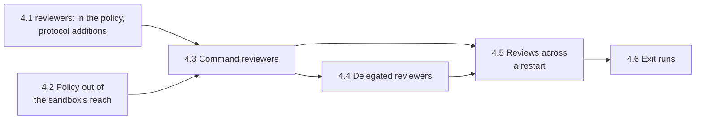

# Phase 4: Policy Reviewers Plan

Oct 6, 2026 · Andre Bremer · Draft

**Status, Oct 6, 2026: drafted**; no sub-phase started. Phase 3 is complete ([plan](phase-3-held-decisions.md), protocol 7 frozen in [PR #34](https://github.com/rcrsr/escrowd/pull/34)). Added Oct 6, 2026, ahead of the TypeScript SDK, which moved to phase 5 ([plan](phase-5-typescript-sdk.md)); every later phase moved down one.

Phase 3 holds a change set for fixed tiers, `llm` and `human`, and anyone who can open the review socket gives any tier's verdict. Nothing in escrowd runs a review: a held scope waits until some process connects and answers. Phase 4 makes reviewers part of the policy. Each reviewer has a name and, optionally, a command: the daemon runs the command on a held change set and applies its verdict as that reviewer's, or the command hands the review off (a chat message, a pull request check) and the verdict comes back later with a single-use token. `review:` rules name the reviewers a path needs. The tiers stay as two built-in reviewers with no command, so phase 3 policies keep working.

Three things follow. A reviewer's identity is real: the daemon ran it, or it holds a token the daemon issued for this review. A project's own checks (linters, secret scanners, test runs) become reviewers, beyond the fixed `write:` rules. And phase 8's LLM auditor becomes one reviewer program, outside the daemon.

## Exit criteria

1. **Declared reviewers review.** A held scope goes to the reviewers its `review:` rules name, in order; each command reviewer runs with the change set on stdin, and its verdict, reasons and name are applied and ledgered as that reviewer's. A reviewer that times out, fails or answers badly gets its `on_failure` verdict.
2. **Delegation works.** A delegated reviewer answers `pending`; its verdict comes later on the review socket with the single-use token it was given, and a token cannot review another scope or another reviewer, or review twice.
3. **The policy is out of the agent's reach.** No sandboxed process can change the policy file or a reviewer's program, or rename or delete a folder holding one: each attempt fails and is ledgered. A daemon whose policy or reviewer program lies in the project refuses `passthrough` mode.
4. **Holds survive a crash.** A daemon killed while command reviewers run reviews those scopes again at start; a delegated review keeps its token. The held soak (100 runs on the dev host) loses no hold and applies no verdict twice.
5. **Phase 3 policies still work.** `tier: llm` and `tier: human` parse and behave as in phase 3; every phase 3 check passes unchanged. The protocol only gains fields (protocol 8, tag `protocol-8`); `buf breaking` against `protocol-v1` passes.
6. **No regression.** The suite passes 10 consecutive times on each CI runner (`ci:repeat`) and once on each Lima host; the Python SDK on 3.11 and 3.14.

## Sub-phases



| # | Sub-phase | Goal (done when…) | Checks |
| --- | --- | --- | --- |
| 4.1 | `reviewers:` in the policy, protocol additions | The policy declares named reviewers; `review:` rules name them; `llm` and `human` are built-in; the protocol carries reviewer names beside tiers; `escrow review --as NAME` | 5 |
| 4.2 | Policy out of the sandbox's reach | The policy file and every reviewer program are read-only in every view, their folders cannot be renamed or deleted, and `passthrough` mode is refused when one lies in the project | 3 |
| 4.3 | Command reviewers | The daemon runs a held scope's next command reviewer with the JSON contract below, applies its answer, and enforces `timeout` and `on_failure` | 1 |
| 4.4 | Delegated reviewers | `pending` answers, single-use tokens, verdicts on the review socket by token, a delegated review's timeout | 2 |
| 4.5 | Reviews across a restart | Pending command reviews run again at start; delegated tokens persist; the held soak covers both | 4 |
| 4.6 | Exit runs | Checks 1–6 on the final commit | All |

## Design for each sub-phase

### 4.1 `reviewers:` in the policy, protocol additions

```yaml
reviewers:
  lint:
    run: ["/opt/review/lint.sh", "--strict"]   # argv; no shell
    timeout: 30s                               # default 60s
    on_failure: discard                        # timeout, non-zero exit, bad output [default: discard]
  claude:
    run: ["escrow-review-claude", "--model", "claude-opus-5-5"]
    timeout: 5m
    env: [ANTHROPIC_API_KEY]                   # daemon variables the command gets
  oncall:
    run: ["/opt/review/to-slack", "#reviews"]
    delegate: true                             # may answer "pending"; the verdict comes by token
    timeout: 24h                               # for the delegated verdict too
    can_override: true                         # may loosen an earlier reviewer's verdict

review:                                        # first matching rule wins, as in phase 3
  - {paths: ["src/auth/**"], reviewers: [lint, claude, oncall], wait: required}
  - {paths: ["src/**"], reviewers: [lint, claude]}
  - {paths: ["docs/**"], tier: llm, wait: optional}   # phase 3 form
```

- **Names.** `[a-z][a-z0-9-]*`, unique. `llm` and `human` are built-in: no `run`, answered on the review socket as in phase 3; `human` has `can_override: true`. A policy may not redefine them.
- **Rules.** A rule takes `tier:` or `reviewers:`, not both. `tier: llm` means `reviewers: [llm]`; `tier: human` means `reviewers: [llm, human]`, phase 3's "every tier up to the highest". A change set's reviewers are the union over its paths' rules, in the order the policy declares the reviewers, built-ins last (`llm` before `human`).
- **Order and monotonic verdicts.** Reviewers review one at a time, in that order. Each can only tighten the verdict so far (commit < return < discard), unless it has `can_override`, which the ledger records, as phase 3's human override. A discard ends the review unless a later reviewer has `can_override`. A reviewer that is not next may not answer, except one with `can_override`, whose verdict then stands for every reviewer before it (phase 3's human standing for a pending LLM).
- **Protocol (additions only, protocol 8).** `HeldScope.reviewers` and `Outcome.reviewers` (repeated string: pending, in order); `TierReview.reviewer`; `ReviewRequest.reviewer` and `ReviewRequest.token`; `Review.reviewers` in the change set's review. Built-in reviewers keep filling the `Tier` fields, so a phase 3 client still sees `llm` and `human`. A reviewer the client does not know reads as pending, as an unknown status does today.
- **CLI.** `escrow review commit SCOPE --as NAME` gives a named reviewer's verdict; `--tier llm|human` stays as an alias for the built-ins. `escrow review list` and `show` print reviewer names.

### 4.2 Policy out of the sandbox's reach

The policy now runs programs, so the agent must not be able to change it or them. The daemon reads the policy once at start; the risk is a change that lands in the project and runs at the next start.

- **Protected paths.** The policy file and each reviewer's program (`run[0]`, resolved on `PATH` at start) are protected in every root where they lie (project, `$HOME`, `/tmp`): reads pass, every change fails with EACCES and a `decision=deny` ledger line, and a rename or delete of any folder above one fails the same way. Writes through the SDK in the host process meet the same view.
- **Read-only, not hidden.** The agent can read the rules it is held to, which helps it comply, and a reviewer's reasons often cite them. Secrets belong in `env:`, never in the policy or a reviewer script.
- **Passthrough mode.** In `passthrough`, writes outside a scope reach the project without escrow, so a protected path in the project could change. The daemon refuses to start in `passthrough` when one lies in the project, naming it.
- **What a reviewer reads besides its program** (a config file, a Python module it imports) is not protected, and `LIMITATIONS.md` gets the row. Inside the project, such a file still changes only through a reviewed commit or from outside escrowd.
- **`escrow daemon --check`**: loads the policy, resolves every reviewer program, prints the protected paths and exits.

### 4.3 Command reviewers

When a scope is held and its next reviewer has `run`, the daemon starts it:

- **Process.** argv from `run`, no shell, outside every sandbox, as the daemon's user. Working directory: the state folder's `reviews/<scope>/`, which holds the change set and diff as files. Environment: `PATH`, `HOME`, `LANG`, the names in `env:`, and `ESCROW_*` variables (below). stdin: the request; stdout: the answer, capped at 1 MiB; stderr: to the daemon's log, prefixed with the reviewer and scope.
- **Request** (one JSON object on stdin, closed after writing):

  ```json
  {
    "contract": "escrow.review.v1",
    "scope": {"id": "s7", "name": "tool-call-3", "session": "agent-1", "labels": {}},
    "reviewer": "claude",
    "attempt": 1,
    "verdict_so_far": "commit",
    "reviews": [{"reviewer": "lint", "verdict": "commit", "reasons": []}],
    "change_set": {"changes": [], "reads": [], "processes": [], "diff": "…"},
    "session_history": [{"scope_id": "s5", "outcome": {}, "change_set": {}}]
  }
  ```

  `change_set` is the protocol's `ChangeSet` in protobuf's JSON mapping, so every SDK's types parse it; `session_history` is `GetHeld`'s last 20 decisions.
- **Answer** (one JSON object on stdout): `{"verdict": "commit" | "return" | "discard" | "pending", "reasons": ["…"]}`. `pending` only from a `delegate: true` reviewer. Exit 0 with a valid answer counts; anything else (non-zero exit, timeout, invalid JSON, `pending` from a non-delegate) is a failure: the `on_failure` verdict with the reason `<name>: failed: <cause>`.
- **Timeout.** SIGTERM at `timeout`, SIGKILL 5 s later, as a scope's children (`close.grace_ms`).
- **Concurrency.** Up to 4 reviewers run at once across scopes (`reviewers_parallel:` in the policy); a scope's reviewers run one at a time. A withdrawn scope (the opener's discard) stops its running reviewer.
- **Ledger.** `op=review` lines name the reviewer, its verdict and its pid; a failure names the cause.

### 4.4 Delegated reviewers

- **Token.** Each run of a `delegate: true` reviewer gets `ESCROW_REVIEW_TOKEN` (32 random bytes, hex) and `ESCROW_REVIEW_SOCKET`. The daemon keeps the token's SHA-256 with the hold. The token reviews one scope as one reviewer, once.
- **Answering later.** The delegate (a chat bot, a CI job) calls `Review` on the review socket with `reviewer` and `token` set, or runs `escrow review commit SCOPE --as oncall --token T`. A wrong, reused or expired token gets `PERMISSION_DENIED`, ledgered.
- **Timeout.** A delegated review that gets no verdict within `timeout` takes `on_failure`.
- **Who can reach the socket.** The review socket stays mode 0600: a delegate posts as the daemon's user, from the same host. A remote delegate needs a relay on the host; that relay is the delegate's command, not escrowd's.

### 4.5 Reviews across a restart

- **Command reviewers.** A hold records which reviewer is running and its attempt number. At start, the daemon runs it again with `attempt` one higher. Reviews are at least once: a command must tolerate a repeat (post one chat message per `scope.id` and `reviewer`, not per run).
- **Delegated reviewers.** The token's SHA-256 and its deadline persist with the hold; the delegate is not run again, and its token stays valid.
- **Soak.** `tests/soak/held.py` gains command and delegated reviewers: kill the daemon while each runs, check that every hold ends in exactly one applied verdict.

### 4.6 Exit runs

Checks 1–6 on the final commit: the held soak (100 runs on the dev host), the suite 10 consecutive times on each CI runner (`ci:repeat`) and once on each Lima host, `buf breaking` against `protocol-v1`, then the tag `protocol-8`, which phase 5's `daemon-frozen` check counts from. Logs go to `tests/soak/results/` and `tests/conformance/results/`, and the status line gets the PR link.

## Carried limits

All known limits are in [LIMITATIONS.md](../LIMITATIONS.md). Out of phase 4, by design:

- An LLM auditor program and a human review interface beyond `escrow review`: phase 8. Phase 4's checks use stand-in reviewer scripts.
- Reviewers in a sandbox: they run as the daemon's user, trusted like the policy that names them.
- Reviewers on another host: a delegate's relay does that.
- Reloading the policy while the daemon runs: a restart reads it.

## Open questions

- [ ] Protected, read-only policy (agents can read the rules) or hidden (ENOENT, as the state folder)? Proposed: read-only.
- [ ] A discard that ends the review early: also stop when no later reviewer could loosen it, or always run every reviewer so the ledger has each one's view? Proposed: stop early.
- [ ] Should reviewer commands get a read-only view of the scope's staged tree (to run a linter on whole files), or only the change set and diff? Proposed: a read-only view path in the request, mounted outside every sandbox.
- [ ] `reviewers_parallel` default: 4, or the number of CPUs?
- [x] Phase slot: phase 4, ahead of the TypeScript SDK, so the SDK mirrors the reviewer model. Decided Oct 6, 2026.
- [x] Reviews across a restart: hold the scope until every reviewer has settled; command reviewers run again, delegated ones keep their token. Decided Oct 6, 2026.
- [x] The policy and reviewer programs: protected from every sandbox, and `passthrough` refused when they lie in the project. Decided Oct 6, 2026 (refusing any policy inside the project was the alternative).
