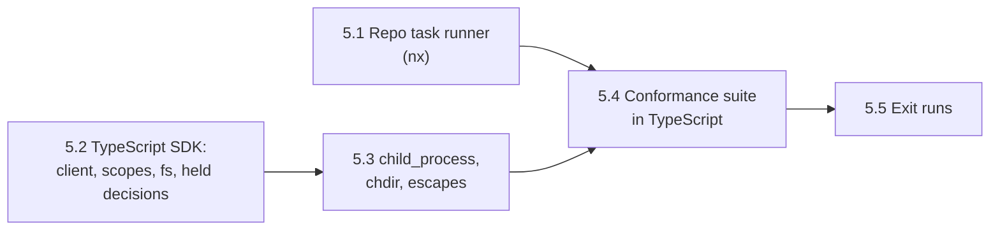

# Phase 5: TypeScript SDK Plan

Oct 5, 2026 · Andre Bremer · Draft

**Status, Oct 6, 2026: drafted**; no sub-phase started. Waits on phase 4, policy reviewers ([plan](phase-4-reviewers.md)). Drafted as phase 3; renumbered Oct 5, 2026, when held decisions moved ahead of the freeze, and again Oct 6, 2026 (phase 4 to 5), when policy reviewers moved ahead of it.

Phase 5 proves that escrowd is one daemon behind many SDKs. Phase 3 froze the protocol and phase 4 adds policy reviewers to it, additions only; a TypeScript SDK is built against the daemon as phase 4 leaves it, and the conformance suite, ported to TypeScript, must pass against it, held decisions and reviewers included. Phase 6's pi adapter is written in TypeScript and captures pi's built-in tools through this SDK, so the SDK must cover what pi does: `fs` and `fs/promises`, `child_process`, concurrent async work on one thread.

From the proposal: **the conformance suite, ported to TypeScript, passes against the same daemon with no daemon changes.**

## Exit criteria

1. **No daemon changes.** From the end of phase 4 (tag `protocol-8`) to the end of phase 5, `crates/escrowd/` and `proto/` are unchanged: a CI check fails any phase 5 PR that touches them. A daemon bug found by the TypeScript work is fixed in its own PR, which moves the tag and restarts this count.
2. **The suite, ported.** The conformance suite, ported to TypeScript (Vitest), passes against the TypeScript SDK and the same daemon, held-decision checks included; the Python suite keeps passing against the Python SDK. `nx run-many -t conformance` runs both, 10 consecutive times on each CI runner (`ci:repeat`) and once on each Lima host.
3. **pi's IO is covered.** Each call pi's built-in bash, read, write and edit tools make (an inventory taken in 5.2) is either captured in the scope or listed in `LIMITATIONS.md` with what it falls to.
4. **No regression.** The daemon-level checks and the Python SDK pass as at the end of phase 4.

## Sub-phases

| # | Sub-phase | Goal (done when…) | Checks |
| --- | --- | --- | --- |
| 5.1 | Repo task runner | An nx workspace: build, lint, test and conformance targets for Rust, Python and TypeScript; CI and the git hooks run nx; the Python suite runs through it unchanged | 2 (Python), 4 |
| 5.2 | TypeScript SDK: client, scopes, fs, held decisions | `sdk/typescript/`: gRPC client, `init` re-exec under `escrow run`, `scope()` in `AsyncLocalStorage`, decide callbacks, held outcomes and `AwaitDecision`, outcome, typed errors, path rewrite of `fs`, `fs/promises` and streams; pi's IO inventory | 3 (fs) |
| 5.3 | `child_process`, `chdir`, escapes | `spawn`, `exec`, `execFile` and their sync forms run through `escrow exec` with the scope's token; `process.chdir` into the view; unscoped count and warning; stale handles | 3 |
| 5.4 | Conformance suite in TypeScript | The suite ported to Vitest (daemon-level and SDK checks, the test app in TypeScript), passing against the TypeScript SDK on the dev host | 2 |
| 5.5 | Exit runs | Checks 1–4 on the final commit: 10 consecutive CI runs per runner, the Lima matrix, the daemon unchanged since the tag | All |

## Design for each sub-phase

### 5.1 Repo task runner

With three languages (Rust, Python, TypeScript), each with its own build, lint and test commands, nx (23.2.1, latest on Oct 5, 2026) gives the whole repo one task graph, decided Oct 5, 2026. Each part is an nx project with `build`, `lint`, `test` and, where it applies, `conformance` targets that run the existing tools (`cargo`, `uv`, `pnpm`): the daemon and CLI (`crates/`), the Python SDK, the TypeScript SDK, and the two conformance suites, which depend on the daemon's build. `nx run-many -t lint test` and `nx affected -t conformance` replace the tool commands spelled out in CI and the lefthook hooks; nx caches task outputs by their inputs, so an unchanged part is not rebuilt or retested. The cost: Rust and Python work needs Node and pnpm installed (both already pinned in `mise.toml`). The Python suite runs through nx unchanged before the TypeScript work starts.

### 5.2 TypeScript SDK: client, scopes, fs, held decisions

`sdk/typescript/`, a pnpm package, TypeScript 7 compiled to ESM, Node 22 and 24, lint and format with oxlint and oxfmt, tests in Vitest (decided Oct 5, 2026):

- **Client.** `@grpc/grpc-js` over `unix:` with `grpc.default_authority` set (tonic rejects the socket path as authority, as with grpcio). Stubs generated from `proto/` and committed; CI diffs them, as it does Python's.
- **`init()`.** Without `ESCROW_SOCKET`, re-executes the process under `escrow run` (same arguments as Python: project, unscoped mode, policy, on-exit) and exits with the child's code.
- **`scope()`.** `await escrow.scope(name, fn, {decide, labels})` and a `Scope` with `outcome`, `resume`; the current scope lives in an `AsyncLocalStorage`, so concurrent async work on one thread keeps separate scopes (exit test 3). The token stays on the `Scope` object.
- **Held decisions.** The close carries the proposed verdict and whether the client can wait, as phase 3 defines it; a `held` outcome resolves through `AwaitDecision`, and the scope's promise settles with the verdict. The outcome names its pending reviewers (`Outcome.reviewers`, phase 4) as Python's does.
- **fs.** Path rewrite (project, `$HOME` and `/tmp` roots from `OpenScopeResponse.roots`) in every path-taking function of `fs`, `fs/promises` and the stream constructors; `realpath`, `__filename`-style results and error paths mapped back. ESM imports of `node:fs` see the patched functions through `module.syncBuiltinESMExports()`. Flush before close: every handle opened in the scope is fsynced (`FileHandle.sync`, `fs.fsync`), as Python's `Scope.flush` does.
- **Typed errors.** `EscrowUnscopedError` (code `EROFS`, a `deny`-mode write outside a scope), `EscrowStaleHandleError` (`EBADF` on a handle of a closed scope), `EscrowUnscopedWarning` through `process.emitWarning`; each keeps `code`, `errno`, `syscall` and `path`, so `err.code === 'EROFS'` checks keep working.
- **pi's IO inventory.** List the calls pi's bash, read, write and edit tools make (from pi's source at a pinned version), and mark each covered, covered in 5.3, or a limit. This is check 3's list.

### 5.3 `child_process`, `chdir`, escapes

- **Subprocesses.** `spawn`, `exec`, `execFile`, `spawnSync`, `execSync`, `execFileSync` inside a scope run `escrow exec --scope ID --socket S -- argv` with `ESCROW_SCOPE_TOKEN` in its environment, `cwd` rewritten into the view, `shell: true` as `/bin/sh -c`. `fork` (Node IPC over an extra fd) falls to the unscoped mode: `escrow exec` passes fds 0–2 only (a limit since 1.5).
- **`process.chdir`** into the project moves into the scope's view; `process.cwd()` maps back; the decision restores it (Python's 2.6 design).
- **Unscoped count.** `outcome.unscoped` and a warning at close, from `ChangeSet.unscoped_ops`.
- **Not covered, by design:** native addons doing their own IO, `worker_threads` (a worker does not inherit the `AsyncLocalStorage` context; work it does falls to the unscoped mode unless the worker opens its own scope), `process.binding` and other internals.

### 5.4 Conformance suite in TypeScript

The suite is ported to TypeScript as a whole, decided Oct 5, 2026: `tests/conformance-ts/` in Vitest, with the fixtures (`Daemon`, policies, the Lima runner's hooks) and every check, daemon-level ones included, and `examples/test-app/app.ts` beside `app.py`. Both suites run against the same daemon binary; nx runs both (`nx run-many -t conformance`). Cost accepted: two suites to keep in step. A check added to one is added to the other in the same PR; a CI step compares the two suites' check names and fails on a difference that is not listed as SDK-specific (`os.posix_spawn` has no Node counterpart; `fork` has no Python one).

The SDK's own unit tests (path rewrite tables, error mapping) run in Vitest in a `TypeScript` CI job beside `Python`.

### 5.5 Exit runs

Checks 1–4 on the final commit: the suite 10 consecutive times on each CI runner with both SDKs (`ci:repeat`), once on each Lima host (the Lima guest gets the host's Node through the read-only home mount, as it gets uv and Python), and the daemon diff since the `protocol-8` tag empty. Logs go to `tests/conformance/results/`, and the status line gets the PR link.

## Carried limits

All known limits are in [LIMITATIONS.md](../LIMITATIONS.md). Out of phase 5, by design:

- Bun and Deno: Node only. Their `fs` and process APIs differ; each would be its own SDK work.
- Browsers and edge runtimes: no filesystem to capture.
- The LLM auditor and a human review interface beyond `escrow review`: phase 8.
- The pi adapter itself: phase 6.

## Open questions

- [x] Node versions: 22 and 24 (both LTS; 22 leaves maintenance in Apr 2027), one extra conformance job on `ubuntu-24.04`, as Python covers 3.11 and 3.14. Decided Oct 5, 2026.
- [x] Module format: ESM only; Node 22+ loads ESM from CommonJS with `require()`. Decided Oct 5, 2026.
- [x] TypeScript toolchain: TypeScript 7 (7.0.2, the native compiler, latest on Oct 5, 2026), oxlint and oxfmt (OXC) for lint and format, Vitest for tests; versions pinned exactly in `package.json` and `mise.toml` when 5.2 starts. Decided Oct 5, 2026.
- [x] gRPC stack: `@grpc/grpc-js` with generated stubs committed and diffed in CI (it handles `unix:` and `grpc.default_authority`, as grpcio does). Decided Oct 5, 2026.
- [x] Publishing: unpublished; a workspace package that pi's adapter (phase 6) uses from the repo. Decided Oct 5, 2026.
- [x] The conformance suite: ported to TypeScript as a whole (not one pytest harness over both SDKs), and driven through a repo task runner for consistency. Decided Oct 5, 2026.
- [x] Task runner: nx for the whole repo (one task graph, caching, affected-only runs; Node and pnpm needed for every target, both already pinned). Decided Oct 5, 2026 (`make` was the alternative).
