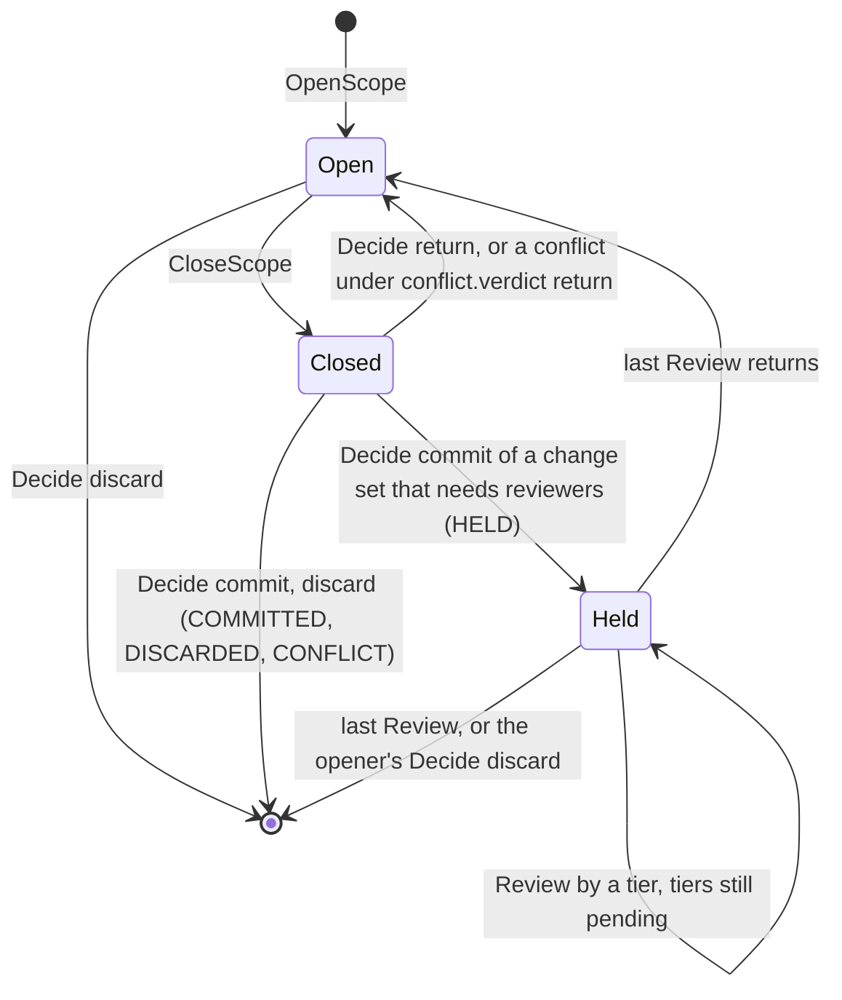

# escrowd Protocol v1

Oct 6, 2026 · Frozen at protocol 7, tag `protocol-v1`

This spec is for the authors of escrowd SDKs and reviewers. The schema is [`proto/escrow/v1/escrow.proto`](../proto/escrow/v1/escrow.proto), and its comments give each field's meaning. This page gives what the schema cannot: the sockets, the scope lifecycle, which call needs which credential, the status codes, the rules for compatibility, the exec socket's frames and the `escrow exec` command. The Python SDK (`sdk/python/`) implements all of it, and the conformance suite (`tests/conformance/`) checks it.

## Sockets

A daemon serves one project on three Unix sockets. Clients find the first one in `ESCROW_SOCKET`.

| Socket | Serves | Who connects |
| --- | --- | --- |
| `<socket>` | gRPC `escrow.v1.EscrowService` | the app's SDK, inside the app's sandbox |
| `<socket>.exec` | framed `SpawnRequest`, `SpawnEvent` and `SpawnSignal` (see [Exec socket](#exec-socket)) | `escrow exec`, for a scope's subprocesses |
| `<socket>.review` | gRPC `escrow.v1.ReviewerService` | reviewers: `escrow review`, an LLM auditor |

- **Review socket.** It has mode 0600 and the daemon's owner. No sandbox gets it, so the file mode is the reviewer's credential. Scope tokens give no access there, and the review socket gives no scope rights.
- **Separate services.** Each gRPC socket answers the other service's calls with `UNIMPLEMENTED`.
- **gRPC clients.**
  - Send a valid host name as `:authority`, for example `localhost`. grpcio sends the socket path by default, and the daemon's HTTP/2 stack resets that stream (RST_STREAM).
  - Lift the client's receive limit. A change set carries its diff, up to the policy's `diff.max_bytes`, which can pass grpcio's 4 MiB default.

## Scope lifecycle



- **Open.** The scope's view serves reads from its snapshot and keeps every write in its upper layer. Nothing reaches the project.
- **Closed.** The daemon has stopped the scope's subprocesses and frozen it. `CloseScope` returns its change set. `CloseScope` on a closed scope returns the same change set again.
- **Held.** A commit whose change set needs a tier above software (policy `review:`) waits for those reviewers. The holds survive a daemon restart. The opener can only withdraw the scope (`Decide` discard).
- **Reopened.** A return reopens the scope with its changes, so the agent fixes them in the same scope. `Outcome.reopened` says so.
- **Decided.** A committed or discarded scope is gone. Its decision stays in the daemon's history when the scope had a session or was held, for `AwaitDecision` and for reviewers.

Sessions order an agent's scopes. While a scope of a session is held with a wait (`Outcome.wait`), the session's next `OpenScope` waits for its verdict.

## Calls

`EscrowService`, on `<socket>`:

| Call | Token | Does | Errors |
| --- | --- | --- | --- |
| `Ping` | none | Daemon version and `protocol_version` | none |
| `OpenScope` | none | Opens a scope; returns its id, views and token. In a session behind a held scope, waits for the verdict | `FAILED_PRECONDITION` at the deadline |
| `CloseScope` | the scope's | Stops the scope's children, freezes it, returns its change set | `NOT_FOUND`, `PERMISSION_DENIED` |
| `Decide` | the scope's | Commits, discards or returns the scope; a commit may hold it | `NOT_FOUND`, `PERMISSION_DENIED`, `FAILED_PRECONDITION`, `INVALID_ARGUMENT`, `ABORTED` |
| `SettleUnscoped` | none | Closes the implicit default scope (id `unscoped`) and returns its change set | `FAILED_PRECONDITION` outside `implicit` mode |
| `GetChangeSet` | none | A closed, undecided scope's change set, diff included | `NOT_FOUND`, `FAILED_PRECONDITION` |
| `AwaitDecision` | the scope's | Streams a held scope's outcome after each review, then its verdict | `NOT_FOUND`, `PERMISSION_DENIED`, `FAILED_PRECONDITION` |

`ReviewerService`, on `<socket>.review`:

| Call | Does | Errors |
| --- | --- | --- |
| `ListHeld` | The held scopes, oldest hold first | none |
| `GetHeld` | A held scope: change set with writers and diff, its tiers' verdicts so far, its session's last 20 decisions | `NOT_FOUND`, `FAILED_PRECONDITION` |
| `Review` | A tier's verdict; after the last pending tier, the scope is decided | `NOT_FOUND`, `FAILED_PRECONDITION`, `INVALID_ARGUMENT`, `PERMISSION_DENIED`, `ABORTED` |

- **Tokens.** `OpenScopeResponse.token` is the scope's capability. Only the opener gets it; the scope id alone, which a path reveals, is not enough. The daemon keeps its SHA-256. The unscoped scope has no token.
- **Deadlines.** `OpenScope` in a session reads the call's `grpc-timeout`. 100 ms before it, the call fails with `FAILED_PRECONDITION` and the held scope stays held; a client can also see its own `DEADLINE_EXCEEDED` first. With no deadline, the call waits for the verdict. The Python SDK opens with none.
- **Verdicts.** They only tighten: commit < return < discard. `Decide` cannot loosen the software tier's verdict (`ChangeSet.review`), and a reviewer cannot loosen an earlier tier's, unless the tier is human and `override` is set. The ledger records each override.
- **Arguments in change sets.** `Process.args` holds each writer's whole command line. Command lines can carry secrets (`curl -H "Authorization: …"`). Reviewers get them in full; the ledger keeps the first 4 KiB.

## Status codes

The daemon fails a call with one of these codes. An SDK maps each one to the same typed error. The Python SDK's classes all derive from `EscrowRpcError`, which is also a `grpc.RpcError` with `code()` and `details()`.

| Code | Meaning | Python | Retry? |
| --- | --- | --- | --- |
| `NOT_FOUND` | No scope with that id: never opened, or decided and dropped | `EscrowNotFoundError` | No |
| `PERMISSION_DENIED` | A missing or wrong token; the opener's commit or return of a held scope; a looser verdict without a human override | `EscrowPermissionError` | No |
| `FAILED_PRECONDITION` | The scope is not in the state the call needs (open, closed, held, this tier's turn); the daemon's mode does not serve the call; a session's next scope hit its deadline behind a held one | `EscrowStateError` | After the state changes |
| `INVALID_ARGUMENT` | A request field is missing or out of range: verdict unset, tier not `llm` or `human` | `EscrowInvalidArgumentError` | No |
| `ABORTED` | A commit failed and was rolled back. Nothing reached the project; the scope stays closed | `EscrowAbortedError` | Yes: decide again |
| `UNAVAILABLE` | No daemon on the socket, or it stopped during the call | `EscrowUnavailableError` | When a daemon runs |
| `DEADLINE_EXCEEDED` | The client's deadline passed; a decision may still have run | `EscrowTimeoutError` | Read the state first |
| `UNIMPLEMENTED` | The socket does not serve the call (the other service), or the daemon predates it | `EscrowUnsupportedError` | No |
| `INTERNAL`, other codes | A daemon fault; the message says which | `EscrowRpcError` | No |

The message (`details()`) is for people. Clients branch on the code, never on the text.

The exec socket has no codes: it answers a request it cannot run with a `SpawnEvent.error` string, and `escrow exec` exits 125.

## Versioning

- **`PingResponse.protocol_version` is 7** for the whole of `escrow.v1`. A lower value is a daemon from before the freeze. A client can refuse it.
- **Additions only.** New fields, enum values, messages and calls keep v1. Field numbers and names, enum numbers, calls and their request and response types never change or go away.
- **Breaking changes** go in a new package, `escrow.v2`, served beside v1 or instead of it. Its calls have new gRPC paths (`/escrow.v2.EscrowService/…`), so a v1 client gets `UNIMPLEMENTED`, never a silent misread.
- **CI** runs `buf lint` (STANDARD rules) and `buf breaking --against '.git#tag=protocol-v1'` with buf's FILE rules, which also keep generated code compiling (`buf.yaml`).
- **Unique messages.** Every call has its own request and response message, so a later version adds a field to one call's response without touching the others. Shared messages (`ChangeSet`, `Outcome`) sit inside them.

### Unknown values

A later daemon can send values a v1 client does not know. A client must not fail on them:

- **`OutcomeStatus`**: an unknown status is not decided yet, like `OUTCOME_STATUS_HELD`. A client that waits keeps following `AwaitDecision` until a status it knows as final: committed, discarded, returned or conflict. Phase 7 can add review states this way.
- **Other enums** (`Tier`, `ChangeKind`, `ReadDecision`): keep the value and show it as unknown. The Python SDK names an unknown tier or change kind `"unknown"` and treats an unknown read decision as a denial.
- **Fields**: proto3 skips unknown fields.

## Exec socket

gRPC cannot carry file descriptors, and a scope's subprocess needs its caller's stdin, stdout and stderr. Each connection to `<socket>.exec` starts one child in the scope's sandbox.

**Frames.** Each frame is a little-endian u32 length, then one protobuf message of that length. Frames are 16 MiB at most.

**Exchange.**

1. The client sends the first frame's 4 length bytes in one `sendmsg`, with three file descriptors attached (`SCM_RIGHTS`): stdin, stdout, stderr, in that order.
2. The client sends the `SpawnRequest` body.
3. The daemon answers `SpawnEvent{pid}` once the child runs: the sandbox's PID, in the daemon's PID namespace.
4. The client sends any number of `SpawnSignal` frames. The daemon delivers each signal to the command's processes, not to bwrap.
5. The daemon sends `SpawnEvent{exit_code}` when the child exits: its exit status, or 128 plus the signal that killed it. The daemon then shuts down its side of the connection.

A request the daemon cannot run gets one `SpawnEvent{error}` instead of `pid`: an unknown or closed scope, a wrong token, an empty `argv`, or missing descriptors. If the client closes the connection before the child exits, the daemon kills the child's whole sandbox (SIGKILL). Closing the scope also stops its children: SIGTERM, then SIGKILL after the policy's `close.grace_ms`.

**The child.**

- **Working directory.** `cwd` in the scope's view (`/escrow/<scope_id>/…` in the app's sandbox, `<mount>/<scope_id>/…` on the host) maps to the same place in the child's sandbox. So does a path in the project or a served root. Anything else maps to the project root.
- **Environment.** `env` minus `ESCROW_SOCKET*` and `ESCROW_SCOPE_TOKEN`. The child cannot reach the daemon.
- **Process group.** Its own.

**Example.** `make test` in scope `s1`, token `tk`, interrupted by Ctrl-C. Bytes in hex; `|` separates a frame's length from its body.

```text
client → 22 00 00 00                                   + SCM_RIGHTS [0, 1, 2]
client → 0a 02 73 31 12 04 6d 61 6b 65 12 04 74 65 73 74 1a 0c 2f 68 6f 6d 65
         2f 75 2f 70 72 6f 6a 2a 02 74 6b              SpawnRequest{scope_id: "s1", argv: ["make", "test"], cwd: "/home/u/proj", token: "tk"}
daemon ← 03 00 00 00 | 08 92 21                        SpawnEvent{pid: 4242}
client → 02 00 00 00 | 08 02                           SpawnSignal{signal: 2}
daemon ← 03 00 00 00 | 10 82 01                        SpawnEvent{exit_code: 130}
```

`SpawnEvent` is a `oneof`, so `exit_code: 0` is still on the wire (`02 00 00 00 | 10 00`). A refused request gets one frame, for example `0d 00 00 00 | 1a 0b 6e 6f 20 73 63 6f 70 65 20 73 39` (`SpawnEvent{error: "no scope s9"}`).

## `escrow exec`

SDKs that cannot pass file descriptors over a Unix socket run this binary instead; Node is one. The Python SDK runs it for every subprocess of a scope. Its interface is part of v1.

```text
escrow exec --scope <scope_id> [--socket <path>] -- <command> [args…]
```

| Input | Meaning |
| --- | --- |
| `--scope` | The scope's id |
| `--socket` | The daemon's socket; default `ESCROW_SOCKET` |
| `ESCROW_SCOPE_TOKEN` | The scope's token, from the environment, never an argument; empty for the unscoped scope. The child does not get it |
| stdin, stdout, stderr | Passed to the child as they are |

**Signals.** `escrow exec` relays SIGINT, SIGTERM, SIGHUP, SIGQUIT, SIGUSR1 and SIGUSR2 to the child. If `escrow exec` dies, its connection closes and the child is killed.

**Exit codes.**

| Code | Meaning |
| --- | --- |
| The child's | The child exited |
| 128 + n | Signal n killed the child |
| 125 | `escrow exec` failed: no daemon, or the daemon refused the request. The reason goes to stderr, prefixed `escrow exec:` |
| 127 | The daemon could not wait for the child |
